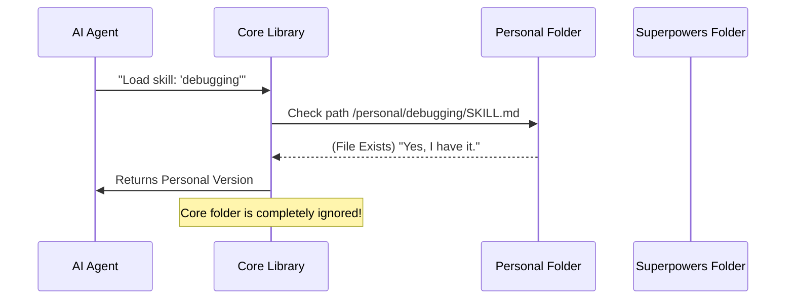

# Chapter 3: Skill Discovery & Core Library

In [Chapter 2: The Bootstrap Layer (Context Injection)](02_the_bootstrap_layer__context_injection_.md), we acted like "The Operator" in *The Matrix*. We downloaded a single "Master Skill" into the AI's brain that taught it *how* to use tools.

Now, the AI knows it has superpowers. It knows it should look for skills. But here is the problem: **Where are they?**

Are they in `C:/MyDocuments`? Are they in the cloud? How does the AI know that a file named `SKILL.md` inside a folder named `fancy-testing` is actually the tool it needs?

This chapter introduces the **Core Library**—the librarian that organizes, indexes, and retrieves your skills.

## The Motivation: The Library Card Catalog

Imagine walking into the Library of Congress and asking for "a book about space." Without a system, the librarian would have to run through millions of shelves randomly opening books.

In our system, we have two types of "shelves":
1.  **Core Skills (Superpowers):** The default skills that come with the project (like standard debugging).
2.  **Personal Skills (User):** Custom skills you write for your specific project.

We need a system that:
1.  Scans all shelves.
2.  Reads the "book covers" (Metadata).
3.  Decides which book to give you if two books have the same title (Shadowing).

## The Use Case: "Shadowing" a Default Skill

Let's say the Superpowers system comes with a built-in skill called `test`. It runs generic unit tests.

However, your specific project uses a weird, custom testing framework. You write your own skill named `test` and put it in your personal folder.

**The Goal:** When the agent says "I want to run `test`," the system must figure out: "Wait, the user has their *own* version of this. I should ignore the built-in one and give them the custom one."

This is called **Shadowing**, and it is the most powerful feature of the Core Library.

## Concept 1: The Scanner (Recursive Discovery)

The first job of the Core Library is to walk through directories. It looks for a specific file pattern: `folder_name/SKILL.md`.

It doesn't matter how deep the folders are nested.

*   `skills/coding/python/formatting/SKILL.md` ✅
*   `skills/debugging/SKILL.md` ✅

The scanner converts these file paths into a list of available tools.

## Concept 2: The ID Card (Frontmatter Parsing)

As we learned in [Chapter 1: The Skill Definition (Natural Language Programs)](01_the_skill_definition__natural_language_programs_.md), every skill starts with YAML frontmatter.

The Core Library reads this section *before* loading the rest of the file. It extracts the `name` and `description` to build the index.

```javascript
// Example of what the Core Library extracts into memory:
[
  { name: "debug", description: "Fixes errors...", path: "/.../debug/SKILL.md" },
  { name: "plan", description: "Creates architecture...", path: "/.../plan/SKILL.md" }
]
```

## Concept 3: Shadowing (The Override Logic)

This is the decision-making logic.

If the AI asks for `test`, the library checks:
1.  **Personal Folder:** Is there a `test` skill here?
    *   *Yes:* Return this one. Stop looking.
2.  **Superpowers Folder:** Is there a `test` skill here?
    *   *Yes:* Return this one.
3.  **Nowhere:** Return `null` (Skill not found).

This allows you to customize *any* part of the system without deleting the original files.

## Under the Hood: Implementation

How does this actually work in the code? Let's watch the flow of data when an Agent requests a skill.



### The Code: Resolving Paths

This logic lives in `lib/skills-core.js`. We will look at the `resolveSkillPath` function. This is the heart of the Shadowing concept.

**Input:** `skillName` (e.g., "debugging")
**Output:** The absolute file path to the correct `SKILL.md`.

```javascript
// lib/skills-core.js (Simplified)
function resolveSkillPath(skillName, coreDir, personalDir) {
    // 1. Check Personal Directory FIRST
    if (personalDir) {
        // Construct path: /personal/debugging/SKILL.md
        const personalPath = path.join(personalDir, skillName, 'SKILL.md');
        
        // If it exists, WE WIN. Return immediately.
        if (fs.existsSync(personalPath)) {
            return { path: personalPath, source: 'personal' };
        }
    }

    // 2. If not found, Check Core Directory
    const corePath = path.join(coreDir, skillName, 'SKILL.md');
    if (fs.existsSync(corePath)) {
         return { path: corePath, source: 'superpowers' };
    }

    // 3. Not found anywhere
    return null;
}
```

*Explanation:*
1.  We construct the path where the personal skill *should* be.
2.  `fs.existsSync` asks the hard drive: "Is there a file here?"
3.  If yes, we return it immediately. The code never even checks the Core directory. This is how the override works.

### The Code: Reading the Label

To populate the list of skills, we use `extractFrontmatter`. This function is careful; it only reads the top of the file.

```javascript
// lib/skills-core.js (Simplified)
function extractFrontmatter(filePath) {
    const content = fs.readFileSync(filePath, 'utf8');
    
    // Split file into lines
    const lines = content.split('\n');
    let name = '';

    // Loop through lines looking for keys
    for (const line of lines) {
        // Stop if we hit the second "---" separator
        if (line.trim() === '---' && name) break;

        // If we find "name: something", grab "something"
        if (line.startsWith('name:')) {
            name = line.split(':')[1].trim();
        }
    }
    return { name };
}
```

*Explanation:*
1.  It reads the file.
2.  It looks specifically for the line starting with `name:`.
3.  It ignores the hundreds of lines of instructions below. We don't need the instructions yet, just the name.

### The Code: The Recursive Scanner

Finally, here is how we find files deep inside subfolders.

```javascript
// lib/skills-core.js (Simplified)
function findSkillsInDir(dir) {
    const results = [];
    const entries = fs.readdirSync(dir, { withFileTypes: true });

    for (const entry of entries) {
        const fullPath = path.join(dir, entry.name);

        // If it's a folder, look inside! (Recursion)
        if (entry.isDirectory()) {
            // Check if this folder has a SKILL.md
            if (fs.existsSync(path.join(fullPath, 'SKILL.md'))) {
                results.push(fullPath);
            }
            // Keep digging deeper
            findSkillsInDir(fullPath); 
        }
    }
    return results;
}
```

*Explanation:*
This function is a loop. If it finds a folder, it dives into it. If it finds `SKILL.md`, it adds it to the "catalog."

## Conclusion

The **Core Library** is the nervous system of Superpowers. It ensures that:
1.  The AI can find the tools it needs.
2.  You, the user, always have the final say via **Shadowing**.

If the built-in AI behavior annoys you, you don't have to hack the source code. You just create a folder with the same name in your personal skills directory, write your own `SKILL.md`, and the system will prefer your version automatically.

Now that the AI can find skills, how does it decide *which* ones to combine to solve a complex problem?

[The Planning Pipeline (Architectural Phase)](04_the_planning_pipeline__architectural_phase_.md)

---

Generated by [Code IQ](https://github.com/adityasoni99/Code-IQ)