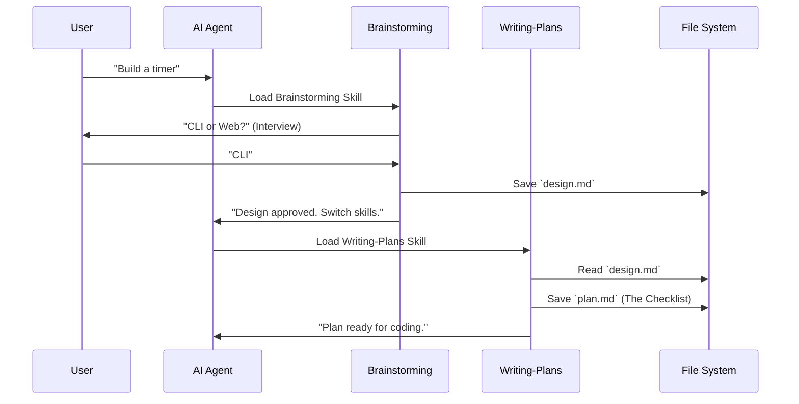

# Chapter 4: The Planning Pipeline (Architectural Phase)

In [Chapter 3: Skill Discovery & Core Library](03_skill_discovery___core_library.md), we built a "Library" that allows our AI to find the right tool for the job.

But having a hammer doesn't mean you know how to build a house. If you hand a hammer to an enthusiastic amateur (or an AI) and say "Build me a house," they will likely start nailing boards together randomly. The result will be a shack that collapses when the wind blows.

To build professional software, we need **Architecture**. We need to separate "thinking" from "doing."

## The Problem: The "Rush to Code"

When you ask a standard AI: "Make me a Snake game in Python," it immediately starts spitting out Python code.

It usually fails because:
1.  **It assumes too much:** It guesses you want a GUI when you wanted a terminal game.
2.  **It runs out of memory:** It tries to write the whole game in one response, gets cut off, and forgets where it was.
3.  **It writes unmaintainable code:** It creates one giant "God Object" instead of clean, separate files.

We need to force the AI to slow down.

## The Solution: The Architect and the Site Manager

Superpowers introduces a **Planning Pipeline** that strictly forbids writing code until two things happen:

1.  **Brainstorming (The Architect):** We agree on *what* we are building.
2.  **Writing Plans (The Site Manager):** We list exactly *how* to build it, step-by-step.

This pipeline ensures that when we finally start coding, the AI is just following a checklist.

## Use Case: Building a Pomodoro Timer

Let's say we want to build a simple "Pomodoro Timer" (a productivity clock).

**Without Pipeline:**
> **User:** "Build a Pomodoro timer."
> **AI:** *Writes 200 lines of buggy Python code immediately.*

**With Pipeline:**
> **User:** "Build a Pomodoro timer."
> **AI:** "Okay, I am opening the **Brainstorming** skill. Do you want this to be a web app or a command-line tool?"
> **User:** "Command line."
> **AI:** "Should it play a sound when the timer ends?"
> **User:** "Yes."
> **AI:** "Okay, I have created a design. Now I am opening the **Writing Plans** skill to create the task list."

## Phase 1: The Brainstorming Skill

The first skill in the pipeline is `brainstorming`. Its job is to interview you.

It contains a `<HARD-GATE>` rule. This is a special instruction that tells the AI: **"Do not write implementation code yet."**

### Concept: The Recursive Interview

The skill forces the AI to loop through a cycle:
1.  Ask a clarifying question.
2.  Wait for your answer.
3.  Update its mental model.
4.  Repeat until the design is clear.

### Example Output

When you run this skill, the conversation looks like this:

```text
AI: I'm starting the brainstorming phase.
    1. Check existing files... Done.
    2. Question: specifically what language should we use? Python or Node.js?
User: Python.
AI: noted.
    3. Question: Should we save stats to a database?
User: No, keep it simple.
```

Once the AI is satisfied, it generates a **Design Document**.

### The "Design Doc"

This is a file saved to `docs/plans/2023-10-27-pomodoro-design.md`. It acts as the "Blueprints."

```markdown
# Pomodoro Timer Design
- **Type:** CLI Tool
- **Language:** Python
- **Libraries:** `click` for arguments, `playsound` for alerts.
- **Data Flow:** User inputs time -> Loop counts down -> Sound plays.
```

## Phase 2: The Writing-Plans Skill

Once you approve the design, the AI automatically switches to the next skill: `writing-plans`.

This skill represents the **Site Manager**. It takes the blueprint (Design Doc) and converts it into instructions for the workers (the coding agents).

### Concept: Bite-Sized Tasks

AI models get confused if a task is too big. The `writing-plans` skill forces the AI to break the feature down into tiny, atomic steps (2-5 minutes each).

### The "Implementation Plan"

This is the output file, usually `docs/plans/2023-10-27-pomodoro-plan.md`. It looks like a Todo list on steroids.

```markdown
# Implementation Plan

## Task 1: Basic Timer Logic
- [ ] Create `src/timer.py`
- [ ] Write test: `test_timer_counts_down`
- [ ] Implement `countdown()` function
- [ ] Verify test passes

## Task 2: Add Sound
- [ ] Import `playsound`
- [ ] ...
```

Notice how detailed this is? It tells the future coder *exactly* which file to create and which function to write.

## Under the Hood: The Skill Implementation

How do we force the AI to behave this way? We program it using the `SKILL.md` files we learned about in [Chapter 1: The Skill Definition (Natural Language Programs)](01_the_skill_definition__natural_language_programs_.md).

Let's visualize the flow:



### The Brainstorming Code

Let's look at a simplified version of `skills/brainstorming/SKILL.md`.

```markdown
# Brainstorming Logic

## Overview
Turn ideas into designs.

<HARD-GATE>
Do NOT invoke any implementation skill or write code
until the user has approved the design.
</HARD-GATE>

## Process
1. Ask clarifying questions (one at a time).
2. Propose approaches.
3. Write design doc to `docs/plans/`.
4. ONLY THEN invoke `writing-plans`.
```

*Explanation:* The `<HARD-GATE>` tag is a prompt engineering technique. It screams at the AI to stop it from rushing ahead. The "Process" section gives it a strict order of operations.

### The Writing-Plans Code

Now let's look at `skills/writing-plans/SKILL.md`. This forces the "Bite-Sized" philosophy.

```markdown
# Writing Plans Logic

## Overview
Write comprehensive plans assuming the engineer has zero context.

## Bite-Sized Task Granularity
Each step is one action (2-5 minutes):
- "Write the failing test"
- "Implement minimal code"
- "Run tests"

## Output Format
You MUST output a file with checkboxes [ ].
```

*Explanation:* By defining "Granularity," we prevent the AI from creating a task like "Build the whole app." We force it to think in small, testable steps (Test-Driven Development).

## Why This Matters

This separation gives you two opportunities to catch mistakes before they become expensive:

1.  **During Brainstorming:** You catch *logic* errors. ("Oh wait, I forgot we need a pause button.")
2.  **During Planning:** You catch *architectural* errors. ("Wait, why are you using that library? It's outdated.")

If you skipped straight to coding, you would have to rewrite hundreds of lines of code to fix these mistakes. Here, you just rewrite a few lines of English text in a plan.

## Conclusion

The **Planning Pipeline** transforms the AI from a frantic junior coder into a methodical engineering team. It ensures that by the time code is written, the design is solid and the steps are clear.

We have successfully separated **Thinking** (`brainstorming` + `writing-plans`) from **Doing**.

Now we have a perfectly detailed `plan.md` file waiting on our hard drive. But who is going to execute it? Do we have to copy-paste tasks manually?

In the next chapter, we will introduce the "Manager," a special skill that reads the plan and assigns tasks to sub-agents automatically.

[Subagent-Driven Development (The Manager Pattern)](05_subagent_driven_development__the_manager_pattern_.md)

---

Generated by [Code IQ](https://github.com/adityasoni99/Code-IQ)