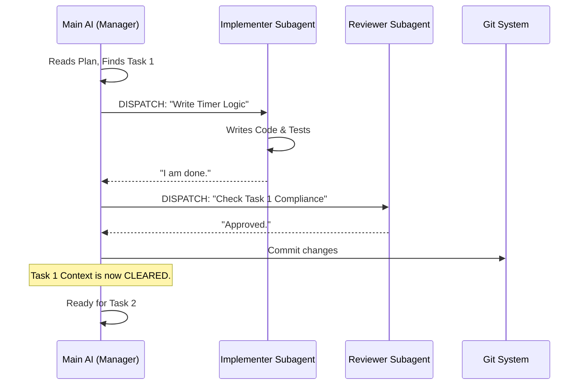

# Chapter 5: Subagent-Driven Development (The Manager Pattern)

In [Chapter 4: The Planning Pipeline (Architectural Phase)](04_the_planning_pipeline__architectural_phase_.md), we learned how to stop the AI from rushing. We acted as Architects and created a detailed implementation plan (`plan.md`) for our software.

Now we have a checklist of 5 tasks. You might be tempted to say to the AI: *"Okay, go do Task 1, then Task 2, then Task 3..."*

**Do not do this.**

If you try to build a complex project in a single chat session, you will run into the **Context Window Problem**. The AI acts like a developer who hasn't slept in 48 hours. It starts forgetting file names, it confuses old errors with new ones, and it starts hallucinating code that doesn't exist.

We need a better way. We need **Subagent-Driven Development**.

## The Problem: The Tired Developer

Imagine a whiteboard. Every time the AI reads a file or writes code, it fills up space on that whiteboard.

1.  **Task 1:** The AI fills 20% of the whiteboard.
2.  **Task 2:** The AI fills another 30%.
3.  **Task 3:** The whiteboard is full. To make room for Task 4, the AI starts erasing the instructions for Task 1.

Suddenly, the AI breaks the code from Task 1 because it forgot how it worked. This is why long AI coding sessions usually end in disaster.

## The Solution: The Manager Pattern

Instead of one AI doing everything, we split the roles:

1.  **The Manager (General Contractor):** This is your main chat session. It holds the `plan.md`. It does **not** write code. Its only job is to hire workers.
2.  **The Subagent (Subcontractor):** This is a *fresh* AI session created just for one task. It wakes up, does the task, reports back, and then **disappears**.

By using Subagents, every single task is done by an AI with a perfectly clean, empty whiteboard. It has maximum intelligence and zero confusion.

## Central Use Case: Executing the Plan

Let's continue with our **Pomodoro Timer** example.

**The Manager's Job:**
1.  Read `plan.md`.
2.  See **Task 1: Create Timer Logic**.
3.  **Dispatch** a Subagent to do it.
4.  **Review** the work.
5.  Commit the code to Git.
6.  Move to Task 2.

## Concept 1: The Dispatcher

The "Manager" (the main AI you are talking to) uses a tool to spawn a child process.

Think of it like a Russian Nesting Doll. The Big Doll (Manager) opens up and releases a Little Doll (Subagent). The Little Doll does the work, hands the result up, and vanishes.

### The Subagent's Prompt

The Manager doesn't just say "Do the task." It wraps the task in a very specific prompt template found in `skills/subagent-driven-development/implementer-prompt.md`.

It looks like this:

```markdown
You are a subagent.
1. Here is Task N: [Insert Description from Plan]
2. Here is the project context.
3. Write the code.
4. Verify it with tests.
5. DO NOT report back until you have self-reviewed.
```

## Concept 2: The Two-Stage Review

A big problem with AI is that it lies. It says "I fixed the bug," but it actually just deleted the test file so the error message would go away.

In Subagent-Driven Development, we don't trust the worker. We send in **Inspectors**.

After the Subagent claims it is finished, the Manager automatically dispatches two *more* subagents to check the work:

1.  **The Spec Reviewer:** Checks *"Did you build exactly what I asked for?"* (No more, no less).
2.  **The Code Quality Reviewer:** Checks *"Is the code clean and safe?"*

If either inspector finds a problem, the Manager sends the original Subagent back to fix it.

## The Process Visualization

Here is how the data flows when you run the skill `subagent-driven-development`.



## How to Use It

In your chat with the AI, once you have a plan, you simply invoke the skill.

**User:** "Okay, the plan looks good. Let's build it."
**AI:** "I am activating `subagent-driven-development`. I see 5 tasks. Starting Task 1..."

The AI will then start running commands in your terminal to spin up the subagents. You will see output like this:

```text
> Dispatching Implementer for Task 1...
... Subagent is coding ...
> Dispatching Spec Reviewer...
... Reviewer says: MISSING REQUIREMENT: No sound file found.
> Sending Implementer back to fix...
... Subagent adds sound file ...
> Dispatching Spec Reviewer...
... Reviewer says: Approved.
> Task 1 Complete. Committing to Git.
```

## Under the Hood: Internal Implementation

How does one AI "run" another AI?

It's actually a simple script. The Superpowers system includes a tool (often a bash script or a Node.js script) that makes an API call to the AI provider (like Anthropic or OpenAI).

### 1. The Wrapper Script

The Manager uses a script like `scripts/dispatch-agent.sh`.

```bash
#!/bin/bash
# simplified dispatch script
PROMPT_FILE=$1
TASK_CONTEXT=$2

# Combine the template with the specific task
FULL_PROMPT=$(cat $PROMPT_FILE)
FULL_PROMPT+=$TASK_CONTEXT

# Call the AI API (CLI tool)
claude --prompt "$FULL_PROMPT" --project-dir ./
```

*Explanation:* This script takes a prompt template (like "You are a subagent...") and appends the specific instructions for the current task. It then runs a fresh instance of the AI CLI tool.

### 2. The Loop Logic

The logic inside `skills/subagent-driven-development/SKILL.md` orchestrates the flow.

```javascript
// Pseudo-code logic for the Manager Skill
while (tasks_remain) {
    current_task = plan.next();
    
    // 1. Implementation Loop
    do {
        result = execute_subagent("implementer", current_task);
        spec_check = execute_subagent("spec-reviewer", result);
        quality_check = execute_subagent("quality-reviewer", result);
    } while (spec_check.failed || quality_check.failed);

    // 2. Finalize
    git.commit(current_task.name);
}
```

*Explanation:* This isn't literal code, but it represents the instructions the Manager follows. It refuses to move to the `git commit` step until both reviewers say "Yes."

## Why This Changes Everything

By using the Manager Pattern, we achieve **Scalability**.

*   **Complexity:** You can build a massive system with 100 tasks. The Manager never gets confused because it only focuses on *one* task at a time.
*   **Reliability:** The Two-Stage Review catches "lazy" AI mistakes before they enter your codebase.
*   **Isolation:** If Task 5 goes horribly wrong, you can just revert Task 5. Tasks 1-4 are safely committed and forgotten.

## Conclusion

You have learned that **Subagent-Driven Development** is the execution engine of Superpowers. It solves the "Context Window" problem by treating the main AI as a Manager who delegates work to fresh, temporary workers.

We have now:
1.  Defined Skills (Chapter 1)
2.  Bootstrapped the System (Chapter 2)
3.  Organized our Tools (Chapter 3)
4.  Planned the Architecture (Chapter 4)
5.  Built the Software (Chapter 5)

However, even with subagents, things can get messy if we don't follow strict coding rules. How do we ensure the AI follows specific formatting, naming conventions, and safety protocols?

In the next chapter, we will discuss how to enforce discipline across the entire swarm.

[Systematic Discipline (Enforced Best Practices)](06_systematic_discipline__enforced_best_practices_.md)

---

Generated by [Code IQ](https://github.com/adityasoni99/Code-IQ)