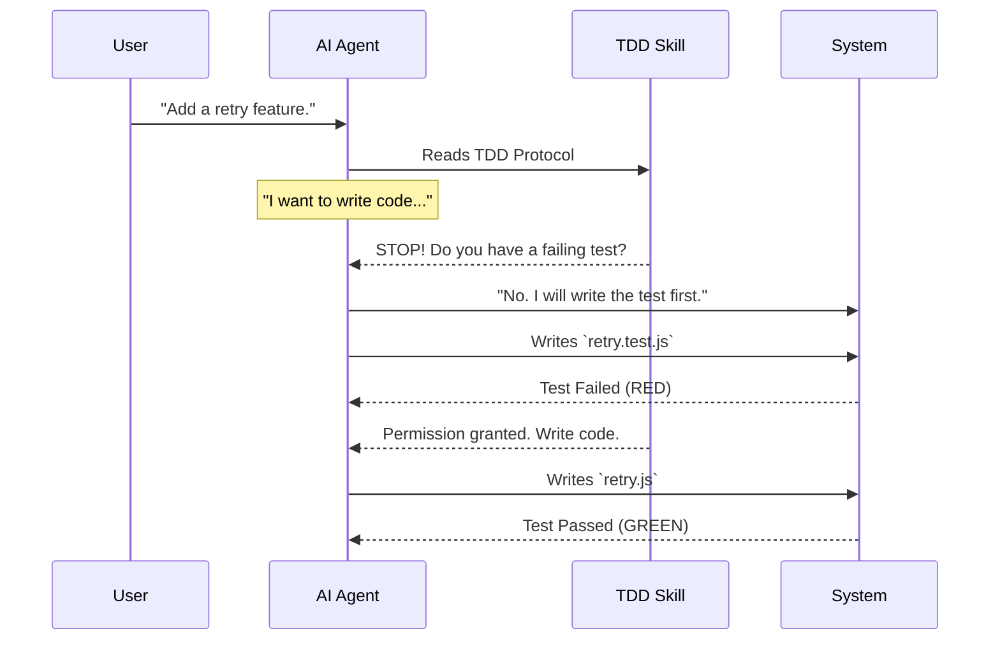

# Chapter 6: Systematic Discipline (Enforced Best Practices)

In [Chapter 5: Subagent-Driven Development (The Manager Pattern)](05_subagent_driven_development__the_manager_pattern_.md), we built a system where a "Manager" AI delegates tasks to "Worker" subagents. This solved the problem of the AI getting tired or confused by large tasks.

However, we still have one major problem: **The "Eager Junior" Problem.**

AI models are trained to be helpful *fast*. If you tell them "Fix this bug," their instinct is to guess, apply a random patch, and say "Done!" This leads to messy code, broken features, and technical debt.

We need to turn our AI agents from "Eager Juniors" into "Strict Senior Engineers."

## The Problem: The Guessing Loop

Without discipline, an AI debugging session looks like this:

1.  **AI:** "I think the error is in line 10. I changed it."
2.  **User:** "That didn't work."
3.  **AI:** "Oh, sorry. Maybe it's line 20? I changed that."
4.  **User:** "Now the database is broken."

This is the **Guess-and-Check Loop**. It is dangerous.

## The Solution: Protocol Skills

In Superpowers, we introduce **Discipline Skills**. These are not skills that *do* things (like writing code); they are skills that *govern behavior*.

They act like a safety protocol in a chemistry lab. You cannot mix chemicals (write code) until you have put on your safety goggles (written a test).

We will cover two specific protocols:
1.  **Test-Driven Development (TDD)**
2.  **Systematic Debugging**

## Concept 1: Test-Driven Development (TDD)

The `test-driven-development` skill enforces a strict rule: **You cannot write production code until you have written a test that fails.**

### The "Iron Law"

The skill file contains this instruction:

```text
NO PRODUCTION CODE WITHOUT A FAILING TEST FIRST.
Write code before the test? Delete it. Start over.
```

### How it Works (The Traffic Light)

1.  **RED:** Write a test that fails. (Proof that the feature is missing).
2.  **GREEN:** Write just enough code to make the test pass.
3.  **REFACTOR:** Clean up the code.

### Example: Fixing a "Submit" Button

**Without Discipline:**
The AI immediately edits `submitButton.js` to change the `onClick` handler. It hopes it works.

**With Discipline:**
The AI says: *"I must enter the RED phase."*

It creates `submitButton.test.js`:

```javascript
test('button triggers API call on click', () => {
  const mockApi = jest.fn();
  const button = render(<Button onSubmit={mockApi} />);
  
  fireEvent.click(button);
  
  // This MUST fail right now because the feature isn't built
  expect(mockApi).toHaveBeenCalled(); 
});
```

Only *after* it sees this test fail in the terminal does it allow itself to write the actual button code.

## Concept 2: Systematic Debugging

The `systematic-debugging` skill prevents the AI from guessing. It forces a scientific method approach.

### The "Iron Law" of Debugging

```text
NO FIXES WITHOUT ROOT CAUSE INVESTIGATION FIRST.
Symptom fixes are failure.
```

### The Protocol

The skill forces the AI to stop and answer questions before it can touch the code:

1.  **Observation:** What exactly is the error?
2.  **Hypothesis:** "I believe X is causing Y."
3.  **Experiment:** "I will add a log to trace the data."
4.  **Conclusion:** "The log shows data is null."

### Example: The "Silent Failure"

You click "Login" and nothing happens. No error message.

**Lazy AI:** "I'll try reinstalling the node modules." (Guessing).

**Disciplined AI:** "I am activating Systematic Debugging."
1.  *Trace:* "I will add logging to `Login.js` and `AuthService.js`."
2.  *Experiment:* "Running the app..."
3.  *Observation:* "`Login.js` sends data, but `AuthService.js` receives an empty object."
4.  *Root Cause:* "The data is being lost in the network request."

Only *now* is the AI allowed to write a fix.

## Under the Hood: How We Enforce It

How do we force a large language model to obey these rules? We use **Prompt Engineering as Code**.

We structure the `SKILL.md` files with aggressive "Stop Sequences" and logical gates.

### The Sequence Diagram

Here is how the system handles a request when these skills are active.



### The Implementation Code

Let's look at a simplified version of `skills/systematic-debugging/SKILL.md`. Notice the capitalized warnings.

```markdown
# Systematic Debugging

## The Iron Law
NO FIXES WITHOUT ROOT CAUSE INVESTIGATION FIRST.

## Process
1. **Read Error Messages:** Don't skip them.
2. **Trace Data Flow:** Where does the bad value start?
3. **Form Hypothesis:** State clearly: "I think X causes Y".

## Red Flags - STOP
If you catch yourself thinking:
- "Quick fix for now"
- "Just try changing X"
- "I don't understand but this might work"

STOP. Return to step 1.
```

When the AI loads this skill (via the Context Injection we learned in Chapter 2), these words become part of its identity. It becomes "afraid" to break the rules because the instructions are so explicit.

## Bonus: Dispatching Parallel Agents

Because we can trust our agents to be disciplined, we can do something magical: **Parallel Work.**

If you have 3 unrelated bugs, you don't need to fix them one by one. You can use the `dispatching-parallel-agents` skill.

1.  **Agent A** takes Bug 1. It writes a test, sees it fail, fixes it, verifies.
2.  **Agent B** takes Bug 2. It follows the same strict process.
3.  **Agent C** takes Bug 3.

Because they are disciplined, they rarely step on each other's toes or break shared code.

## Conclusion: The "Superpowers" System

Congratulations! You have completed the tour of the Superpowers architecture.

Let's review what we have built:

1.  **Skills (Chapter 1):** We turned English instructions into executable programs.
2.  **Bootstrap (Chapter 2):** We taught the AI how to find these tools automatically.
3.  **Discovery (Chapter 3):** We built a library system that lets you override default behaviors.
4.  **Planning (Chapter 4):** We separated "Architecture" from "Coding."
5.  **Subagents (Chapter 5):** We solved the context window limit by using a Manager/Worker pattern.
6.  **Discipline (Chapter 6):** We enforced Senior Engineer standards using strict protocols.

By combining these layers, you move beyond "chatting" with an AI. You are now **collaborating with a structured, intelligent engineering swarm.**

The AI no longer just guesses; it plans, it delegates, it tests, and it verifies. You have given it Superpowers.

**End of Tutorial.**

---

Generated by [Code IQ](https://github.com/adityasoni99/Code-IQ)