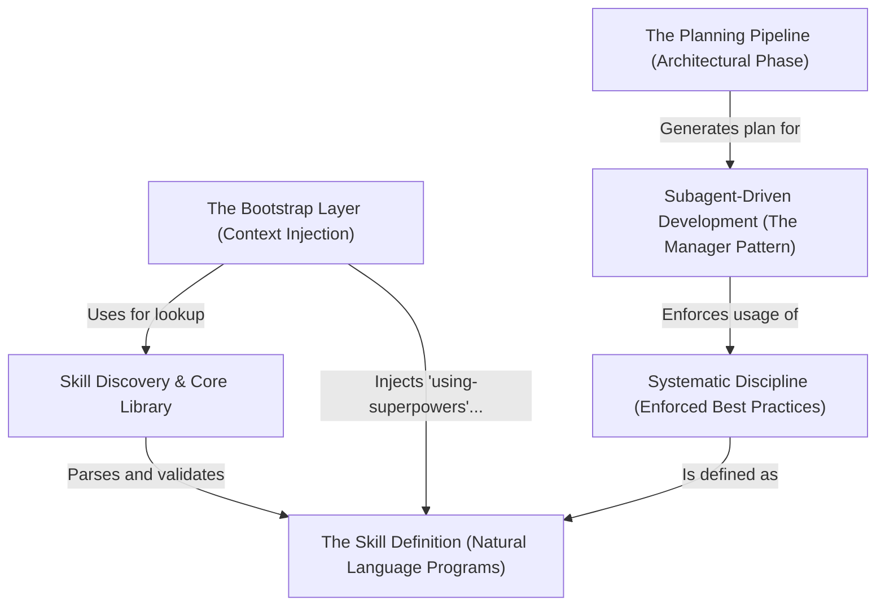

# Tutorial: superpowers

Superpowers is a comprehensive workflow engine for AI coding agents that transforms standard **software engineering best practices** into executable "skills" (markdown files). It separates the development process into distinct phases: an architectural **Planning Pipeline** to design specifications, and a **Subagent-Driven Development** engine where a "General Contractor" agent dispatches isolated sub-agents to execute tasks. The system enforces **Systematic Discipline**, such as *Test-Driven Development (TDD)* and rigorous debugging protocols, ensuring high-quality, reliable code generation.

**Source Repository:** [https://github.com/obra/superpowers](https://github.com/obra/superpowers)

## Chapters

1. [The Skill Definition (Natural Language Programs)](01_the_skill_definition__natural_language_programs_.md)
2. [The Bootstrap Layer (Context Injection)](02_the_bootstrap_layer__context_injection_.md)
3. [Skill Discovery & Core Library](03_skill_discovery___core_library.md)
4. [The Planning Pipeline (Architectural Phase)](04_the_planning_pipeline__architectural_phase_.md)
5. [Subagent-Driven Development (The Manager Pattern)](05_subagent_driven_development__the_manager_pattern_.md)
6. [Systematic Discipline (Enforced Best Practices)](06_systematic_discipline__enforced_best_practices_.md)

---

Generated by [Code IQ](https://github.com/adityasoni99/Code-IQ)