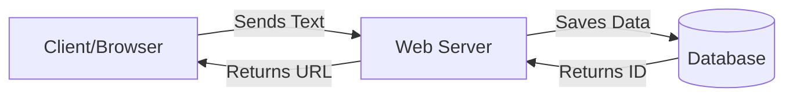
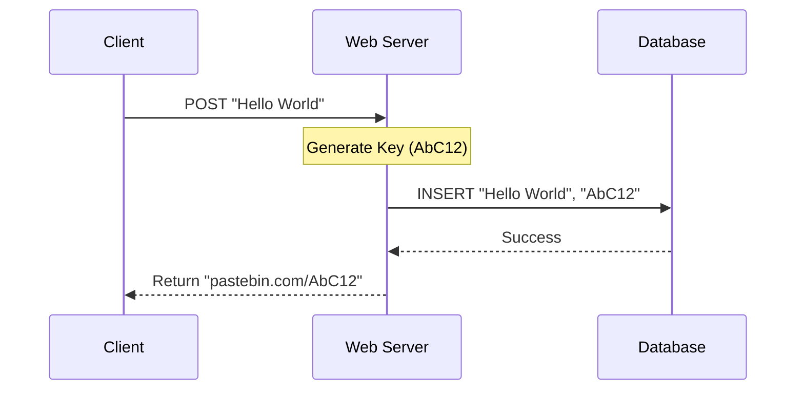
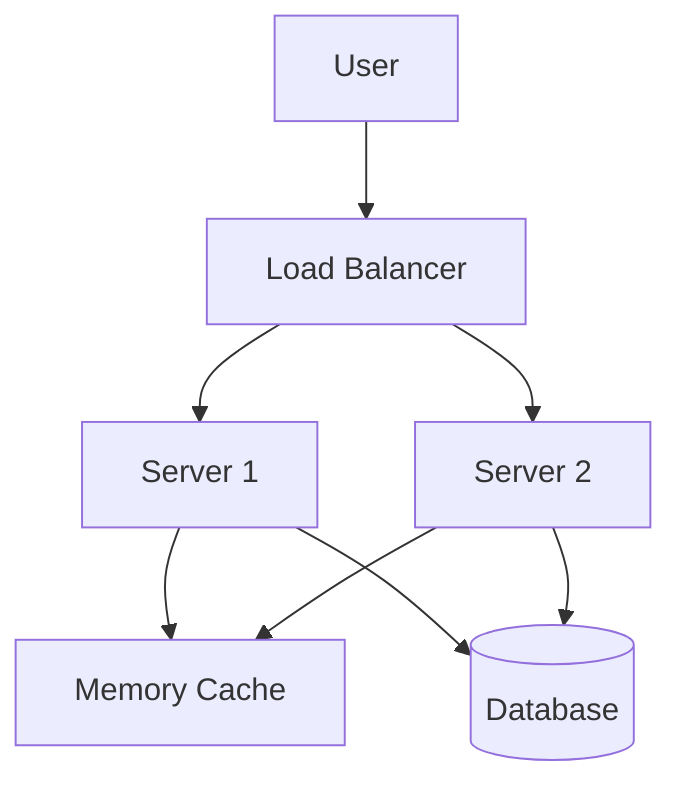

# Chapter 1: System Architecture Design

Welcome to the world of System Design! 

If you were building a small doghouse, you could probably grab some wood, a hammer, and just start building. But if you were building a skyscraper, you couldn't just "wing it." You would need a blueprint. 

**System Architecture Design** is that blueprint for software. It is the process of defining the components, modules, interfaces, and data for a system to satisfy specified requirements.

In this chapter, we will learn the standard framework for designing large systems by building a simple version of **Pastebin** (a service where you paste text and get a link to share it).

## The 4-Step Framework

When designing a system like Twitter, Mint, or a Web Crawler, we generally follow these four steps:

1.  **Outline Use Cases and Constraints**: What are we building?
2.  **Create a High-Level Design**: The big picture diagram.
3.  **Design Core Components**: The specific APIs and Data models.
4.  **Scale the Design**: How to handle millions of users.

---

## Step 1: Outline Use Cases

Before drawing any boxes, we must understand the goal. We call this "scoping."

For our **Pastebin** example, let's define the requirements:

*   **User** enters a block of text.
*   **System** saves it and returns a short, unique URL (like `bit.ly/AbC12`).
*   **User** visits that URL later to read the text.
*   **Constraint**: The system must handle high traffic (e.g., 10 million pastes a month).

---

## Step 2: High-Level Design

Now, let's draw the "Big Picture." At a minimum, most web applications need:
1.  **Client**: The user's browser.
2.  **Web Server**: The computer processing the request.
3.  **Database**: The place where data lives.

Here is the simplest version of our architecture:



This works for one user. But what happens if the Server crashes? Or the Database gets full? That is where **System Architecture** evolves into more complex diagrams involving multiple servers and caching (which we will cover in [Caching and Storage Mechanisms](03_caching_and_storage_mechanisms.md)).

---

## Step 3: Design Core Components

Now we zoom in. How does the server actually talk to the database? What does the data look like?

### The Data Model
We need a place to store the text. In a database, we use a **Table**.

```sql
-- A simplified table schema
CREATE TABLE pastes (
    shortlink CHAR(7) NOT NULL, -- The generated ID (e.g., AbC12)
    content TEXT,               -- The user's pasted text
    created_at DATETIME,        -- When it was made
    PRIMARY KEY(shortlink)
);
```
*Explanation: We use `shortlink` as the primary key so the database can quickly find the text when a user requests the URL.*

### The API (Application Programming Interface)
The client needs a specific way to ask the server to do things. We use **REST APIs**.

**1. Create a Paste (Write)**

```json
// POST request to /api/paste
{
    "content": "Hello, this is my code snippet!"
}
```

**2. Get a Paste (Read)**

```json
// GET request to /api/paste?shortlink=AbC12
{
    "content": "Hello, this is my code snippet!",
    "created_at": "2023-10-27 10:00:00"
}
```

---

## Internal Implementation: How it Works

Let's look at what happens "under the hood" when a user creates a paste.

1.  The server receives the text.
2.  The server generates a unique short key (like `AbC12`).
3.  The server saves the key and text to the database.
4.  The server tells the user the new URL.



### Generating the Short Key

A critical part of this design is converting a long ID into a short string (e.g., ID `1005` becomes `b9`). We often use **Base62 encoding** (a-z, A-Z, 0-9).

Here is simplified logic for generating that key:

```python
# Simplified Base62 logic
def generate_shortlink(id):
    characters = "0123456789abcdefghijklmnopqrstuvwxyzABCDEFGHIJKLMNOPQRSTUVWXYZ"
    base = 62
    shortlink = []
    
    # Mathematical conversion from ID to Base62
    while id > 0:
        val = id % base
        shortlink.append(characters[val])
        id = id // base
        
    return "".join(shortlink[::-1])
```
*Explanation: This function takes a database ID (number) and converts it into a short string of characters that looks like a random URL snippet.*

---

## Step 4: Scale the Design

This is the most important part of System Architecture for large companies. The design above works for 100 users. It fails for 10 million.

When traffic increases, a single server gets overwhelmed (like a single cashier at a busy grocery store).

### 1. Load Balancing
We add a **Load Balancer**. This is a "traffic cop" that sits in front of your servers. We also add multiple servers (Horizontal Scaling).

### 2. Caching
Reading from a database is slow (like walking to the library). Reading from memory is fast (like reading a note in your hand). We add a **Memory Cache** (like Redis) to store popular pastes.

Here is the Scaled Architecture:



### Code: Reading with Cache
Here is how the logic changes when we add a cache. We check the fast memory first, and only hit the slow database if necessary.

```python
def get_paste(shortlink):
    # 1. Try to get from fast Memory Cache
    data = cache.get(shortlink)
    if data:
        return data # Super fast!
        
    # 2. If missing, get from slow Database
    data = db.query("SELECT * FROM pastes WHERE shortlink = ?", shortlink)
    
    # 3. Save to cache for next time
    cache.set(shortlink, data)
    
    return data
```
*Explanation: This pattern prevents the database from being overwhelmed by millions of people reading the exact same popular paste.*

### Database Sharding
If we have billions of pastes, one database is not enough. We split the data across multiple machines. This is called **Sharding**. For example, pastes starting with A-M go to Database 1, and N-Z go to Database 2.

We will explore distributed data deeper in [Distributed Data Processing](05_distributed_data_processing.md).

---

## Summary

In this chapter, we learned the 4-step framework for **System Architecture Design**:

1.  **Requirements**: We defined what a Pastebin needs to do.
2.  **High-Level**: We drew the Client, Server, and Database.
3.  **Components**: We defined the API and Database Table.
4.  **Scaling**: We added Load Balancers and Caching to handle traffic.

This high-level view uses "objects" (Servers, Databases, Caches) interacting with each other. To understand how to model these individual components effectively, we need to look at how we structure our code.

[Next Chapter: Object-Oriented System Modeling](02_object_oriented_system_modeling.md)

---

Generated by [Code IQ](https://github.com/adityasoni99/Code-IQ)