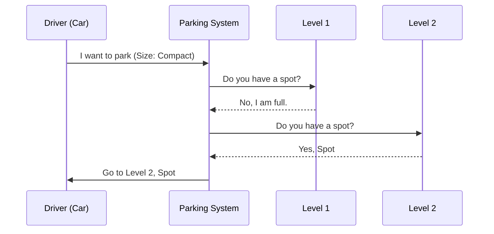

# Chapter 2: Object-Oriented System Modeling

In the previous chapter, [System Architecture Design](01_system_architecture_design.md), we looked at the "City Map" of our software—how servers, databases, and users connect.

Now, we are going to walk inside the building. **Object-Oriented System Modeling** is about designing the logic *inside* your code. It answers the question: "How do I translate real-world business rules into code?"

## What is Object-Oriented Design (OOD)?

Imagine you are managing a **Parking Lot**. You have cars, motorcycles, buses, parking spots, and multiple floor levels.

If you wrote this as a simple script, you might have a messy pile of variables like `car_1_size`, `spot_5_taken`, and `bus_location`. This becomes a nightmare to manage.

**OOD** allows us to create **Classes** (blueprints) representing these real-world things.
*   **Entities**: We define what a `Vehicle` is and what a `Spot` is.
*   **Interactions**: We define how a `Vehicle` takes a `Spot`.

---

## The Use Case: Designing a Parking Lot

Let's build a system that manages a parking lot.

**Requirements:**
1.  The lot has multiple **Levels**.
2.  We have different types of vehicles: **Motorcycles**, **Cars**, and **Buses**.
3.  A spot can be filled or empty.
4.  Large vehicles (Buses) cannot park in small spots (Compact).

---

## Concept 1: The Blueprint (Class vs. Object)

First, we need to define what a "Vehicle" looks like in our digital world.

In Python, we use a **Class** to define the shape of the data. We will create a generic `Vehicle` class.

```python
from enum import Enum

class VehicleSize(Enum):
    MOTORCYCLE = 0
    COMPACT = 1
    LARGE = 2

class Vehicle:
    def __init__(self, vehicle_size, license_plate):
        self.vehicle_size = vehicle_size
        self.license_plate = license_plate
        self.spots_taken = []
```
*Explanation: This is our blueprint. Every vehicle, regardless of type, has a size and a license plate.*

### Inheritance
We don't want to rewrite code for every specific type of vehicle. We use **Inheritance**. A `Car` *is a* `Vehicle`.

```python
class Car(Vehicle):
    def __init__(self, license_plate):
        # A Car is always 'COMPACT' size
        super().__init__(VehicleSize.COMPACT, license_plate)

    def can_fit_in_spot(self, spot):
        # Checks if the spot is big enough
        return spot.size in (VehicleSize.LARGE, VehicleSize.COMPACT)
```
*Explanation: The `Car` class inherits everything from `Vehicle`, but it automatically sets its size to COMPACT. This keeps our code clean (DRY - Don't Repeat Yourself).*

---

## Concept 2: Composition (Building the Hierarchy)

A **Parking Lot** isn't just one thing. It is made of **Levels**, and Levels are made of **Spots**. This relationship is called **Composition**.

1.  **ParkingLot** has a list of `Levels`.
2.  **Level** has a list of `ParkingSpots`.

Let's define the `ParkingSpot`.

```python
class ParkingSpot:
    def __init__(self, level, row, number, size):
        self.level = level
        self.number = number
        self.size = size
        self.vehicle = None # Starts empty

    def is_available(self):
        return self.vehicle is None
```
*Explanation: Each spot knows where it is (level/row) and if it is currently holding a car (`self.vehicle`).*

---

## Internal Implementation: How Parking Works

Now that we have our "Lego blocks" (Vehicle, Spot, Level), let's see how they interact when a driver enters.

### The Flow
When a car arrives, the system must ask: "Is there space on Level 1? No? Check Level 2."



### The Code Implementation

Let's write the logic for the **ParkingLot** class to handle this request.

```python
class ParkingLot:
    def __init__(self, num_levels):
        self.levels = [] 
        # Logic to create 'num_levels' would go here

    def park_vehicle(self, vehicle):
        # Ask each level if it has space
        for level in self.levels:
            if level.park_vehicle(vehicle):
                return True # Success!
        return False # Lot is full
```
*Explanation: The Parking Lot acts as the manager. It doesn't know the details of every spot; it delegates that work to the `Level`.*

Now, let's look at the **Level** logic. This is where the actual search happens.

```python
class Level:
    def __init__(self, floor, total_spots):
        self.spots = [] # List of ParkingSpot objects

    def park_vehicle(self, vehicle):
        # Find a spot that fits
        spot = self._find_available_spot(vehicle)
        
        if spot:
            spot.park_vehicle(vehicle) # Occupy the spot
            return True
        return False
```
*Explanation: The Level loops through its specific spots. If it finds a match, it tells the spot to "take" the vehicle.*

---

## Why Use This Approach?

You might ask, "Why write all these classes instead of one big function?"

1.  **Encapsulation**: The logic for a `Car` stays inside the `Car` class. If we change how cars work, we don't break the `ParkingLot`.
2.  **Scalability**: If we want to add a `Helicopter` vehicle or a `VIPLevel`, we just create new classes. We don't have to rewrite the whole system.
3.  **Readability**: Code like `if spot.is_available():` reads like plain English.

### Another Example: A Call Center
The same principles apply elsewhere. In a **Call Center** system:
*   **Entities**: `Employee`, `Manager`, `Director`.
*   **Inheritance**: `Manager` inherits from `Employee` but has higher priority.
*   **Logic**: If an `Employee` can't handle a call, `escalate_call()` moves it to a `Manager`.

By modeling these as objects, we create a digital simulation of the real business.

---

## Summary

In this chapter, we learned:
1.  **Classes and Objects**: How to create digital blueprints for real-world things.
2.  **Inheritance**: How `Car` and `Bus` share common traits from `Vehicle`.
3.  **Composition**: How a `ParkingLot` is built of `Levels`, which are built of `Spots`.

However, our Parking Lot currently lives entirely in the computer's RAM. If we restart the script, all the parked cars disappear! To make this a real application, we need to save the data permanently and retrieve it quickly.

[Next Chapter: Caching and Storage Mechanisms](03_caching_and_storage_mechanisms.md)

---

Generated by [Code IQ](https://github.com/adityasoni99/Code-IQ)