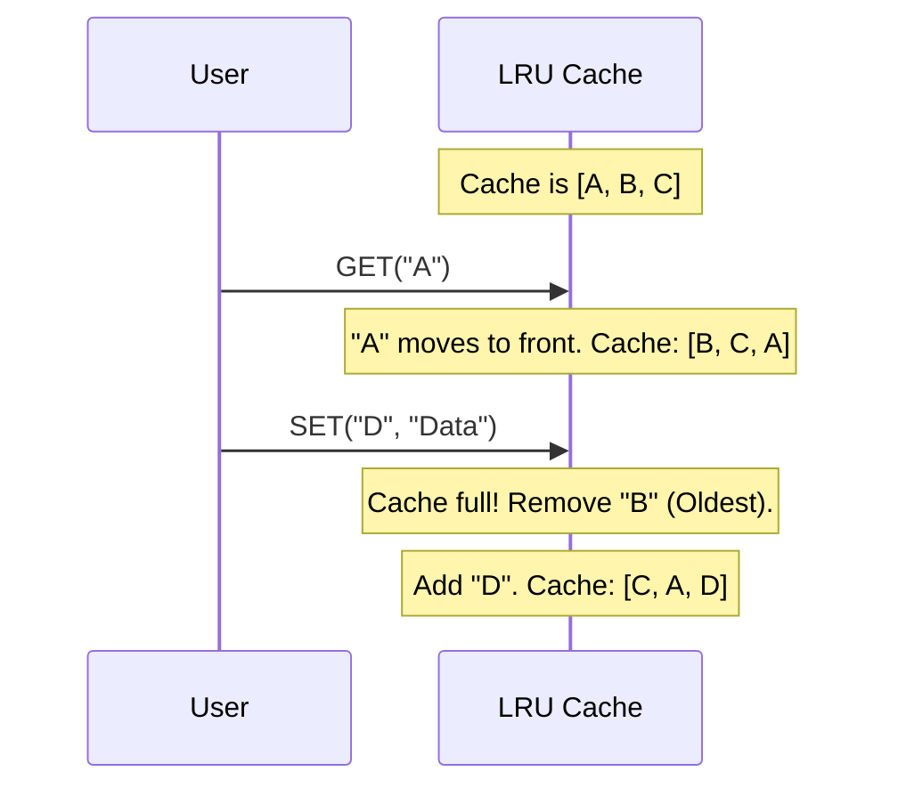

# Chapter 3: Caching and Storage Mechanisms

In the previous chapter, [Object-Oriented System Modeling](02_object_oriented_system_modeling.md), we learned how to structure code using Classes and Objects. We built a Parking Lot system where cars occupied spots in our computer's memory.

However, there was a catch: **Memory (RAM) is volatile.** If the server restarts, the parking lot becomes empty. To make data permanent, we need a Database (Hard Disk). But reading from a hard disk is slow—sometimes 100x slower than reading from RAM.

This creates a dilemma:
*   **Database**: Permanent, but slow.
*   **Memory**: Fast, but temporary.

**Caching** is the bridge between these two. It is the strategy of keeping frequently used data in fast memory to avoid slow database trips. It acts as your system's "Short-Term Memory."

---

## The Use Case: A Search Engine

Imagine we are building a search engine like Google.
1.  A user searches for "System Design Primer".
2.  Our server searches billions of documents in the database.
3.  It takes 2 seconds to find the answer.

If 10,000 people search for "System Design Primer" every hour, we don't want to repeat that slow 2-second database hunt every time.

**Solution**: The *first* time someone searches, we save the result in a **Cache**. The *next* 9,999 people get the result instantly from memory.

---

## High-Level Design: Where does the Cache live?

The cache sits between your Web Server and your Database.

```mermaid
flowchart LR
    User --> Server[Web Server]
    Server -->|1. Check Cache| Cache[Memory Cache]
    Cache -->|2. Return Data (Hit)| Server
    Cache -.->|3. Missing? (Miss)| Server
    Server -->|4. Fetch from DB| DB[(Database)]
    Server -->|5. Save to Cache| Cache
```

*   **Cache Hit**: The data is in the cache. Super fast!
*   **Cache Miss**: The data is not there. We must go to the slow database, then save the result to the cache for next time.

---

## Core Concept 1: The Hash Table (The Lookup)

How does the cache find data so fast? It uses a data structure called a **Hash Table** (or Dictionary in Python).

Imagine a library.
*   **Database**: Walking through the shelves looking for a book (Slow - Linear Search).
*   **Hash Table**: Looking up the book ID in the computer system (Fast - Constant Time).

In a Hash Table, every piece of data has a unique **Key**.

```python
# A simple Hash Table (Dictionary) in Python
cache = {}

# We map a Query (Key) to a Result (Value)
cache["system design"] = "A guide to building scalable systems..."
cache["python"] = "A popular programming language..."
```

Accessing `cache["system design"]` is instant, regardless of whether you have 10 items or 10 million items.

---

## Core Concept 2: Eviction Policies (LRU)

Memory is expensive and limited. We cannot cache everything. When the cache gets full, we must decide what to delete to make room for new data. This is called an **Eviction Policy**.

The most popular policy is **LRU (Least Recently Used)**.

**The Rule**:
1.  Keep the most popular items at the **Front**.
2.  When an item is accessed, move it to the **Front**.
3.  If the cache is full, delete the item at the **Back** (the one nobody has looked at for the longest time).

---

## Internal Implementation: Building an LRU Cache

To build an efficient LRU Cache, we combine two data structures:
1.  **Hash Table**: For instant lookups (`get` the data).
2.  **Doubly Linked List**: For tracking the order (`move` to front).

### Step-by-Step Visualization

Let's trace what happens when we use a cache with a **Max Size of 3**.



### The Code

We will write a simplified `LRUCache` class. This builds on the skills from [Object-Oriented System Modeling](02_object_oriented_system_modeling.md).

#### 1. The Wrapper (Node)
First, we wrap our data in a "Node" so we can link items together.

```python
class Node:
    def __init__(self, key, value):
        self.key = key
        self.value = value
        self.prev = None # Link to the item behind this
        self.next = None # Link to the item ahead of this
```

#### 2. The Cache Structure
The cache needs a generic dictionary for lookups and a size limit.

```python
class LRUCache:
    def __init__(self, capacity):
        self.capacity = capacity
        self.lookup = {} # The Hash Table
        # We use dummy nodes for Head (newest) and Tail (oldest)
        self.head = Node(0, 0) 
        self.tail = Node(0, 0)
        self.head.next = self.tail
        self.tail.prev = self.head
```
*Explanation: `self.lookup` lets us find a node instantly. The `head` and `tail` are empty placeholders to help us organize the list.*

#### 3. Getting Data (Read)
When we read data, we must move it to the "newest" position (right after head).

```python
    def get(self, key):
        if key in self.lookup:
            node = self.lookup[key]
            self._remove(node) # Helper to detach node
            self._add(node)    # Helper to move to front
            return node.value
        return -1 # Not found
```
*Explanation: If the key exists, we technically "delete" it from its current spot and "re-add" it to the front. This updates its "freshness."*

#### 4. Setting Data (Write)
When we save data, we check if we are full. If so, we delete the oldest item.

```python
    def put(self, key, value):
        if key in self.lookup:
            self._remove(self.lookup[key]) # Remove old version
            
        node = Node(key, value)
        self._add(node) # Add new version to front
        self.lookup[key] = node
        
        if len(self.lookup) > self.capacity:
            # Too full! Delete the guy at the back (prev to tail)
            oldest = self.tail.prev
            self._remove(oldest)
            del self.lookup[oldest.key]
```
*Explanation: This is the magic of LRU. We enforce the limit by sacrificing the `tail.prev` node.*

---

## When to use this?

You don't always need to write this code yourself. Tools like **Redis** or **Memcached** are pre-built, high-performance caches that use these exact concepts.

You should use Caching when:
1.  **Read Heavy**: You read data much more often than you change it (e.g., a Twitter profile, a News article).
2.  **Tolerance for Staleness**: It's okay if the data is 5 seconds old (e.g., YouTube view count).

You should **NOT** use Caching when:
1.  **Consistency is Critical**: If bank balance changes, you need the exact number immediately, not a cached version from 1 minute ago.

---

## Scaling the Cache

Just like we learned in [System Architecture Design](01_system_architecture_design.md), a single computer has limits. If we have 100GB of data to cache, but our server only has 16GB of RAM, we need to split the data.

This is called **Distributed Caching**. We might use a technique called **Sharding** (e.g., User IDs 1-100 go to Cache Server A, 101-200 go to Cache Server B). We will look closer at distributed systems in [Distributed Data Processing](05_distributed_data_processing.md).

---

## Summary

In this chapter, we learned:
1.  **The Motivation**: Databases are slow; Memory is fast.
2.  **Hash Tables**: Provide *O(1)* (instant) lookups.
3.  **LRU Policy**: A strategy to keep popular items and discard old ones.
4.  **Implementation**: Combining a Dictionary with a Linked List to manage data efficiently.

Now that we can store objects (Chapter 2) and retrieve them quickly (Chapter 3), we face a new challenge: **Relationships**.

How do we model connections, like "Friend lists" on Facebook or "Route maps" in Uber? A simple list or cache isn't enough. We need to understand graphs.

[Next Chapter: Graph Relationships and Search](04_graph_relationships_and_search.md)

---

Generated by [Code IQ](https://github.com/adityasoni99/Code-IQ)