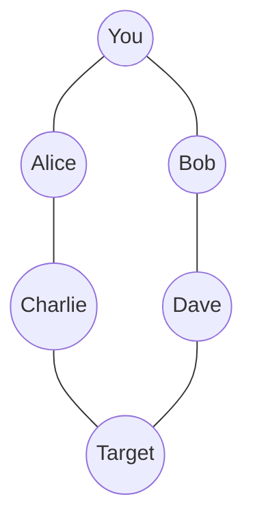
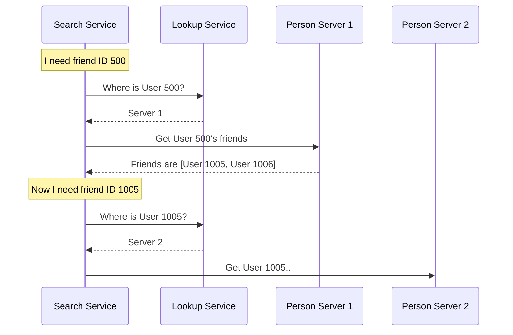

# Chapter 4: Graph Relationships and Search

In the previous chapter, [Caching and Storage Mechanisms](03_caching_and_storage_mechanisms.md), we learned how to make our system fast by keeping popular data in memory (RAM).

But speed isn't the only challenge. Sometimes, the **relationships** between data matter more than the data itself.

Imagine you are building **LinkedIn** or **Facebook**. The most important feature isn't just storing a user's name; it's storing who they know. You need to answer questions like:
*   "Who are the mutual friends between Alice and Bob?"
*   "How is User A connected to User Z?" (e.g., User A -> Friend 1 -> Friend 2 -> User Z).

This is where **Graph Theory** comes in. A Graph is a data structure that models relationships. In this chapter, we will build a system to find the "Shortest Path" between two people.

---

## Core Concept 1: The Graph (Nodes and Edges)

Standard databases (like spreadsheets) are great for lists. They are terrible for webs of connections.

In a **Graph**, we have two main ingredients:
1.  **Node (Vertex)**: The entity (e.g., a Person, a City).
2.  **Edge**: The relationship (e.g., "is friends with", "connected by road").

### Visualizing a Social Network



In the diagram above:
*   **You** are connected to **Alice** (1 hop).
*   **Alice** is connected to **Charlie** (1 hop).
*   Therefore, **You** are connected to **Charlie** via **Alice** (2 hops).

### The Data Model

How do we represent this in code? We don't need a complex library. We can just use a Class where every Person stores a list of their friends' IDs.

```python
class Person:
    def __init__(self, id, name):
        self.id = id
        self.name = name
        # The edges (connections)
        self.friend_ids = [] 
        
    def add_friend(self, friend_id):
        self.friend_ids.append(friend_id)
```
*Explanation: `friend_ids` acts as our list of "Edges." If ID `100` is in this list, there is a line connecting us to them.*

---

## The Use Case: "How do I know Kevin Bacon?"

Our goal is to write a function `find_shortest_path(start_user, end_user)`.
If you want to reach the **Target**, is it faster to go through Alice or Bob?

To solve this, we use an algorithm called **Breadth-First Search (BFS)**.

### Why BFS?
Imagine dropping a stone in a pond. The ripples move out in perfect circles.
1.  First, it touches everything 1 meter away.
2.  Then, it touches everything 2 meters away.

**BFS** works the same way. It checks all your direct friends first. Then it checks all friends-of-friends. This guarantees that the first time you find the target, it is the **shortest path**.

---

## Internal Implementation: The Search Algorithm

Let's simulate a search for "Target" starting from "You".

1.  **Queue**: `[You]`
2.  Check `You`. Are you "Target"? No. Add friends `[Alice, Bob]` to Queue.
3.  Check `Alice`. Are you "Target"? No. Add `[Charlie]` to Queue.
4.  Check `Bob`. Are you "Target"? No. Add `[Dave]` to Queue.
5.  Check `Charlie`. Are you "Target"? No. Add `[Target]`... **Found him!**

### The Code: BFS

We use a `Queue` (First-In, First-Out) to manage who we check next.

```python
from collections import deque

def shortest_path(source, destination):
    queue = deque()
    queue.append(source) # Start with yourself
    
    # Keep track of who we visited to avoid loops
    visited = set([source.id]) 
    
    # To reconstruct the path, we remember who introduced whom
    parents = {source.id: None} 

    while queue:
        current_person = queue.popleft()
        
        if current_person.id == destination.id:
            return reconstruct_path(parents, destination.id)
            
        for friend_id in current_person.friend_ids:
            if friend_id not in visited:
                visited.add(friend_id)
                parents[friend_id] = current_person.id
                # In a real app, we would fetch the Person object here
                friend_obj = get_person(friend_id) 
                queue.append(friend_obj)
    return None
```
*Explanation: We loop through the queue. For every person, we look at their friends. If we haven't seen a friend before, we add them to the back of the line (queue).*

---

## Scaling: When the Graph is too Big

The code above works great if all 100 users fit on your laptop. But Facebook has billions of users. You cannot load a billion `Person` objects into one list.

We must use **Sharding**.
We split the users across different servers (e.g., Users 1-1,000,000 on Server A; Users 1,000,001-2,000,000 on Server B).

### The Architecture

We introduce a **Lookup Service**. It acts like a phonebook directory. It tells us which server holds a specific user.



### Implementing the Lookup

The **Lookup Service** is a simple map. In a real system, this might be a fast database or a cache.

```python
class LookupService:
    def __init__(self):
        # Maps Person ID -> Server Instance
        self.directory = {} 

    def register_person(self, person_id, server):
        self.directory[person_id] = server

    def get_server_for_user(self, person_id):
        return self.directory.get(person_id)
```
*Explanation: This service answers the question: "Which computer is User 123 stored on?"*

### Implementing the Person Server

The **Person Server** holds a chunk of the total users.

```python
class PersonServer:
    def __init__(self):
        self.people = {} # Local storage for this specific server

    def get_person(self, person_id):
        return self.people.get(person_id)

    def add_person(self, person):
        self.people[person.id] = person
```
*Explanation: This is just a container. In the real world, "Server 1" and "Server 2" would be physical machines miles apart.*

### The Distributed Search

Now, our BFS algorithm changes slightly. Instead of just accessing `person.friends` directly, we have to ask the Lookup Service where to find them.

```python
class UserGraphService:
    def __init__(self, lookup_service):
        self.lookup = lookup_service

    def get_person_from_network(self, person_id):
        # 1. Find the server
        server = self.lookup.get_server_for_user(person_id)
        # 2. Ask that server for the person
        return server.get_person(person_id)
```

This tiny change adds complexity (Network Latency), but allows us to have infinite users by just adding more Person Servers!

---

## Optimization: Bi-Directional Search

If you are looking for a path from New York to Los Angeles, you don't just start walking from NY. You start a team in NY walking West, and a team in LA walking East. Where they meet is your path.

**Bi-Directional Search** runs two BFS searches simultaneously:
1.  Source -> Friends -> ...
2.  Destination -> Friends -> ...

This is much faster because the search radius is smaller for both sides.

---

## Summary

In this chapter, we explored **Graph Relationships**:

1.  **Graphs**: Modeled users as Nodes and friendships as Edges.
2.  **BFS**: Used the Breadth-First Search algorithm to find the shortest path (ripple effect).
3.  **Sharding**: Learned that massive graphs must be split across multiple servers.
4.  **Lookup Service**: Created a directory to find which server holds which user.

We now have a system that can store data, cache it, and map connections between it. But what happens when we need to perform heavy calculations on this data, like counting how many friends *every* user has, all at once?

For that, we need to process data in parallel.

[Next Chapter: Distributed Data Processing](05_distributed_data_processing.md)

---

Generated by [Code IQ](https://github.com/adityasoni99/Code-IQ)