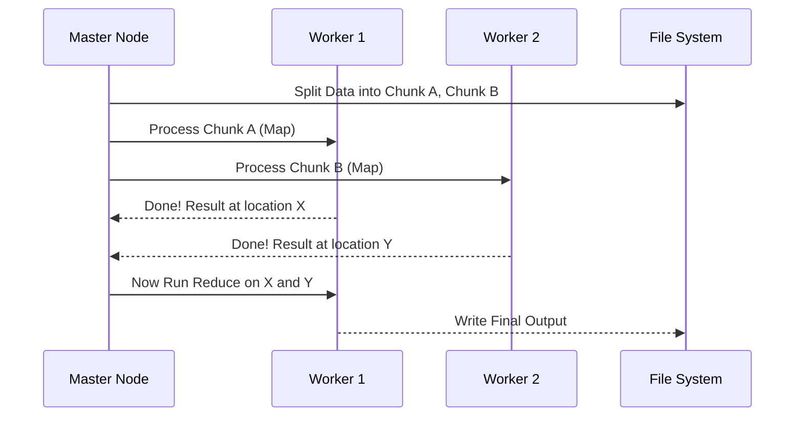

# Chapter 5: Distributed Data Processing

In the previous chapter, [Graph Relationships and Search](04_graph_relationships_and_search.md), we learned how to map connections between data, like finding the shortest path between two friends.

But what if we aren't just looking for *one* path? What if we need to analyze *everything*?

Imagine you have a stack of 1,000,000 receipts from a grocery store, and you need to calculate the total sales for "Bananas."

If you do this alone (one computer), it might take a week. But if you hire 1,000 friends (machines) and give each friend 1,000 receipts, you can finish in minutes.

**Distributed Data Processing** is the art of breaking a massive task into tiny pieces, processing them in parallel on many machines, and combining the results.

---

## The Use Case: Counting URL Hits

Let's look back at our **Pastebin** example from [System Architecture Design](01_system_architecture_design.md).

Every time someone visits a paste (like `pastebin.com/AbC12`), we save a log entry:
```text
2023-10-27 10:00:01, /AbC12
2023-10-27 10:00:02, /XyZ99
2023-10-27 10:00:03, /AbC12
... (1 Billion more lines) ...
```

**Goal**: We want to know: "How many times was `/AbC12` visited in October?"

We cannot load a 1-billion-line file into memory. We need a strategy called **MapReduce**.

---

## Core Concept: MapReduce

MapReduce is a programming model Google made famous. It works like a kitchen brigade.

### 1. The Map Phase (The Chopping)
Imagine we give a page of logs to a worker. The worker's only job is to look at a line and say, "I saw `/AbC12` one time."

**Input**: A line of text.
**Output**: A Key-Value pair `(URL, 1)`.

### 2. The Shuffle Phase (The Sorting)
The system groups all the results by Key. All the `/AbC12` notes go to one pile. All the `/XyZ99` notes go to another pile.

### 3. The Reduce Phase (The Cooking)
A different worker takes the `/AbC12` pile. They don't need to read the original logs. They just look at the notes: "1, 1, 1... okay, that's 3 total."

---

## High-Level Design: The Flow

Here is how data flows through the system:

```mermaid
flowchart LR
    Input[Big Log File] --> Split1[Split A]
    Input --> Split2[Split B]
    
    Split1 --> Map1[Worker 1 (Map)]
    Split2 --> Map2[Worker 2 (Map)]
    
    Map1 -->|"/AbC12", 1| Shuffle
    Map2 -->|"/AbC12", 1| Shuffle
    
    Shuffle -->|List: 1, 1| Reduce[Worker 3 (Reduce)]
    
    Reduce --> Output[Final Count: 2]
```

---

## Coding the Solution

We will use a Python library called `mrjob` which hides the complex messy parts (like sending data over networks) and lets us focus on the logic.

### Step 1: The Mapper

The Mapper looks at one line at a time. It extracts the data we care about (the URL) and "yields" a count of 1.

```python
    def mapper(self, _, line):
        # Line looks like: "2023-10-27, /AbC12"
        data = line.split(',') 
        url = data[1].strip()
        
        # We output: (Key, Value)
        yield url, 1
```
*Explanation: We don't try to add anything up yet. We just shout, "I found one /AbC12!"*

### Step 2: The Reducer

The Reducer receives a key (the URL) and a list of all the "1"s found by all the mappers.

```python
    def reducer(self, key, values):
        # key = "/AbC12"
        # values = [1, 1, 1, 1, ...]
        
        total_hits = sum(values)
        
        yield key, total_hits
```
*Explanation: The `sum()` function adds up the list. If 500 different workers each found the URL once, the list has 500 ones. The sum is 500.*

### Step 3: Putting it Together

Here is the complete code structure (based on `solutions/system_design/pastebin/pastebin.py`).

```python
from mrjob.job import MRJob

class HitCounts(MRJob):

    def mapper(self, _, line):
        # extract_url is a helper function to parse text
        url = self.extract_url(line) 
        yield url, 1

    def reducer(self, key, values):
        yield key, sum(values)

if __name__ == '__main__':
    HitCounts.run()
```
*Explanation: This script can be run on your laptop for small files, or sent to a cluster (like Amazon EMR) to run on 1,000 servers automatically.*

---

## Internal Implementation: How it Works Under the Hood

You might wonder: "Who coordinates all these workers?"

This architecture requires a **Master Node** (The Manager).

1.  **Job Submission**: You send the code to the Master.
2.  **Splitting**: The Master looks at the 10TB file stored in the Distributed File System (DFS). It splits it into 64MB chunks.
3.  **Assignment**: The Master assigns chunks to idle Worker machines.
4.  **Failure Handling**: If Worker A crashes (smoke comes out), the Master notices it didn't finish and gives that chunk to Worker B.

### Sequence Diagram



---

## Another Example: Sales Ranking

What if we want to sort items? For example, finding the "Best Selling Product."
This requires **Chaining** jobs.

1.  **Job 1 (Filter)**: Keep only sales from the last 7 days.
2.  **Job 2 (Sort)**: Sort the results by quantity.

Here is how a simplified `SalesRanker` works (from `solutions/system_design/sales_rank/sales_rank_mapreduce.py`):

```python
    def steps(self):
        # We tell the system to run two steps in order
        return [
            self.mr(mapper=self.mapper_sum, 
                    reducer=self.reducer_sum),
            self.mr(mapper=self.mapper_sort,
                    reducer=self.reducer_identity)
        ]
```
*Explanation: The output of step 1 becomes the input of step 2. This is how we build complex data pipelines.*

### The Sorting Trick
MapReduce sorts keys automatically between Map and Reduce. If we want to sort by sales numbers, we make the "Number of Sales" the key.

```python
    def mapper_sort(self, product_id, total_sales):
        # Make the sales count the KEY
        # Format: (Sales Count, Product Name)
        yield total_sales, product_id
```
*Explanation: Because the system sorts keys, the products will arrive at the reducer in order (e.g., 10 sales, then 20 sales, then 100 sales).*

---

## Summary

In this tutorial series, we have traveled from the basics to advanced scale.

1.  **[System Architecture Design](01_system_architecture_design.md)**: We built the blueprint.
2.  **[Object-Oriented System Modeling](02_object_oriented_system_modeling.md)**: We organized our logic into classes.
3.  **[Caching and Storage Mechanisms](03_caching_and_storage_mechanisms.md)**: We made it fast with memory.
4.  **[Graph Relationships and Search](04_graph_relationships_and_search.md)**: We connected the data.
5.  **Distributed Data Processing**: We learned how to process massive data by splitting the work (Map) and combining the answers (Reduce).

**Congratulations!** You now understand the fundamental building blocks used by software architects to design systems like Google, Amazon, and Facebook.

While specific tools (like Kubernetes, Kafka, or React) will change over time, these core concepts—Architecture, Data Modeling, Caching, Graph Theory, and Distributed Processing—remain the foundation of modern software engineering.

---

Generated by [Code IQ](https://github.com/adityasoni99/Code-IQ)