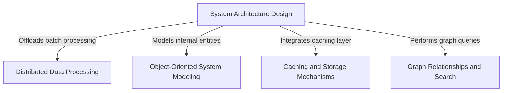

# Tutorial: system-design-primer

This project serves as a comprehensive educational guide for mastering **system design** and **object-oriented design** interviews. It provides architectural blueprints for large-scale services like *Twitter* and *Mint*, while offering Python code implementations for core components such as **MapReduce** jobs, **LRU caches**, and **social graph** algorithms to demonstrate scalability and efficient data processing.

**Source Repository:** [https://github.com/donnemartin/system-design-primer](https://github.com/donnemartin/system-design-primer)

## Chapters

1. [System Architecture Design](01_system_architecture_design.md)
2. [Object-Oriented System Modeling](02_object_oriented_system_modeling.md)
3. [Caching and Storage Mechanisms](03_caching_and_storage_mechanisms.md)
4. [Graph Relationships and Search](04_graph_relationships_and_search.md)
5. [Distributed Data Processing](05_distributed_data_processing.md)

---

Generated by [Code IQ](https://github.com/adityasoni99/Code-IQ)