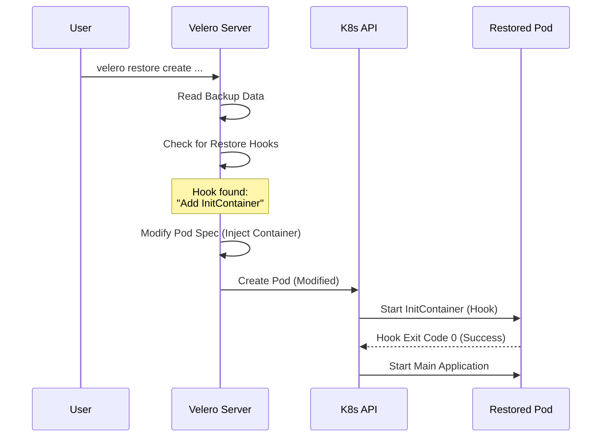

# Chapter 1: Overview of Restore Hooks

Welcome to the first chapter of our deep dive into Velero's Restore Hooks! If you have ever performed a system restore, you know that simply putting files back where they belong isn't always enough. Sometimes, the application needs a little "nudge" to start working correctly again.

## The Motivation: Moving House Analogy

Imagine you are moving into a new house.
1.  **Backup:** You pack all your items into boxes.
2.  **Restore:** Movers drop all the boxes into your new living room.

If you immediately invite guests over (start the application), it will be a disaster. The boxes are there, but the TV isn't plugged in, and the dishes aren't in the cupboards.

**Restore Hooks** are the steps you take *after* the boxes arrive but *before* you invite guests. They allow you to:
*   Reset database passwords.
*   Clear out temporary cache files that shouldn't be restored.
*   Update configuration files to match the new environment.

### A Concrete Use Case
Let's say you are restoring a **PostgreSQL** database. When the database comes up from a backup, it might contain an old "PID file" (a file that says "I am running") from the previous crash. If the database sees this file, it might refuse to start, thinking it's already running.

**The Solution:** Use a Restore Hook to delete that PID file *before* the database application tries to start.

## Key Concepts

Velero provides two main ways (hooks) to perform these actions during a restore. These bring feature parity with *Backup Hooks* (which you might already use to freeze data before backing up).

### 1. InitContainer Hooks
In Kubernetes, a Pod can have "InitContainers." These are helper containers that run and complete **before** your main application container starts.

Velero can automatically inject an InitContainer into your restored Pod.
*   **Best for:** Setup tasks that must finish before the app starts.
*   **Example:** "Download this config file before the web server starts."

### 2. Exec Hooks
This involves executing a command directly inside a container.
*   **Best for:** Running binaries or scripts that already exist inside your container image.
*   **Example:** `pg_ctl restart` or `rm /tmp/session.lock`.

## How It Works: High-Level View

To solve our PostgreSQL use case (removing the PID file), we don't need to manually edit Kubernetes YAML files. We just tell Velero what we want to do.

Velero allows you to define these hooks in two places:
1.  **In the Restore Spec:** Rules that apply to the restore job globally.
2.  **In Pod Annotations:** Rules attached to specific Pods inside the backup.

Here is a simplified conceptual example of what we want to achieve. We want to tell the Pod: "Hey, before you run `postgres`, run `rm /var/run/postgresql/postmaster.pid`."

## Under the Hood: The Internal Implementation

How does Velero actually make this happen? It doesn't magically pause Kubernetes. Instead, it modifies the definition of your application *before* Kubernetes even sees it.

### The Restore Workflow

When you ask Velero to restore a backup, it reads the stored data and reconstructs the Kubernetes objects (like Deployments and Pods).

1.  Velero reads the **Pod** definition from the backup.
2.  Velero checks if there are any **Hooks** defined (via Annotations or the Restore Spec).
3.  If an **InitContainer Hook** is found, Velero *modifies* the Pod definition to add a new container at the beginning of the list.
4.  Velero submits this *modified* Pod to the Kubernetes API.
5.  Kubernetes starts the Pod. The InitContainer runs first (executing your hook).
6.  Once the hook finishes successfully, Kubernetes starts your main application.

### Sequence Diagram

Here is a sequence diagram illustrating this flow:



### Code Implementation Insight

While we won't dive deep into the Go code just yet, it's helpful to understand that Velero uses a "Patch" mechanism.

Inside Velero's code structure (specifically in the `pkg/restore` logic), the restorer looks for specific annotations. If it finds a request for a hook, it creates a structure like this (simplified):

```go
// Conceptual Go code snippet inside Velero's restore logic
// This represents creating the InitContainer definition
initContainer := corev1.Container{
    Name:  "velero-restore-init",
    Image: "alpine:latest", // Or the user's image
    Command: []string{"/bin/sh", "-c", "rm /var/run/postmaster.pid"},
    VolumeMounts: originalVolumeMounts, // Needs access to the same data
}

// Prepend this container to the Pod's Spec
pod.Spec.InitContainers = append([]corev1.Container{initContainer}, pod.Spec.InitContainers...)
```
*Explanation:* The code above creates a standard Kubernetes Container object. Crucially, it copies `VolumeMounts` so the hook can access the same data files as the main application. Finally, it adds this container to the front of the `InitContainers` list of the Pod being restored.

## Summary

In this chapter, we learned:
*   **Restore Hooks** allow us to perform actions after files are restored but before applications start.
*   They are essential for tasks like database cleanup or configuration resets.
*   They come in two flavors: **InitContainer** and **Exec**.
*   Velero implements this by modifying the Pod specification "on the fly" during the restore process.

In the next chapter, we will look at how to define these rules globally using the Restore Custom Resource Definition (CRD).

[Next Chapter: Configuration via Restore CRD Spec](02_configuration_via_restore_crd_spec.md)

---

Generated by [Code IQ](https://github.com/adityasoni99/Code-IQ)