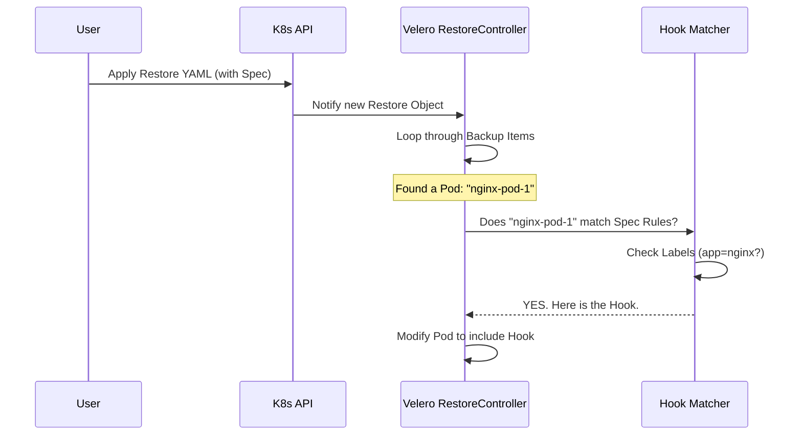

# Chapter 2: Configuration via Restore CRD Spec

Welcome back! In the [Overview of Restore Hooks](01_overview_of_restore_hooks.md), we learned *what* hooks are (InitContainer and Exec) and *why* we need them (to clean up before an app starts).

Now, we need to answer the question: **Where do we write these rules?**

## The Motivation: The "Company Policy" Analogy

Imagine you manage a company with 100 employees. You want everyone to wear a security badge.

You have two ways to enforce this:
1.  **The Micro-Manager Way:** Go to every single employee's desk and stick a note on their monitor saying, "Wear your badge."
2.  **The Policy Way:** Write one rule in the Employee Handbook: "If you work here, wear a badge."

**Configuration via Restore CRD Spec** is the "Policy Way."

If you have 50 web servers and you want *all* of them to clear a cache file upon restore, you don't want to edit 50 individual configuration files. Instead, you create a **Restore Rule** that says: "For any Pod labeled `app: web-server`, run this command."

## Concept: The Restore CRD

In Kubernetes, when you run `velero restore create`, you are actually creating a **Custom Resource** called a `Restore`. This resource is a text file (YAML) that contains the "Master Plan" for your restoration.

We can add a special section called `hooks` to this Master Plan.

### The "No CLI Flag" Warning
⚠️ **Important Note:** Unlike many Velero features, you **cannot** configure complex hooks using simple flags in the terminal (like `--hooks="do this"`).

To use the powerful "Policy Way" of configuration, you must write a **YAML file** and submit it to Kubernetes.

## How to Configure It

Let's solve a specific use case: **"I want to reset the `maintenance-mode` flag on all my Nginx servers."**

### Step 1: Target the Pods (Label Selector)

First, we need to tell Velero which Pods this rule applies to. We use a **Label Selector**. This acts like a filter.

```yaml
# Part of the Restore YAML
spec:
  hooks:
    resources:
      - name: my-hook
        includedNamespaces:
        - prod
        labelSelector:
          matchLabels:
            app: nginx  # <--- The Filter
```
*Explanation:* This snippet tells Velero: "Only apply this rule to items in the `prod` namespace that have the label `app: nginx`."

### Step 2: Define the Action

Next, inside that same block, we define *what* to do. This is where we choose between `init` (InitContainer) or `exec` (Command).

```yaml
        postHooks:
        - exec:
            container: nginx-container
            command:
            - /bin/bash
            - -c
            - "rm /tmp/maintenance.flag"
            onError: Continue
```
*Explanation:* This tells Velero to run the `rm` command inside the `nginx-container`. If the command fails (`onError`), the restore continues anyway.

### Putting it Together

Here is the complete, minimal YAML file you would submit to Kubernetes.

```yaml
apiVersion: velero.io/v1
kind: Restore
metadata:
  name: restore-web-servers
  namespace: velero
spec:
  backupName: my-backup
  hooks:
    resources:
    - name: clear-maintenance-flag
      labelSelector:
        matchLabels:
          app: nginx
      postHooks:
      - exec:
          command: ["rm", "/tmp/maintenance.flag"]
```

To run this, you would save it as `restore.yaml` and run:
`kubectl apply -f restore.yaml`

## Under the Hood: Internal Implementation

How does Velero process this "Global Policy"?

When the Velero server processes a Restore object, it loads the entire "Spec" (specification) into memory. As it iterates through every item in your backup, it checks this Spec to see if the item matches your rules.

### Sequence Diagram



### Code Insight: The Matcher

Deep inside Velero's code (in `pkg/restore`), there is logic that compares the Pod being restored against the rules defined in the `Restore` object.

Here is a simplified view of how Velero defines the `RestoreSpec` struct in Go. This determines what valid YAML looks like.

```go
// pkg/apis/velero/v1/restore_types.go

type RestoreSpec struct {
    // BackupName is the unique name of the Velero backup to restore from.
    BackupName string `json:"backupName"`

    // Hooks are rules for executing actions during restore
    Hooks RestoreHooks `json:"hooks,omitempty"`
}
```
*Explanation:* This Struct defines the inputs Velero accepts. You can see the `Hooks` field here, which matches the YAML we wrote earlier.

When Velero restores a specific Pod, it runs a function to check for applicable hooks.

```go
// Simplified pseudo-code for hook matching
func GetApplicableHooks(pod *corev1.Pod, hooks []RestoreResourceHookSpec) []Hook {
    var applicable []Hook

    for _, rule := range hooks {
        // Does the Pod have the labels required by the rule?
        if selectorMatches(rule.LabelSelector, pod.Labels) {
            applicable = append(applicable, rule.PostHooks...)
        }
    }
    return applicable
}
```
*Explanation:*
1.  The function accepts the `pod` currently being restored and the list of global `hooks`.
2.  It loops through every rule.
3.  It calls `selectorMatches` to see if `app: nginx` (from the rule) exists on the Pod.
4.  If it matches, it adds the hook instructions to the list of things to do.

## Summary

In this chapter, we learned:
*   **The Problem:** Configuring hooks for many pods individually is tedious.
*   **The Solution:** Use the **Restore CRD Spec** to define "Global Policies."
*   **The Tool:** Use **Label Selectors** to target specific groups of pods (e.g., all Nginx servers).
*   **The Constraint:** This configuration requires a YAML file; it cannot be done via CLI flags alone.

But what if you *do* want to be a micro-manager? What if a specific Pod needs a unique password reset that applies *only* to itself and not to other web servers?

In the next chapter, we will discuss exactly that.

[Next Chapter: Configuration via Pod Annotations](03_configuration_via_pod_annotations.md)

---

Generated by [Code IQ](https://github.com/adityasoni99/Code-IQ)