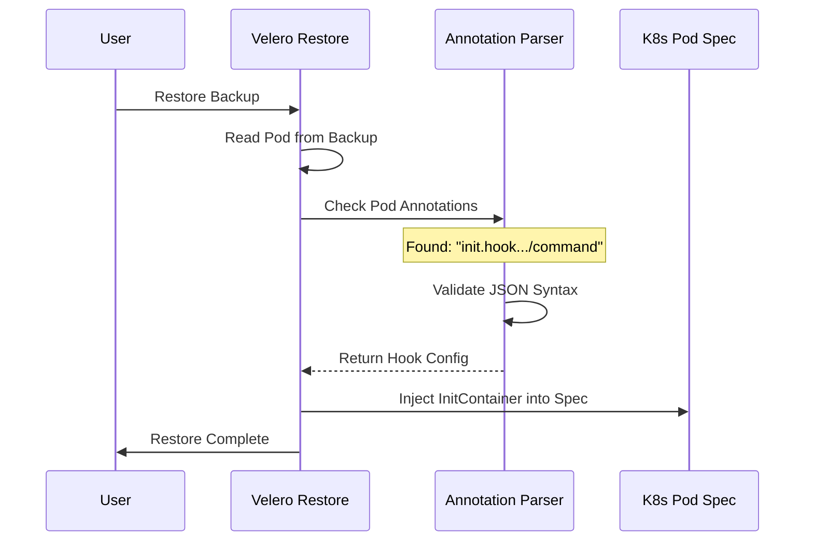

# Chapter 3: Configuration via Pod Annotations

Welcome to Chapter 3! In the previous chapter, [Configuration via Restore CRD Spec](02_configuration_via_restore_crd_spec.md), we learned how to set "Company Policies" to apply restore rules to many Pods at once.

But what happens when you have a **unique** requirement? What if just *one* specific Pod needs special treatment?

## The Motivation: The "Fragile" Sticky Note

Imagine you are moving house again.
1.  **Global Rule (Chapter 2):** You tell the movers, "Put all boxes labeled 'Kitchen' in the kitchen."
2.  **Specific Exception (This Chapter):** You have one specific box containing a fragile antique vase. You don't want a general rule for this. You put a **Sticky Note** directly on that box saying: *"Handle with extra care, place on the top shelf."*

**Configuration via Pod Annotations** is that sticky note.

Instead of writing a rule in a separate YAML file, you write the restore instructions directly onto the Pod itself (before you back it up). When Velero restores that specific Pod, it reads the note and executes the instruction.

### Central Use Case: The "One-Off" Migration
You have a specific application called `legacy-app`. When it restores, it needs to run a database migration command (`db-migrate`). No other app needs this. Creating a global rule just for this one app is overkill.

**Solution:** We will attach a Velero annotation to the `legacy-app` Pod.

## Key Concepts: The Supported Sticky Notes

Velero looks for annotations starting with `post.hook.restore.velero.io/` or `init.hook.restore.velero.io/`.

Here are the specific "notes" you can stick on your Pods:

### 1. For InitContainer Hooks (Before App Starts)
*   **`init.hook.restore.velero.io/container-image`**: Which Docker image should run the hook? (e.g., `alpine:latest`).
*   **`init.hook.restore.velero.io/command`**: What command to run? (e.g., `["/bin/sh", "-c", "echo hello"]`).
*   **`init.hook.restore.velero.io/timeout`**: How long to wait before giving up?

### 2. For Exec Hooks (After App Starts)
*   **`post.hook.restore.velero.io/command`**: The command to run.
*   **`post.hook.restore.velero.io/container`**: Which container inside the Pod should run this? (Defaults to the first one).
*   **`post.hook.restore.velero.io/on-error`**: If the command fails, should the restore stop (`Fail`) or keep going (`Continue`)?

## How to Use: Solving the Use Case

Let's apply this to our `legacy-app`. We want to run a migration script using an **InitContainer** hook.

### Step 1: Annotate the Pod
We must add these annotations to the Pod **before** the backup is taken.

*Note: In the example below, the command format must be a valid JSON array.*

```yaml
apiVersion: v1
kind: Pod
metadata:
  name: legacy-app
  annotations:
    # The Sticky Note: Define the Image
    init.hook.restore.velero.io/container-image: alpine:3.18
    # The Sticky Note: Define the Command
    init.hook.restore.velero.io/command: '["/bin/sh", "-c", "echo Migrating...; sleep 2"]'
spec:
  containers:
  - name: main-app
    image: my-app:v1
```

### Step 2: Take the Backup
Velero saves these annotations inside the backup file.

```bash
velero backup create my-backup --include-pods legacy-app
```

### Step 3: Restore
When you run `velero restore create`, you don't need to specify anything special! Velero sees the sticky note on the Pod and automatically creates the InitContainer.

## Under the Hood: Internal Implementation

How does Velero turn a text annotation into a running container?

When Velero restores a Pod, it parses the Pod's metadata. It looks specifically for map keys that match the Velero hook prefix. If it finds them, it extracts the values and builds the hook logic dynamically.

### Sequence Diagram



### Code Example: Parsing the Annotations

Let's look at a simplified version of how Velero (in Go) reads these annotations. This happens inside the `pkg/restore` package.

First, Velero defines the keys it is looking for:

```go
// Common prefixes for the annotations
const (
    initCmdAnnotation   = "init.hook.restore.velero.io/command"
    initImageAnnotation = "init.hook.restore.velero.io/container-image"
)
```

Next, it tries to fetch the value from the Pod's metadata:

```go
// Simplified function to get the command
func getInitCommand(podAnnotations map[string]string) []string {
    // Check if the specific key exists on the 'sticky note'
    if val, ok := podAnnotations[initCmdAnnotation]; ok {
        var command []string
        // Parse the JSON string '["/bin/sh"...]' into a Go slice
        json.Unmarshal([]byte(val), &command)
        return command
    }
    return nil
}
```
*Explanation:* The code checks the map of annotations. If it finds the command key, it converts the JSON string (like `["ls", "-la"]`) into a list of strings that Kubernetes understands.

Finally, it builds the actual Container object:

```go
// Creating the InitContainer structure
func createHookContainer(image string, command []string) v1.Container {
    return v1.Container{
        Name:    "velero-restore-init",
        Image:   image,
        Command: command,
        // Velero also automatically mounts volumes here
    }
}
```
*Explanation:* Velero takes the data extracted from the annotations and fills out a standard Kubernetes Container definition, which is then injected into the Pod.

## Summary

In this chapter, we learned:
*   **The Problem:** Sometimes we need restore rules for just *one* specific Pod, not a global policy.
*   **The Solution:** **Pod Annotations** act like "Sticky Notes" with instructions.
*   **The Workflow:** Add annotations -> Backup -> Restore (Velero reads annotations and acts).
*   **The Implementation:** Velero parses these JSON-formatted strings and dynamically injects containers or commands.

Now that we know *how* to define hooks (Global Policies vs. Sticky Notes), we need to make sure they are actually correct. What happens if you make a typo?

[Next Chapter: Hook Validation](04_hook_validation.md)

---

Generated by [Code IQ](https://github.com/adityasoni99/Code-IQ)