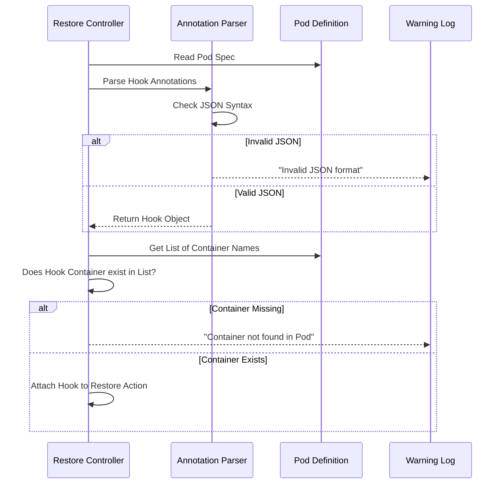

# Chapter 4: Hook Validation

Welcome to Chapter 4! In the previous chapter, [Configuration via Pod Annotations](03_configuration_via_pod_annotations.md), we learned how to attach "sticky notes" to specific Pods to tell Velero to run commands during a restore.

But here is the catch with sticky notes: **You can write whatever you want on them.**

What happens if you make a typo? What happens if you tell Velero to run a command in a container that doesn't exist? In this chapter, we explore **Hook Validation**—the safety checks Velero performs to ensure your instructions make sense before it tries to execute them.

## The Motivation: The "Blueprint Checker" Analogy

Imagine you are an architect submitting a blueprint for a new house.
1.  **Drafting:** You draw a door leading into the backyard.
2.  **Review:** A structural engineer looks at your drawing and says, "Wait, there is a concrete wall here. You cannot put a door here."

If the engineer didn't check, the builders would show up, try to install a door, and fail halfway through.

**Hook Validation** is that structural engineer.

### Central Use Case: The "Missing Container" Typo
You have a Pod running a simple web server in a container named `nginx`.
You want to run a hook, but you make a typo in your annotation:

```yaml
# You typed 'ngnix' (typo) instead of 'nginx'
post.hook.restore.velero.io/container: ngnix
```

If Velero attempts to run this without checking, the restore process might hang or fail mysteriously because it's looking for a container that isn't there. Validation catches this error *early* and logs a clear warning.

## Key Concepts

Velero performs validation primarily on **Pod Annotations**. Since annotations are just simple text strings, Kubernetes doesn't check them for you. Velero has to do it manually.

### 1. JSON Syntax Validation
Velero commands must be lists of strings (JSON arrays), like `["/bin/sh", "-c", "ls"]`.
*   **Common Mistake:** Writing a plain string like `"/bin/sh -c ls"`.
*   **Validation:** Velero checks if the text is valid JSON.

### 2. Container Existence Validation
If you specify a container name for an Exec hook, Velero checks the Pod's definition.
*   **The Check:** "Does the Pod actually have a container with this name?"
*   **The Result:** If not, the hook is skipped, and a warning is logged.

## How It Works: The Validation Flow

Let's look at what happens when Velero encounters our "Missing Container" typo.

### The Input (Bad Annotation)
We add this annotation to a Pod:
`post.hook.restore.velero.io/container: ghost-container`

### The Process
1.  Velero reads the Pod from the backup.
2.  Velero sees the hook annotation.
3.  Velero looks at the list of containers in the Pod (`main-app`, `sidecar`).
4.  Velero compares `ghost-container` against the list.
5.  **Mismatch Found!**

### The Output (Log Warning)
Velero will not crash. Instead, it will log a warning to the restore log, effectively saying:

> "I found a hook for container 'ghost-container', but that container does not exist in this Pod. I am skipping this hook."

This ensures your restore finishes, but notifies you that your hook didn't run.

## Under the Hood: Internal Implementation

How does the code actually perform these checks? It happens during the restore logic, just before the Pod is sent to the Kubernetes API.

### Sequence Diagram



### Code Insight: Validating the Container

Let's look at a simplified version of the Go code that performs the **Container Existence Validation**. This logic resides within the `pkg/restore` package.

First, Velero needs a helper function to see if a container exists in a list:

```go
// Helper function: simply checks if a name exists in a list
func hasContainer(name string, containers []corev1.Container) bool {
    for _, c := range containers {
        if c.Name == name {
            return true
        }
    }
    return false
}
```
*Explanation:* This function loops through every container in the Pod. If it finds a name match, it returns `true`.

Next, the main validation logic uses this helper:

```go
// Simplified validation logic inside the Restore Controller
func validateHook(hook Hook, pod corev1.Pod) error {
    // If the user didn't specify a container, it defaults to the first one (valid)
    if hook.Container == "" {
        return nil 
    }

    // Check InitContainers and regular Containers
    if !hasContainer(hook.Container, pod.Spec.Containers) && 
       !hasContainer(hook.Container, pod.Spec.InitContainers) {
           return fmt.Errorf("container %s not found in pod", hook.Container)
    }

    return nil
}
```
*Explanation:*
1.  The code checks if the user provided a specific container name.
2.  It checks the Pod's `Containers` list (where the app lives).
3.  It checks the Pod's `InitContainers` list.
4.  If the name isn't found in either list, it returns an error, which prevents the hook from being added.

### Code Insight: Validating JSON Syntax

Velero also ensures you didn't write "garbage" in the command annotation.

```go
// Simplified JSON validation
func parseCommand(jsonString string) ([]string, error) {
    var command []string
    
    // Try to convert the string into a slice of strings
    err := json.Unmarshal([]byte(jsonString), &command)
    
    if err != nil {
        return nil, fmt.Errorf("invalid command format: %v", err)
    }
    
    return command, nil
}
```
*Explanation:* The `json.Unmarshal` function attempts to parse the text. If the text is not valid JSON (e.g., missing a bracket `]`), it returns an error immediately.

## Summary

In this chapter, we learned:
*   **Validation is crucial** because Pod Annotations are free-text and prone to typos.
*   Velero validates **JSON Syntax** (is the command formatted correctly?).
*   Velero validates **Container Existence** (does the requested container exist?).
*   If validation fails, Velero logs a warning and usually skips the hook to prevent crashing the entire restore.

Now that we have defined our hooks (Chapters 2 & 3) and validated that they are correct (Chapter 4), it is time to see how Velero actually executes them.

In the next chapter, we will deep dive into the implementation of the first type of hook: the **InitContainer**.

[Next Chapter: InitContainer Hooks Implementation](05_initcontainer_hooks_implementation.md)

---

Generated by [Code IQ](https://github.com/adityasoni99/Code-IQ)