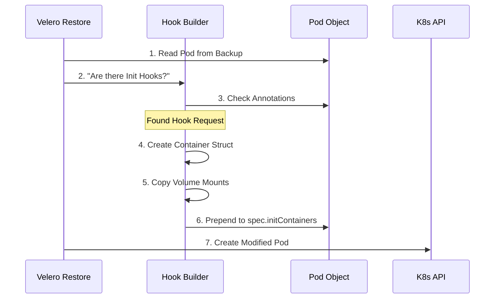

# Chapter 5: InitContainer Hooks Implementation

Welcome to Chapter 5! In the previous chapter, [Hook Validation](04_hook_validation.md), we acted like structural engineers, checking our blueprints (annotations) for errors.

Now that we know our instructions are valid, it is time to start building. In this chapter, we explore how Velero actually performs the "surgery" on your Pods to inject **InitContainer Hooks**.

## The Motivation: The "Pre-Game Warmup" Analogy

Imagine a professional athlete (your Application). Before they run onto the field to play the game, they must do a warmup in the locker room (InitContainer).

If the athlete runs onto the field cold, they might get injured. Similarly, if your application starts without its configuration files or database connections ready, it will crash.

**The Problem:** The "Warmup" (InitContainer) wasn't part of the original backup.
**The Solution:** Velero needs to physically add this warmup routine to the athlete's schedule *during* the restore process.

### Central Use Case: The Missing Config File
You have a web server (`my-web-app`). It requires a file called `db-config.json` to exist in the `/data` folder, or it refuses to start.
*   **Goal:** Run a script to generate this file *before* the app starts.
*   **Method:** We will use an InitContainer Hook to generate the file.

## Key Concepts

To make this work, Velero performs three clever tricks "under the hood."

### 1. Pod Modification (The Surgery)
Kubernetes Pods are defined by a text file (Spec). Velero reads this text file from your backup, pauses, and **edits** it. It inserts a new container definition into the list of containers. It's like writing a new paragraph into a book before printing it.

### 2. Volume Mounting (Sharing the Locker)
If the athlete does their warmup in a gym across town, it doesn't help. They need to be in the *same* stadium.

Similarly, if your InitContainer creates a file, the Main Container needs to see it.
*   Velero looks at the Volumes (storage folders) your Main Container uses.
*   It **copies** those Volume definitions to the InitContainer.
*   This ensures that if the InitContainer writes to `/data`, the Main Container sees the file in `/data`.

### 3. Ordering (First Things First)
A Pod can have multiple InitContainers. Velero ensures your hook runs **first**. It places your hook at the very top of the list (Index 0), so it finishes before anything else tries to run.

## How to Use: Solving the Use Case

Let's see the transformation. We start with a plain Pod and add our "Sticky Note" instructions (from Chapter 3).

### Input: The Annotation
We annotated our Pod with this instruction:
`init.hook.restore.velero.io/command: '["/bin/sh", "-c", "echo host=db > /data/db-config.json"]'`

### The Process
Velero sees this annotation and generates a standard Kubernetes Container object.

### Output: The Resulting Pod Spec
Below is a simplified view of what Velero submits to Kubernetes. Notice the **new** section that wasn't there before.

```yaml
apiVersion: v1
kind: Pod
metadata:
  name: my-web-app
spec:
  # Velero INJECTED this section!
  initContainers:
  - name: velero-restore-init-0
    image: alpine:latest
    command: ["/bin/sh", "-c", "echo host=db > /data/db-config.json"]
    volumeMounts:
    - name: data-volume  # <--- Copied from below!
      mountPath: /data

  containers:
  - name: main-app
    image: my-app:v1
    volumeMounts:
    - name: data-volume
      mountPath: /data
```
*Explanation:* Velero created `velero-restore-init-0`. Crucially, it noticed `main-app` was using `data-volume`, so it gave the InitContainer access to that same volume.

## Under the Hood: Internal Implementation

How does the Go code handle this injection? It happens during the "Restore Item" phase.

### Sequence Diagram



### Code Logic: Creating the Container

This logic resides in `pkg/restore`. First, Velero creates the basic container definition based on your annotations.

```go
// Simplified function to build the container object
func buildInitContainer(name string, image string, command []string) corev1.Container {
    return corev1.Container{
        Name:            name,
        Image:           image,
        Command:         command,
        ImagePullPolicy: corev1.PullIfNotPresent,
        // Volumes are handled in the next step
    }
}
```
*Explanation:* This creates a standard Kubernetes container struct using the inputs provided in the annotation (Image and Command).

### Code Logic: The "Smart" Volume Copy

This is the most critical part. Velero iterates through the application containers to see what volumes they use.

```go
// Logic to ensure the hook can access the app's data
func attachVolumeMounts(hookContainer *corev1.Container, pod *corev1.Pod) {
    // Look at the main application container
    appContainer := pod.Spec.Containers[0]

    // Copy all volume mounts from App to Hook
    // This allows the hook to write files the app can read
    hookContainer.VolumeMounts = appContainer.VolumeMounts
}
```
*Explanation:* By copying `VolumeMounts`, Velero guarantees that the InitContainer shares the same filesystem view as the main application for those specific paths.

### Code Logic: Ensuring Correct Order

Finally, Velero injects this new container into the Pod's list. It uses "Prepend" logic (adding to the front).

```go
// Adding the hook to the BEGINNING of the list
func injectInitContainer(pod *corev1.Pod, hookContainer corev1.Container) {
    // Create a new list: [Hook, ...ExistingInitContainers]
    newInitList := append(
        []corev1.Container{hookContainer}, // Put hook first
        pod.Spec.InitContainers...,        // Append existing ones
    )

    // Update the Pod
    pod.Spec.InitContainers = newInitList
}
```
*Explanation:*
1.  We create a slice containing just our new Hook.
2.  We append the *existing* InitContainers (if any) after it.
3.  This ensures the Hook runs before any other setup tasks the Pod might have had.

### A Note on "Restore Wait" Containers
Sometimes, Velero adds its *own* helper container called `restore-wait` (to wait for data restores from Restic/Kopia). Velero's logic ensures that user-defined hooks run in the correct sequence so that your logic doesn't fail because the network isn't ready or volumes aren't mounted. By standardizing on `InitContainers`, Kubernetes handles the sequential execution for us automatically.

## Summary

In this chapter, we learned:
*   **The Concept:** InitContainer Hooks act like a "warmup" for your app.
*   **The Surgery:** Velero modifies the Pod Spec on-the-fly to insert these containers.
*   **The Magic:** Velero automatically copies **Volume Mounts** so the hook and the app share data.
*   **The Order:** Hooks are injected at the front of the list to run first.

We have successfully covered how to prepare an environment *before* an app starts. But what if the app is already running, and you need to tell it to do something?

In the next chapter, we will look at **Exec Hooks**—running commands inside a living container.

[Next Chapter: Exec Hooks Implementation](06_exec_hooks_implementation.md)

---

Generated by [Code IQ](https://github.com/adityasoni99/Code-IQ)