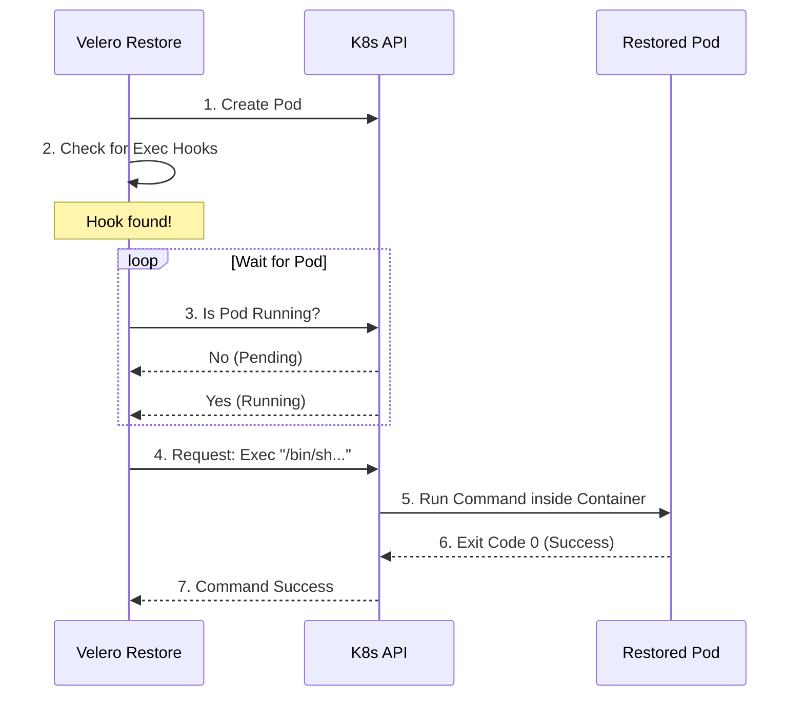

# Chapter 6: Exec Hooks Implementation

Welcome to Chapter 6! In the previous chapter, [InitContainer Hooks Implementation](05_initcontainer_hooks_implementation.md), we learned how Velero performs "surgery" on your Pods to inject setup tasks that run **before** your application starts.

But what if you need to do something **after** the application is up and running?

## The Motivation: The "Smart TV" Analogy

Imagine you are moving into a new house (Performing a Restore).
1.  **InitContainer (Chapter 5):** You paint the walls and install the carpet *before* you move the furniture in. You can't do this while people are living there.
2.  **Exec Hook (This Chapter):** You set up your Smart TV. You **cannot** scan for channels or log into Netflix until the electricity is on, the internet is connected, and the TV is actually turned on.

**Exec Hooks** are like setting up that Smart TV. They are commands that run inside your container only *after* the container is alive and running.

### Central Use Case: The Database "Unfreeze"
Imagine you restored a database. The database software starts up, but it is in "Safe Mode" or "Read-Only Mode" because it detects it was restored from a backup.
*   **Goal:** Tell the database, "I know we are restored. You can switch to Read-Write mode now."
*   **The Problem:** You can't run this command until the database process is actually running.
*   **The Solution:** Use an Exec Hook to run a specific command (e.g., `mongo_unfreeze.sh`) inside the running container.

## Key Concepts

Unlike InitContainers, which modify the text definition of the Pod, Exec Hooks work by "remote controlling" the Pod.

### 1. The Waiter
Velero cannot run a command in a container that doesn't exist yet. When you restore a Pod, Velero submits the request to Kubernetes and then **pauses**. It acts like a waiter, watching the Pod until it sees the status change to `Running`.

### 2. The Remote Control (Exec)
Once the Pod is running, Velero uses the Kubernetes API (just like when you type `kubectl exec` in your terminal) to send a command to the specific container.

### 3. The Timeout
What if the application crashes immediately or hangs? Velero has a stopwatch (Timeout). If the Pod doesn't become ready, or if the command takes too long, Velero stops waiting to prevent the entire restore job from freezing forever.

## How to Use: Solving the Use Case

Let's say we have a Pod named `my-database`. We want to run `echo "Database Ready"` inside it after restore.

### Input: The Configuration
(As learned in [Configuration via Pod Annotations](03_configuration_via_pod_annotations.md)), we have this annotation on our Pod:

```yaml
post.hook.restore.velero.io/command: '["/bin/sh", "-c", "echo Database Ready"]'
post.hook.restore.velero.io/wait-timeout: "2m"
```

### The Process
1.  Velero restores `my-database`.
2.  Velero sees the hook.
3.  Velero waits for the container to turn green (Running).
4.  Velero executes the echo command.

### Output: The Result
The command runs inside the container. If you were watching the logs, you would see the command execute. If it fails (returns an exit code other than 0), Velero marks the hook as failed (depending on your `onError` setting).

## Under the Hood: Internal Implementation

How does Velero manage to "jump" into a running container? It doesn't actually jump; it asks the Kubernetes API Server to run the process on its behalf.

### The Workflow

1.  **Grouping:** Velero first looks at the Pod and groups all hooks by container name (e.g., all hooks for `mysql`, all hooks for `sidecar`).
2.  **Waiting:** Velero polls the Kubernetes API, asking, "Is the Pod running yet?"
3.  **Execution:** Once running, Velero creates a "stream" to the container to run the command.

### Sequence Diagram



### Code Deep Dive: The Wait Loop

Before executing, Velero must ensure the Pod is ready. This logic is found in `pkg/restore/restore_action.go` (conceptually).

```go
// Simplified logic: Waiting for the Pod to start
func waitForPod(k8sClient Client, podName string) error {
    // We loop periodically to check the status
    return wait.Poll(time.Second, time.Minute, func() (bool, error) {
        pod := k8sClient.GetPod(podName)
        
        // We only proceed if the Phase is 'Running'
        if pod.Status.Phase == corev1.PodRunning {
            return true, nil
        }
        return false, nil // Keep waiting
    })
}
```
*Explanation:* This code uses a simple loop (`wait.Poll`). It fetches the Pod's status repeatedly. If the status is `Running`, it returns `true` (stop waiting). If not, it sleeps for a second and tries again, up to a limit (1 minute in this snippet).

### Code Deep Dive: The Execution

Once the Pod is ready, Velero prepares the execution request. This uses the `client-go` library to talk to Kubernetes.

```go
// Simplified logic: preparing the "Remote Control" signal
func executeCommand(client K8sClient, podName, container, cmd) {
    // Create the request to the API Server
    req := client.RESTClient().Post().
        Resource("pods").
        Name(podName).
        SubResource("exec").
        Param("container", container).
        Param("command", cmd)

    // "Stream" initiates the connection
    executor := remotecommand.NewSPDYExecutor(config, "POST", req.URL())
}
```
*Explanation:*
1.  We build a POST request to the specific URL for exec: `/api/v1/.../pods/my-pod/exec`.
2.  We specify parameters like which `container` to use and what `command` to run.
3.  `NewSPDYExecutor` is the technical term for opening a two-way connection (stream) so Velero can send the command and receive the output (stdout/stderr).

### Code Deep Dive: Running the Stream

Finally, Velero triggers the command and captures the output.

```go
// Simplified logic: Pushing the button
func runStream(executor Executor) error {
    // Connect standard output (stdout) and error (stderr)
    var stdout, stderr bytes.Buffer
    
    // Execute!
    err := executor.Stream(StreamOptions{
        Stdout: &stdout,
        Stderr: &stderr,
    })

    // If err is not nil, the command failed (non-zero exit code)
    return err
}
```
*Explanation:* This function actually runs the command. It captures any text the command prints (`stdout`) so it can be logged in the Velero restore logs. If the command fails (e.g., file not found), `err` will contain the details.

## Summary

In this chapter, we learned:
*   **Exec Hooks** are for tasks that must happen *after* the application is running (like database unlocks or cache clearing).
*   **The Wait:** Velero acts as a waiter, monitoring the Pod status until it is `Running`.
*   **The Execution:** Velero uses the standard Kubernetes API to "remote control" the container.
*   **The Implementation:** It involves polling loops (checking status) and streaming connections (sending commands).

We have now covered the entire lifecycle of hooks! From configuration (CRDs and Annotations) to validation, and finally to implementation (InitContainers and Exec).

In the final chapter, we will bring everything together with a concrete code walkthrough on how Velero parses the specific annotations we discussed earlier.

[Next Chapter: Code Example - Parsing Annotations](07_code_example___parsing_annotations.md)

---

Generated by [Code IQ](https://github.com/adityasoni99/Code-IQ)