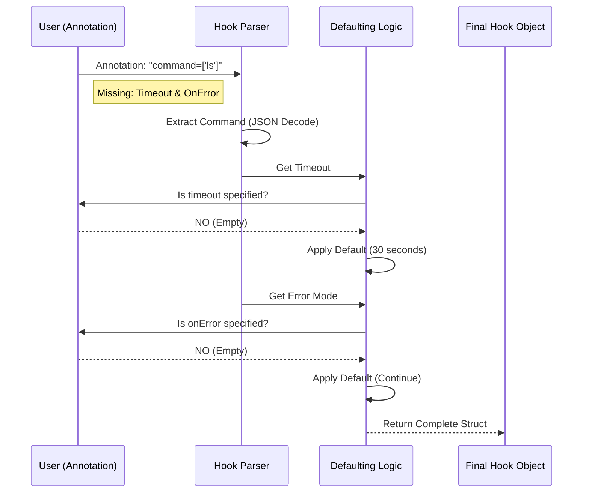

# Chapter 7: Code Example - Parsing Annotations

Welcome to the final chapter of our Restore Hooks series!

In the previous chapter, [Exec Hooks Implementation](06_exec_hooks_implementation.md), we watched Velero act as a "remote control," waiting for a Pod to start and then executing commands inside it.

But before Velero can press the buttons on that remote control, it needs to read the manual. It needs to look at the messy, handwritten "Sticky Notes" (Annotations) you put on your Pod and convert them into a strict, structured plan.

In this chapter, we will look at the **code logic** that parses these annotations. We will specifically focus on how Velero handles **defaults**—filling in the blanks when you forget to write instructions.

## The Motivation: The "Incomplete Form" Analogy

Imagine you are filling out a form at a doctor's office.
*   **Name:** "John Doe"
*   **Emergency Contact:** (Left Blank)
*   **Allergies:** (Left Blank)

The receptionist doesn't panic. They have **Default Rules**:
*   If Emergency Contact is blank, assume "None" or ask later.
*   If Allergies is blank, assume "No Known Allergies."

**The Problem:** Users often provide the bare minimum configuration. They might say "Run this command," but forget to say how long to wait or what to do if it fails.
**The Solution:** The parsing code acts like the receptionist. It reads what exists and applies sensible **Defaults** for what is missing.

### Central Use Case: The Lazy Configuration
You want to run a cleanup script. You write this annotation:

```yaml
post.hook.restore.velero.io/command: '["/bin/sh", "-c", "cleanup.sh"]'
```

You **did not** specify:
1.  Which container to run in.
2.  How long to wait (Timeout).
3.  What to do if it fails (OnError).

We will walk through the code that reads this single line and expands it into a full configuration object.

## Key Concepts

To convert text into a Go Object, we need three logic steps:

### 1. Extraction (The Lookup)
Velero looks at the Pod's metadata map. It searches for specific "Keys" (strings defined as constants in the code).

### 2. Unmarshalling (The Translator)
The command is stored as a JSON string (e.g., `["ls", "-la"]`). Go cannot execute a string directly; it needs a "Slice" (a list). We use a standard library tool called `json.Unmarshal` to convert the text into a list.

### 3. Defaulting (The Safety Net)
This is the logic that says: "If the value is empty, use X." This is crucial for stability. If we didn't have defaults, a missing timeout value could cause Velero to wait forever (infinity).

## How It Works: The Logic Flow

Before looking at the code, let's visualize the flow of data from the raw Pod to the final Hook Object.

### Sequence Diagram



## Internal Implementation: The Code

Let's look at simplified versions of the actual functions Velero uses to parse these annotations. These are typically utility functions found in Velero's codebase.

### Step 1: Parsing the Command (JSON)

First, we need to extract the command. Since it is stored as a JSON array string, we must parse it.

```go
// Simplified Go Code
func getCommand(annotations map[string]string) []string {
    // 1. Get the raw string from the map
    val := annotations["post.hook.restore.velero.io/command"]
    
    // 2. Prepare a list to hold the result
    var command []string
    
    // 3. Convert JSON text to Go List
    // Example: '["ls", "-l"]' -> [ls, -l]
    json.Unmarshal([]byte(val), &command)
    
    return command
}
```
*Explanation:* If `val` contains valid JSON, `command` will become a usable list. If the user wrote invalid JSON, this function would return an error (omitted here for simplicity).

### Step 2: Parsing the Container (With Defaults)

Next, we figure out *where* to run the command. If the user didn't specify a container, what do we do?

```go
func getContainer(annotations map[string]string, pod *v1.Pod) string {
    // 1. Check if the user specified a container
    name := annotations["post.hook.restore.velero.io/container"]
    
    // 2. Logic: If provided, use it.
    if name != "" {
        return name
    }

    // 3. Defaulting Logic: 
    // If blank, default to the FIRST container in the Pod.
    return pod.Spec.Containers[0].Name
}
```
*Explanation:* This logic ensures the hook always has a target. It assumes that if you didn't ask for a specific container, the main application (usually the first one) is the intended target.

### Step 3: Parsing the Timeout (Duration Logic)

Timeouts are strings like "30s" or "5m". We need to convert them into a computer-readable duration.

```go
import "time"

func getTimeout(annotations map[string]string) time.Duration {
    val := annotations["post.hook.restore.velero.io/timeout"]

    // 1. Defaulting Logic: If empty, pick a safe number
    if val == "" {
        return 30 * time.Second // Default
    }

    // 2. Parse the string (e.g., "5m")
    duration, err := time.ParseDuration(val)
    if err != nil {
        return 30 * time.Second // Fallback if typo
    }

    return duration
}
```
*Explanation:* This function protects Velero from hanging. Whether the user forgot the timeout or wrote "55zz" (typo), the code ensures we always return a valid `time.Duration`.

### Step 4: Parsing Error Mode (Enum Logic)

Finally, what happens if the script fails? Valid options are usually `Continue` or `Fail`.

```go
func getOnError(annotations map[string]string) string {
    val := annotations["post.hook.restore.velero.io/on-error"]

    // 1. Defaulting Logic
    if val == "" {
        // By default, don't crash the restore if a cleanup script fails
        return "Continue" 
    }

    // 2. Return user preference
    return val
}
```
*Explanation:* Defaults act as "Safe Mode." For Exec hooks, Velero usually prefers `Continue` so that a minor script failure doesn't mark the whole database restore as "Failed."

## Putting It All Together

When we combine these snippets, we get a full Hook Object.

**Input (User Annotation):**
```yaml
command: '["/bin/echo", "hello"]'
# Container, Timeout, and OnError are MISSING
```

**Internal Logic Execution:**
1.  `getCommand` -> `["/bin/echo", "hello"]`
2.  `getContainer` -> Returns "main-app" (First container)
3.  `getTimeout` -> Returns `30s` (Default)
4.  `getOnError` -> Returns `Continue` (Default)

**Output (Final Object used in Chapter 6):**
```go
Hook{
    Command:   ["/bin/echo", "hello"],
    Container: "main-app",
    Timeout:   30 * time.Second,
    OnError:   "Continue",
}
```

## Tutorial Conclusion

Congratulations! You have completed the **Velero Restore Hooks** tutorial series.

We started with a simple problem—files restored, but applications broken—and journeyed all the way to the internal code that parses text annotations.

**Recap of your journey:**
1.  **[Overview](01_overview_of_restore_hooks.md):** Learned *why* we need hooks (Init vs Exec).
2.  **Configuration:** Learned to use **[CRD Specs](02_configuration_via_restore_crd_spec.md)** for global rules and **[Annotations](03_configuration_via_pod_annotations.md)** for specific Pods.
3.  **[Validation](04_hook_validation.md):** Learned how Velero checks for typos to prevent crashes.
4.  **Implementation:** Saw how Velero injects **[InitContainers](05_initcontainer_hooks_implementation.md)** and "remote controls" **[Exec Hooks](06_exec_hooks_implementation.md)**.
5.  **Parsing:** (This Chapter) Understood how defaults make the system robust.

You now possess a deep understanding of how Velero manipulates Kubernetes workloads to ensure your restores are not just a pile of files, but fully functional applications.

Happy Restoring!

---

Generated by [Code IQ](https://github.com/adityasoni99/Code-IQ)