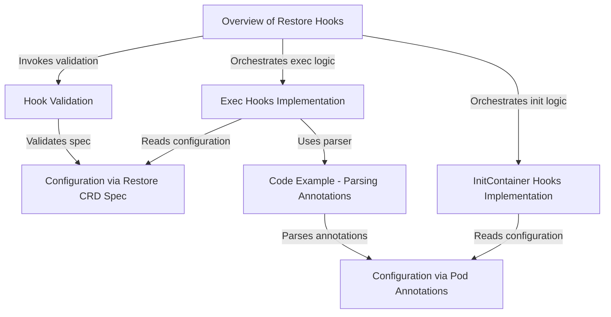

# Tutorial: velero

Velero is a cloud-native tool designed to **backup** and **restore** Kubernetes cluster resources and persistent volumes. It enables disaster recovery, data migration, and the replication of production clusters to development environments. A key feature is the support for *restore hooks*, allowing users to execute custom actions (via InitContainers or Exec commands) during the restoration process.

**Source Repository:** [https://github.com/vmware-tanzu/velero](https://github.com/vmware-tanzu/velero)

## Chapters

1. [Overview of Restore Hooks](01_overview_of_restore_hooks.md)
2. [Configuration via Restore CRD Spec](02_configuration_via_restore_crd_spec.md)
3. [Configuration via Pod Annotations](03_configuration_via_pod_annotations.md)
4. [Hook Validation](04_hook_validation.md)
5. [InitContainer Hooks Implementation](05_initcontainer_hooks_implementation.md)
6. [Exec Hooks Implementation](06_exec_hooks_implementation.md)
7. [Code Example - Parsing Annotations](07_code_example___parsing_annotations.md)

---

Generated by [Code IQ](https://github.com/adityasoni99/Code-IQ)