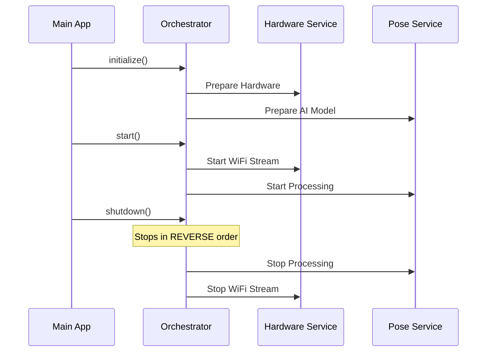

# Chapter 1: Service Orchestrator

Welcome to the first chapter of the **WiFi-DensePose** tutorial! We are about to build a system that can "see" human poses using only WiFi signals. It sounds like magic, but it's actually a symphony of technology working together.

Before we dive into the math of WiFi signals or Neural Networks, we need a manager to organize everything. That manager is the **Service Orchestrator**.

## The Problem: Chaos in the Kitchen

Imagine you are running a complex restaurant kitchen. You have a chef (who cooks), a waiter (who serves), and a dishwasher (who cleans).

If you yell "OPEN THE RESTAURANT!", but the stove isn't on, the chef can't cook. If the waiter tries to serve food before the chef is done, customers get empty plates. If you close the restaurant but forget to turn off the ovens, the place might burn down.

In software, our "kitchen staff" are different subsystems:
1.  **Hardware:** The WiFi receiver.
2.  **Processing:** The AI that analyzes signals.
3.  **API:** The web server that shows results.

We need a central way to start them in the right order, check if they are working, and shut them down safely.

## The Solution: The Conductor

The **Service Orchestrator** acts like the conductor of an orchestra. The conductor doesn't play the violin or the drums; they simply point at the violinist and say "Start now," and point at the drummer and say "Stop."

### Key Responsibilities
1.  **Initialization:** Loading settings and preparing the services.
2.  **Startup:** Turning on the services in the correct order (e.g., Hardware first, then AI).
3.  **Monitoring:** Checking the heartbeat of the system.
4.  **Shutdown:** Turning everything off cleanly to prevent errors.

## Usage: Starting the Engine

Let's look at how we use the Orchestrator in our main entry point (`src/main.py`). We don't need to know *how* the WiFi hardware works yet; we just need to tell the Orchestrator to handle it.

### Step 1: Create the Orchestrator
First, we instantiate the class with our settings.

```python
# From src/main.py
# Create the conductor and give it the music sheet (settings)
orchestrator = ServiceOrchestrator(settings)

# Setup signal handlers (like CTRL+C to quit)
setup_signal_handlers(orchestrator)
```
*Explanation:* We create the `orchestrator` object. It doesn't start anything yet; it just sits there holding the configuration settings, ready to work.

### Step 2: Initialize Services
Before we can run, we need to make sure all components are loaded.

```python
# From src/main.py
# Tell the conductor to prepare the orchestra
await orchestrator.initialize()
```
*Explanation:* The `await` keyword means this takes a moment. The Orchestrator is now going through its checklist, creating the [CSI Signal Processor](03_csi_signal_processor.md) and the [Neural Inference Engine](04_neural_inference_engine.md), but keeping them paused.

### Step 3: Shutdown
When we want to stop the application (like pressing `CTRL+C`), we need a clean exit.

```python
# From src/main.py
# Cleanup block
if 'orchestrator' in locals():
    await orchestrator.shutdown()
logger.info("Application shutdown complete")
```
*Explanation:* This ensures we don't leave the WiFi hardware in a "locked" state. The Orchestrator turns off the lights one by one.

## Under the Hood: How It Works

Let's peek inside `src/services/orchestrator.py` to see how the conductor manages the flow.

### The Lifecycle Flow

Here is a simplified diagram of what happens when you run the program:



### 1. The Service Registry
Inside the Orchestrator, we keep a list (registry) of all the services we manage.

```python
# From src/services/orchestrator.py
class ServiceOrchestrator:
    def __init__(self, settings: Settings):
        self._services = {}  # The registry
        self._initialized = False
        
        # We define slots for our services
        self.hardware_service = None
        self.pose_service = None
```
*Explanation:* In the constructor `__init__`, we set up an empty dictionary `_services`. This is like the attendance sheet for our employees.

### 2. Intelligent Initialization
When `initialize()` is called, we create the specific services. Notice how we use a specialized function to create application services.

```python
# From src/services/orchestrator.py
async def _initialize_application_services(self):
    # Initialize hardware service (Chapter 3)
    self.hardware_service = get_hardware_service()
    await self.hardware_service.initialize()
    
    # Initialize pose service (Chapter 4)
    self.pose_service = get_pose_service()
    await self.pose_service.initialize()
```
*Explanation:* This method calls factory functions (like `get_hardware_service`) to create the objects. It calls `.initialize()` on each one individually. If the hardware fails to initialize, the code stops here, and we don't bother loading the AI.

### 3. Graceful Shutdown
This is arguably the most important job of the Orchestrator. We shut things down in **reverse order** of how they were started.

```python
# From src/services/orchestrator.py
async def _shutdown_application_services(self):
    # Shutdown pose service first
    if self.pose_service:
        await self.pose_service.shutdown()

    # Shutdown hardware last (it's the foundation)
    if self.hardware_service:
        await self.hardware_service.shutdown()
```
*Explanation:* Why reverse order? Imagine the AI service is reading data from the Hardware service. If we kill the Hardware first, the AI might crash trying to read from a dead device. By stopping the AI first, we ensure a smooth exit.

### 4. Background Health Checks
The Orchestrator also runs background tasks to keep an eye on things while the application is running.

```python
# From src/services/orchestrator.py
async def _health_check_loop(self):
    while True:
        try:
            # Ask everyone: "Are you okay?"
            await self.health_service.perform_health_checks()
            await asyncio.sleep(self.settings.health_check_interval)
        except asyncio.CancelledError:
            break
```
*Explanation:* This runs in an infinite loop (until cancelled). Every few seconds, it checks if the services are healthy. If a service crashes, the Orchestrator will know.

## Summary

The **Service Orchestrator** is the backbone of our application. It abstracts away the complexity of managing:
1.  The **CSI Signal Processor** (Hardware).
2.  The **Neural Inference Engine** (AI).
3.  The **Visualization Component** (UI).

By using the Orchestrator, we ensure our application starts reliably and stops safely, no matter how complex the underlying services become.

In the next chapter, we will look at the common language these services speak to communicate with each other.

[Next Chapter: Core Domain Types](02_core_domain_types.md)

---

Generated by [Code IQ](https://github.com/adityasoni99/Code-IQ)