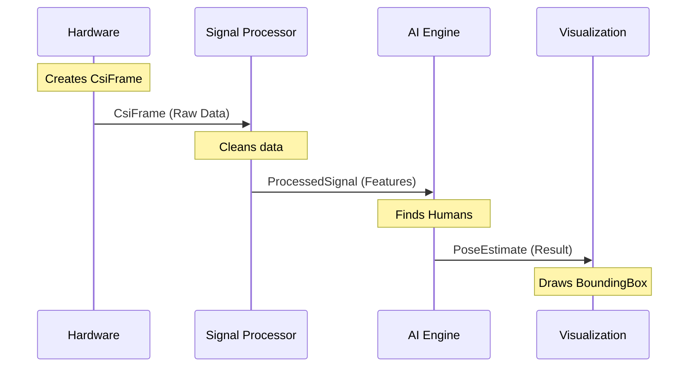

# Chapter 2: Core Domain Types

In the [previous chapter](01_service_orchestrator.md), we built the **Service Orchestrator** to manage our factory. Now that the factory is open, we need to decide **what** we are putting on the conveyor belts.

## The Problem: Speaking Different Languages

Our system is a hybrid:
1.  **Rust** handles the heavy lifting (math and hardware).
2.  **Python** handles the brains (AI models).
3.  **JavaScript** handles the visuals.

If the Rust component sends a "blob of binary data" to Python, and Python expects a "dictionary of numbers," the system crashes. It's like a chef shouting orders in French to a waiter who only speaks Japanese.

## The Solution: A Shared Dictionary

We solve this by defining **Core Domain Types**. These are standardized data structures that act as contracts between different parts of the system.

Think of these types as **Shipping Containers**.
*   It doesn't matter if the container is on a ship (Rust), a truck (Python), or a train (JavaScript).
*   The container always has the same shape.
*   The label (`FrameId`) is always in the same spot.

## The Core Data Lifecycle

Let's follow a single snapshot of time as it flows through our system to understand the three most important types.

### 1. The Tracking Number: `FrameId`
Every single piece of data in our system needs a unique ID. If we lose a frame, or if the AI is running too slow, we need to know exactly *which* moment in time we are looking at.

```rust
// A unique identifier (UUID) for a specific moment in time
pub struct FrameId(Uuid);

// Usage: Stamping a new frame with an ID
let id = FrameId::new();
```
*Explanation:* This is our tracking number. It ensures that the signal captured at 12:00:01 PM stays linked to the pose detected at 12:00:01 PM.

### 2. The Raw Material: `CsiFrame`
This is the raw data captured by the WiFi hardware. It contains complex numbers representing how WiFi signals bounced around the room.

```rust
pub struct CsiFrame {
    pub id: FrameId,              // The tracking number
    pub data: Array2<Complex64>,  // The raw WiFi signal
    pub timestamp: Timestamp,     // Exact time of capture
}
```
*Explanation:* This is the heavy box. It holds the raw "Channel State Information" (CSI). It's messy and needs processing, which we will do in the [CSI Signal Processor](03_csi_signal_processor.md).

### 3. The Finished Product: `PersonPose`
After the AI works its magic, this is what we get. It's a clean, understandable description of a human.

```rust
pub struct PersonPose {
    // Where are the body parts? (Nose, Elbow, Knee...)
    pub keypoints: [Option<Keypoint>; 17], 
    
    // How sure are we that this is a person? (0.0 to 1.0)
    pub confidence: Confidence,
}
```
*Explanation:* This is the final result. It doesn't care about WiFi frequencies or complex math. It just says: "Here is a person."

## Deep Dive: Safe Data Structures

One specific goal of our Core Types is **safety**. We don't just use standard numbers; we use "Smart Types" that prevent bugs.

### The `Confidence` Type
In many systems, confidence is just a decimal number (`float`). But what happens if a bug sets confidence to `500.0` or `-10.0`? That breaks the math.

In `wifi-densepose`, we wrap this in a strict type:

```rust
// From src/types.rs
pub struct Confidence(f32);

impl Confidence {
    pub fn new(value: f32) -> Result<Self, Error> {
        if value < 0.0 || value > 1.0 {
            // This prevents "impossible" values from existing!
            return Err(Error::InvalidConfidence);
        }
        Ok(Self(value))
    }
}
```
*Explanation:* You literally *cannot* create a `Confidence` object with an invalid number. The compiler and the code structure won't let you. This makes the [Neural Inference Engine](04_neural_inference_engine.md) much safer.

### The `Keypoint` Type
A human body map is made of specific points. We use the **COCO Keypoint** standard (common in AI).

```rust
// From src/types.rs
pub struct Keypoint {
    pub keypoint_type: KeypointType, // e.g., Nose, LeftElbow
    pub x: f32,                      // Position X
    pub y: f32,                      // Position Y
    pub confidence: Confidence,      // Is this really an elbow?
}
```
*Explanation:* Each point knows *what* it is, *where* it is, and *how visible* it is.

## Usage: Calculating a Bounding Box

The domain types aren't just for storage; they have helper methods to make our lives easier.

Imagine the AI detected a nose, a left foot, and a right hand. We want to draw a box around the whole person for the [Visualization Component](05_visualization_component.md). We don't need to write the math ourselves; the `PersonPose` type knows how to do it.

```rust
// Example logic using the domain types
fn get_person_box(pose: &PersonPose) -> Option<BoundingBox> {
    // The type itself handles the min/max calculation
    pose.compute_bounding_box()
}
```
*Explanation:* The `PersonPose` struct looks at all its visible keypoints, finds the leftmost, rightmost, top, and bottom points, and returns a clean `BoundingBox`.

## Visualizing the Data Flow

Here is how these types flow through the system we are building.



## Under the Hood

Let's look at `rust-port/wifi-densepose-rs/crates/wifi-densepose-core/src/types.rs` to see how `KeypointType` is defined. We use an **Enum** (Enumeration) to list every possible body part.

```rust
// From src/types.rs
#[repr(u8)]
pub enum KeypointType {
    Nose = 0,
    LeftEye = 1,
    RightEye = 2,
    LeftEar = 3,
    // ... shoulders, elbows, hips ...
    RightAnkle = 16,
}
```
*Explanation:* By assigning a number to every body part, we ensure that `LeftEye` is always index `1`. We never have to guess if the string is "LeftEye", "left_eye", or "eye_L". It is strictly defined.

## Summary

In this chapter, we established the "vocabulary" for our project:

1.  **`FrameId`**: The tracking number.
2.  **`CsiFrame`**: The raw WiFi input.
3.  **`PersonPose`**: The human output.
4.  **`Confidence`**: A safe wrapper for probability.

Now that we have our data structures ready, we can start filling them with real data. In the next chapter, we will build the component that takes messy radio waves and turns them into clean signals.

[Next Chapter: CSI Signal Processor](03_csi_signal_processor.md)

---

Generated by [Code IQ](https://github.com/adityasoni99/Code-IQ)