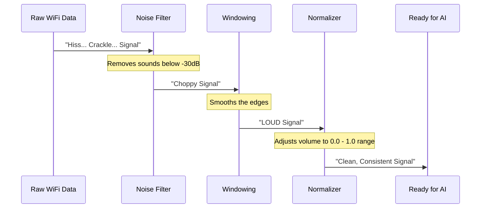

# Chapter 3: CSI Signal Processor

In the [previous chapter](02_core_domain_types.md), we defined the boxes (`CsiFrame`, `PersonPose`) that carry our data. Now, we need to talk about what goes *inside* those boxes.

## The Problem: The "Static" on the Line

Imagine you are trying to listen to your favorite song on an old radio. You turn the dial, but you hear a lot of static hiss, crackles, and pops. The music is there, but it's buried under noise.

Raw WiFi signals are exactly like that.
1.  **Noise:** Random electronic interference creates "static."
2.  **Scale:** Some signals are deafeningly loud (close to the router), others are whispers (far away).
3.  **Glitches:** Sometimes the hardware sends garbage data.

If we send this messy data directly to our AI, it will be like trying to recognize a song while a vacuum cleaner is running next to the speaker. The AI will fail.

## The Solution: The Audio Engineer

The **CSI Signal Processor** is our system's audio engineer. Its job is to take the raw, noisy "recording" from the WiFi hardware and polish it until it is crystal clear.

It performs three main tasks:
1.  **Noise Filtering:** Removes the static hiss.
2.  **Windowing:** Smooths out the sharp edges of the signal.
3.  **Normalization:** Adjusts the volume so everything is at a consistent level.

## Understanding the Signal

Before we process it, we need to understand what a WiFi signal actually looks like to a computer. It has two parts:

1.  **Amplitude:** How "loud" the signal is. If you stand next to the router, amplitude is high.
2.  **Phase:** The timing of the wave. When the signal bounces off a wall, it arrives a tiny fraction of a second later, changing the phase.

> **Analogy:** Think of the signal like a ball being thrown. **Amplitude** is how hard it hits the wall. **Phase** is exactly *when* it hits.

## Usage: Cleaning the Data

Let's look at how we use the processor in our code. We don't need to understand the complex math (Fast Fourier Transforms) happening inside; we just need to use the "Clean" button.

### Step 1: Configuration
First, we tell the processor how aggressive we want to be with cleaning.

```rust
// Create default settings (balanced for most homes)
let config = CsiProcessorConfig::default();

// Create the processor instance
let processor = CsiProcessor::new(config)?;
```
*Explanation:* We load the default settings. These defaults are tuned to filter out background electronic noise without deleting the human signal.

### Step 2: The Cleaning Cycle
Now, we take a raw frame of data and pass it through the processor.

```rust
// 'raw_frame' is the messy data from the hardware
// 'clean_frame' is the polished result
let clean_frame = processor.preprocess(&raw_frame)?;
```
*Explanation:* The `preprocess` function is the magic wand. It runs the data through the noise filter, the smoother, and the volume leveler.

### Step 3: Feature Extraction
Once the data is clean, we extract the specific features the AI needs to see.

```rust
// Extract features (like how the signal changed over time)
// This prepares the data for the Neural Network
let features = processor.extract_features(&clean_frame)?;
```
*Explanation:* The AI doesn't always look at the raw wave; it looks for patterns. `extract_features` summarizes the wave into a "fingerprint" that represents the room at that moment.

## Under the Hood: The Cleaning Pipeline

What actually happens inside `preprocess`? It's a pipeline, meaning the data flows through a series of stations.



### 1. Noise Removal (The Gate)
We use a threshold (usually -30 decibels). Anything quieter than this is considered "silence" or background static and is removed.

```rust
// From src/csi_processor.rs
// Convert amplitude to decibels (dB)
let amplitude_db = csi_data.amplitude.mapv(|a| 20.0 * a.log10());

// Create a mask: Keep only loud signals
let noise_mask = amplitude_db.mapv(|db| db > self.noise_threshold);
```
*Explanation:* We look at every part of the signal. If it's too quiet (`db > threshold` is False), we set it to zero.

### 2. Windowing (The Smoother)
In signal processing, cutting a signal abruptly creates "jagged edges" in the data. We use a **Hamming Window**. Imagine taking a square photo and fading the edges to black so it blends in nicely. That's what windowing does to the signal.

```rust
// From src/csi_processor.rs
// Calculate the curve (Hamming window)
let window = Self::hamming_window(n);

// Multiply our signal by this curve
for (i, val) in row.iter_mut().enumerate() {
    *val *= window[i];
}
```
*Explanation:* We multiply the middle of the signal by 1.0 (keep it) and the edges by nearly 0.0 (fade it out). This prevents mathematical errors later on.

### 3. Normalization (The Equalizer)
Finally, we need to handle the volume. If a person is standing right next to the router, the signal is huge. If they are far away, it's tiny. The AI works best when all numbers are between 0 and 1.

```rust
// From src/csi_processor.rs
// Find the average volume (Standard Deviation)
let std_dev = self.calculate_std(&csi_data.amplitude);

// Divide everything by that average
let normalized = csi_data.amplitude.mapv(|a| a / std_dev);
```
*Explanation:* We divide the signal by its own average size. Now, a "strong" signal is just a relative spike, not a massive number that breaks our math.

## Summary

The **CSI Signal Processor** is the bridge between the chaotic physical world and the orderly digital world.

1.  It takes **Raw Data** (noisy, messy).
2.  It applies **Filtering** (removes static).
3.  It applies **Windowing** (smooths edges).
4.  It applies **Normalization** (fixes volume).

Now that we have clean, standardized data, we are ready to send it to the brain of our operation.

In the next chapter, we will feed this clean signal into the **Neural Inference Engine** to detect human poses.

[Next Chapter: Neural Inference Engine](04_neural_inference_engine.md)

---

Generated by [Code IQ](https://github.com/adityasoni99/Code-IQ)