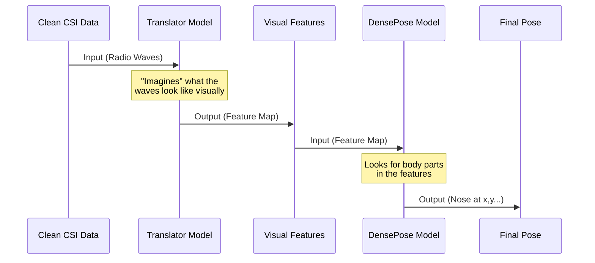

# Chapter 4: Neural Inference Engine

In the [previous chapter](03_csi_signal_processor.md), we acted as "Audio Engineers," cleaning up the messy radio signals from our WiFi hardware. We now have a clean, smooth signal.

But looking at a smooth wave on a graph doesn't tell us where someone is standing. To a human, it just looks like a squiggly line. We need a translator.

## The Problem: The Abstract Language of Radio

Imagine you are handed a note written in a language you've never seen. The handwriting is perfect (thanks to our cleanup work), but you have no idea what it says.

WiFi signals are an abstract language. A specific ripple in the signal might mean "left arm raised," or it might mean "dog walked by." Writing manual "if-then" rules for every possible movement is impossible.

## The Solution: The Artificial Brain

The **Neural Inference Engine** is the brain of our system. Instead of manual rules, we use **Deep Learning**. We have trained a computer model to look at millions of WiFi ripples and learn which ones correspond to which body poses.

This engine performs **Inference**: it looks at new data and makes a prediction based on what it learned in the past.

### Key Responsibilities
1.  **Translation:** Converts 1D WiFi signals into 2D "visual" features (imagine creating a heat map from radio waves).
2.  **Segmentation:** Identifies which parts of the "image" are human body parts (head, torso, arms).
3.  **Coordinate Regression:** Pinpoints the exact location of specific points (like the tip of the nose).

## Usage: Thinking Fast

We implement the engine in **Rust** for maximum speed, but the models are often designed in Python. Let's look at how we use the engine in our application.

### Step 1: Configuring the Engine
Before we can think, we need to decide *how* to think. Do we use the CPU (slower, easier) or the GPU (faster, requires setup)?

```rust
// From src/main.rs (Concept)
// Create options: Use the CPU, running on 4 threads
let options = InferenceOptions::cpu()
    .with_threads(4)
    .with_batch_size(1);
```
*Explanation:* We configure the engine. We stick to the CPU here because it's compatible with almost every computer.

### Step 2: Loading the Pipeline
We don't just run one model; we run a **Pipeline**. This connects the raw signal translator to the pose detector.

```rust
// Create the full pipeline
let pipeline = WiFiDensePosePipeline::new(
    translator_backend, // Model 1: WiFi -> Features
    densepose_backend,  // Model 2: Features -> Pose
    translator_config,
    densepose_config,
    options
);
```
*Explanation:* This creates our "Brain." It loads two separate AI models and links them together.

### Step 3: Making a Prediction
Now, we feed the clean data from the [CSI Signal Processor](03_csi_signal_processor.md) into the pipeline.

```rust
// 'clean_frame' comes from Chapter 3
// 'pose_output' is the result containing body parts
let pose_output = pipeline.run(&clean_frame)?;
```
*Explanation:* This single line does all the heavy lifting. It returns a `DensePoseOutput` containing the segmentation (where the body is) and coordinates.

## Under the Hood: The Logic Flow

How does the engine actually process this? It's a relay race between two neural networks.



### 1. The Python Blueprint (`DensePoseHead`)
The logic for finding body parts is defined in our Python code (`src/models/densepose_head.py`). This defines the structure of the "Brain."

The model splits its attention into two tasks simultaneously:

```python
# From src/models/densepose_head.py
def forward(self, x):
    # 1. Shared processing (understanding the image)
    shared_features = self.shared_conv(x)
    
    # 2. Task A: What body part is this? (Arm? Leg?)
    segmentation = self.segmentation_head(shared_features)
    
    # 3. Task B: Exact coordinates (X, Y)
    uv_coordinates = self.uv_regression_head(shared_features)
    
    return {'segmentation': segmentation, 'uv_coordinates': uv_coordinates}
```
*Explanation:*
*   `shared_features`: The model first tries to understand the general shape.
*   It then splits into two "Heads" (hence the name `DensePoseHead`).
*   One head asks "What is it?" (Segmentation).
*   The other head asks "Where is it exactly?" (UV Regression).

### 2. The Rust Engine (`InferenceEngine`)
The Rust code wraps the raw mathematics to make it safe and easy to use. It handles the details of talking to the hardware (CPU/GPU).

Let's look at `inference.rs` to see how it manages performance stats.

```rust
// From crates/wifi-densepose-nn/src/inference.rs
pub fn infer(&self, input: &Tensor) -> NnResult<Tensor> {
    let start = std::time::Instant::now();

    // Run the actual math (matrix multiplication)
    let result = self.backend.run_single(input)?;

    // Calculate how long it took
    let elapsed_ms = start.elapsed().as_secs_f64() * 1000.0;
    
    // Save stats (for debugging later)
    self.stats.write().await.record(elapsed_ms);

    Ok(result)
}
```
*Explanation:* The engine wraps the actual calculation with a timer. This is crucial for a real-time system. If inference takes 500ms, our video will look laggy. We need to know if the brain is thinking too slowly.

### 3. The Pipeline Connection
The `WiFiDensePosePipeline` in Rust connects the dots. It ensures the output of the first model fits perfectly into the input of the second.

```rust
// From crates/wifi-densepose-nn/src/inference.rs
pub fn run(&self, csi_input: &Tensor) -> NnResult<DensePoseOutput> {
    // Step 1: Translate CSI to visual features
    let visual_features = self.translator_backend.run_single(csi_input)?;

    // Step 2: Feed those features into DensePose
    let mut inputs = HashMap::new();
    inputs.insert("features".to_string(), visual_features);

    let outputs = self.densepose_backend.run(inputs)?;
    // ... process and return outputs
}
```
*Explanation:* This function acts as the glue. It takes the "Visual Features" created by the translator and immediately feeds them into the DensePose backend. It abstracts away the complexity; the user just puts in `csi_input` and gets back a pose.

## Summary

The **Neural Inference Engine** is the magical component that turns abstract numbers into meaningful data.

1.  It uses a **Pipeline** approach: Translating signals first, then detecting poses.
2.  It uses **Heads**: One for identifying body parts, one for precise coordinates.
3.  It is wrapped in **Rust** to ensure it runs fast enough for real-time usage.

At this point, our system knows exactly where the person is. It has the coordinates (e.g., "Nose is at x:50, y:100"). However, coordinates are just numbers. To make this useful for a human user, we need to draw this on a screen.

In the next chapter, we will build the interface that lets us see what the AI sees.

[Next Chapter: Visualization Component](05_visualization_component.md)

---

Generated by [Code IQ](https://github.com/adityasoni99/Code-IQ)