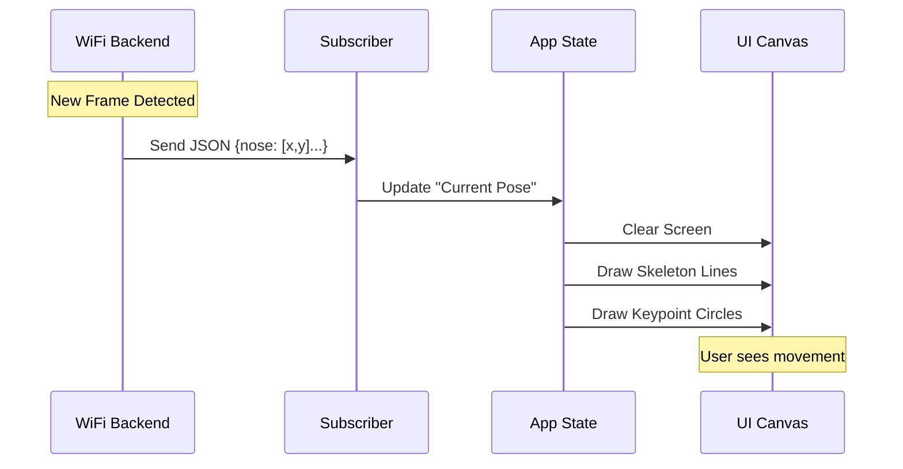

# Chapter 5: Visualization Component

In the [previous chapter](04_neural_inference_engine.md), we built the **Neural Inference Engine**, the brain of our system. It successfully looks at WiFi signals and outputs precise coordinates, like "Person A: Nose at (150, 200)."

However, a stream of coordinates scrolling down a terminal window is impossible for a human to read quickly.

## The Problem: Data You Can't See

Imagine watching a football game, but instead of seeing the players, you only see a spreadsheet of their GPS coordinates updating in real-time. It would be impossible to follow the game.

Our system currently produces mathematically perfect data, but it is **invisible** to the user. We need a way to turn those numbers back into a visual representation that a human can understand instantly.

## The Solution: The Digital Artist

The **Visualization Component** is the frontend interface running in the user's browser. It acts like a high-speed digital artist.

1.  It receives the coordinates from the backend.
2.  It wipes the canvas clean.
3.  It plays "connect the dots" to draw the skeleton.
4.  It does this 30 times a second to create smooth motion.

## Key Concepts

Before we write code, let's understand the three layers of our visualization.

### 1. The Canvas
This is our drawing board. In HTML5, the `<canvas>` element provides a rectangular area where we can draw lines, circles, and text using JavaScript.

### 2. The Subscriber
This is the mailbox. It listens for messages from the backend. When a new "Pose Update" arrives, it wakes up the renderer.

### 3. The Renderer
This is the artist. It knows that a "Left Elbow" connects to a "Left Shoulder" and a "Left Wrist." It handles the geometry and colors.

## Usage: Painting with Code

Let's look at how we use the `PoseDetectionCanvas` component to bring our data to life. This code typically lives in the frontend application (`ui/app.js`).

### Step 1: Create the Canvas
We start by finding the container in our HTML and telling the component to set up shop there.

```javascript
// From ui/components/PoseDetectionCanvas.js
// Initialize the component with a specific container ID
const poseCanvas = new PoseDetectionCanvas('camera-view', {
    width: 800,
    height: 600,
    zoneId: 'living_room'
});
```
*Explanation:* We create a new instance of our visualizer. We tell it to look for an HTML element with `id="camera-view"` and set the resolution.

### Step 2: Start the Flow
Just creating the canvas isn't enough; we need to turn it on.

```javascript
// Start the visualization
await poseCanvas.start();
```
*Explanation:* When we call `.start()`, the component connects to the backend [Service Orchestrator](01_service_orchestrator.md) and asks for the stream of pose data.

### Step 3: Handling Updates (The Loop)
Ideally, you don't need to write this part manually because the component handles it, but conceptually, this is what happens every time data arrives:

```javascript
// Internal logic simplified
handlePoseUpdate(update) {
    // 1. Save the newest data
    this.state.lastPoseData = update.data;

    // 2. Clear the old drawing and paint the new one
    this.renderer.render(update.data);
}
```
*Explanation:* This function runs dozens of times per second. It ensures that what you see on screen matches exactly what the WiFi detected milliseconds ago.

## Visualizing the Flow

Here is how the data travels from the backend to your screen.



## Under the Hood

Let's look inside `ui/components/PoseDetectionCanvas.js` to see how this is implemented.

### 1. The Structure
The component creates the HTML structure dynamically. This ensures that wherever we drop this component, it has its buttons, status lights, and canvas ready.

```javascript
// From ui/components/PoseDetectionCanvas.js
createDOMStructure() {
    this.container.innerHTML = `
      <div class="pose-canvas-wrapper">
        <div class="pose-canvas-header">
           <h3>Human Pose Detection</h3>
        </div>
        <canvas id="pose-canvas-${this.containerId}"></canvas>
      </div>
    `;
}
```
*Explanation:* We inject HTML directly into the page. This creates the "Frame" around our picture.

### 2. The Subscription
This connects our frontend to the [Core Domain Types](02_core_domain_types.md) streaming from the server.

```javascript
// From ui/components/PoseDetectionCanvas.js
setupPoseServiceSubscription() {
    // Listen for data coming from the server
    poseService.subscribeToPoseUpdates((update) => {
        // When data arrives, handle it
        this.handlePoseUpdate(update);
    });
}
```
*Explanation:* We use the Observer pattern. We tell the `poseService`: "Hey, whenever you get new info, run this function."

### 3. The Demo Mode (Simulation)
What if you don't have the WiFi hardware yet? The component includes a "Demo Mode" that mathematically generates fake people walking and dancing.

```javascript
// From ui/components/PoseDetectionCanvas.js
generateWalkingPerson(centerX, centerY, time) {
    // Use Math.sin to create a smooth walking wave
    const walkCycle = Math.sin(time) * 0.3;
    
    // Calculate where the knee should be based on time
    const kneeY = centerY + 120 + walkCycle * 10;
    
    return { x: centerX, y: kneeY, confidence: 0.9 };
}
```
*Explanation:* This is a clever trick. Instead of reading sensors, we use Sine waves (trigonometry) to calculate where body parts *should* be if someone were walking. This allows developers to test the UI without turning on the complex hardware from [Chapter 3](03_csi_signal_processor.md).

### 4. Rendering the Skeleton
While the full code is in a helper class, the logic for drawing a person is straightforward:

```javascript
// Conceptual drawing logic
function drawSkeleton(keypoints) {
    // Draw the "Bones"
    drawLine(keypoints.leftShoulder, keypoints.rightShoulder);
    drawLine(keypoints.leftShoulder, keypoints.leftElbow);
    
    // Draw the "Joints"
    drawCircle(keypoints.nose, 'red');
}
```
*Explanation:* We iterate through the standard list of body parts defined in our [Core Domain Types](02_core_domain_types.md). If the `confidence` score is high enough (meaning the AI is sure), we draw the line.

## Summary

The **Visualization Component** closes the loop for the user.
1.  It creates a **Canvas** to draw on.
2.  It **Subscribes** to the stream of invisible coordinates.
3.  It **Renders** skeletons in real-time.
4.  It offers a **Demo Mode** for testing without hardware.

We now have a complete pipeline! We can read signals, process them, understand them, and see them.

But what do we *do* with this system? In the next chapter, we will build a real-world application using everything we've learned: a system to help rescue teams find victims in disaster zones.

[Next Chapter: WiFi-Mat Disaster Response](06_wifi_mat_disaster_response.md)

---

Generated by [Code IQ](https://github.com/adityasoni99/Code-IQ)