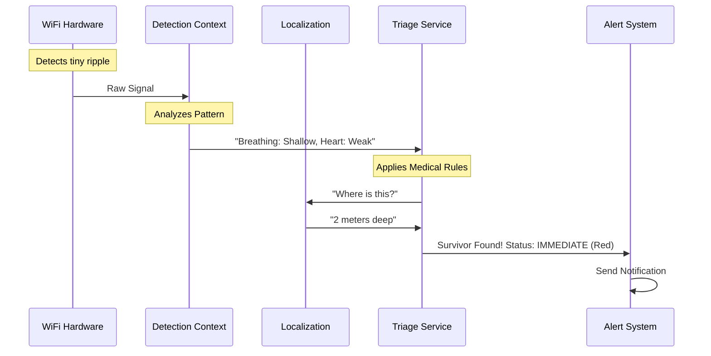

# Chapter 6: WiFi-Mat Disaster Response

In the [previous chapter](05_visualization_component.md), we built a cool visualizer to see stick figures dancing on a screen. That is fun for gaming or smart homes, but now we are going to apply our technology to something much more serious: **Saving Lives**.

## The Problem: Hide and Seek in the Rubble

Imagine an earthquake strikes. A building collapses. Rescue teams arrive, but they face a massive pile of concrete and steel. They know people are trapped underneath, but they don't know *where*.

*   **Rescue Dogs** are great, but they get tired and can be confused by other smells.
*   **Acoustic Sensors** listen for screaming, but unconscious victims can't scream.
*   **Cameras** can't see through concrete.

We need a way to "look" inside the rubble and find people who are alive but motionless.

## The Solution: The High-Tech Rescue Dog

**WiFi-Mat** (Mass Casualty Assessment Tool) is a specialized layer of our system. While the standard pose tracker looks for *movement* (walking, waving), WiFi-Mat looks for **Life**.

It detects the tiny, rhythmic chest movements caused by breathing and heartbeats, even through walls or debris.

### Key Responsibilities
1.  **Scanning:** Monitoring a specific geographic area (a "Scan Zone").
2.  **Detection:** Identifying survivors based on breathing patterns.
3.  **Triage:** Automatically prioritizing victims (Who needs help first?).

## Core Concepts

Before we write code, let's understand the three main concepts in this disaster response domain.

### 1. The Scan Zone
This is the specific area of the disaster site we are checking. Think of it like a flashlight beam. We point our WiFi antennas at a specific pile of rubble.

### 2. The Survivor
In our previous chapters, we just detected a "Pose." In this chapter, we detect a **Survivor**. A Survivor entity contains medical data:
*   Are they breathing?
*   How fast is their heart beating?
*   How deep under the rubble are they?

### 3. Triage Status (The Color Code)
In a disaster, doctors use a color-code system called **START** to decide who to save first. WiFi-Mat calculates this automatically:
*   🔴 **Immediate:** Critical condition (irregular breathing). Save them now!
*   🟡 **Delayed:** Injured but stable.
*   🟢 **Minor:** "Walking wounded."
*   ⚫ **Deceased:** No vital signs detected.

## Usage: Running a Rescue Mission

Let's look at how to use the `DisasterResponse` system in our code.

### Step 1: Configure the Mission
We start by setting up the rules for our search.

```rust
// From src/main.rs
// Configure the rescue system
let config = DisasterConfig::builder()
    .disaster_type(DisasterType::Earthquake)
    .sensitivity(0.9) // High sensitivity (don't miss anyone!)
    .build();

// Initialize the response coordinator
let mut mission = DisasterResponse::new(config);
```
*Explanation:* We create a mission profile. We set sensitivity to `0.9` because in a rescue scenario, it's better to have a false alarm than to miss a dying person.

### Step 2: Define the Zone
We tell the system where the building collapsed.

```rust
// Create a zone for "Building A"
let zone = ScanZone::new(
    "Building A - North Wing",
    ZoneBounds::rectangle(0.0, 0.0, 50.0, 30.0), // 50m x 30m area
);

// Add the zone to our mission
mission.add_zone(zone)?;
```
*Explanation:* We define a rectangular area. The system will now focus the [CSI Signal Processor](03_csi_signal_processor.md) on this coordinate grid.

### Step 3: Start Scanning
Now, we turn on the "X-Ray."

```rust
// Start the async scanning loop
// This runs in the background looking for life
mission.start_scanning().await?;
```
*Explanation:* This starts an infinite loop. It continuously pulls data from the hardware, processes it, and looks for the signature of human breathing.

### Step 4: Checking for Survivors
In your user interface or command center, you can query the system for found victims.

```rust
// Ask: "Who needs help immediately?"
let critical_victims = mission.survivors_by_triage(TriageStatus::Immediate);

for victim in critical_victims {
    println!("CRITICAL ALERT: Survivor at depth {}m", victim.location.z);
}
```
*Explanation:* This allows rescue commanders to see a list of high-priority targets instantly.

## Under the Hood: The Triage Pipeline

How does the system decide if someone is a "Red Tag" (Critical) or "Green Tag" (Minor)? It uses a specialized pipeline.



### 1. The Survivor Entity
This is the core data structure defined in `src/domain/survivor.rs`. It holds the life history of the person found.

```rust
// From src/domain/survivor.rs
pub struct Survivor {
    pub id: SurvivorId,
    pub vital_signs: VitalSignsHistory, // History of breathing/heartbeat
    pub triage_status: TriageStatus,    // Current medical priority
    pub confidence: ConfidenceScore,    // Are we sure it's a person?
}
```
*Explanation:* Unlike the `PersonPose` in [Chapter 2](02_core_domain_types.md), this struct doesn't care about where the nose or elbow is. It cares about the internal state of the body.

### 2. The Triage Calculator
This service implements the logic of a paramedic. It looks at the data and makes a decision.

```rust
// From src/alerting/triage.rs
pub fn calculate_triage(vitals: &VitalSignsReading) -> TriageStatus {
    // Rule 1: No breathing detected?
    if vitals.breathing.is_none() {
        return TriageStatus::Deceased; 
    }

    // Rule 2: Breathing too fast or too slow?
    let rate = vitals.breathing.unwrap().rate_bpm;
    if rate > 30.0 || rate < 10.0 {
        return TriageStatus::Immediate; // Red Tag
    }
    
    // ... more rules ...
    TriageStatus::Delayed // Yellow Tag
}
```
*Explanation:* This is a simplified version of the "START" protocol used by real first responders. If breathing is irregular, the system automatically flags the survivor as **Immediate** priority.

### 3. Localization in Debris
Finding a pose in an open room is easy. Finding a heartbeat under 3 meters of concrete is hard because the signal gets weaker (attenuation).

The `LocalizationService` estimates depth by seeing how much the signal has faded.

```rust
// From src/localization/service.rs
fn estimate_depth(signal_strength: f64, material: MaterialType) -> f64 {
    // Concrete blocks WiFi signals by a known amount
    let attenuation_per_meter = material.attenuation_factor();
    
    // Calculate distance based on signal loss
    let depth = signal_strength.abs() / attenuation_per_meter;
    depth
}
```
*Explanation:* If we know we are scanning through concrete, and the breathing signal is very faint, we can calculate that the person is deep underground.

## Summary

The **WiFi-Mat Disaster Response** module turns our pose detection system into a life-saving tool.

1.  It defines **Scan Zones** to organize the search.
2.  It detects **Survivors** based on vital signs, not just movement.
3.  It performs automated **Triage** to help rescuers prioritize.

However, recognizing "breathing" from a WiFi signal is mathematically very different from recognizing an "arm." An arm is a large movement; breathing is a movement of just a few millimeters.

In the next chapter, we will dive into the **Vital Signs Detector** to see how we extract heartbeats from thin air.

[Next Chapter: Vital Signs Detector](07_vital_signs_detector.md)

---

Generated by [Code IQ](https://github.com/adityasoni99/Code-IQ)