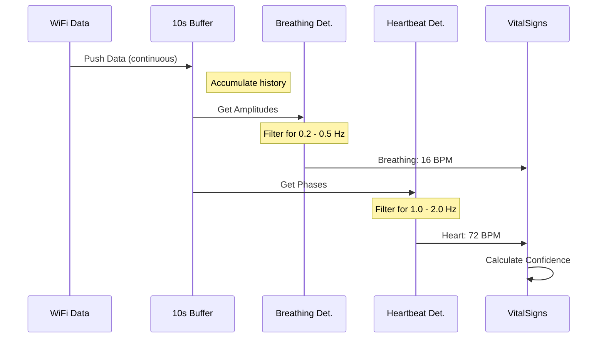

# Chapter 7: Vital Signs Detector

In the [previous chapter](06_wifi_mat_disaster_response.md), we built a "Disaster Response" system to manage search and rescue missions. We defined zones to scan and created a system to triage survivors.

But how do we tell the difference between a pile of rocks and an unconscious person buried under those rocks? Neither of them is walking around.

## The Problem: The Silence of the Rubble

Standard motion detection (like in security cameras) works by seeing pixels change significantly. If you wave your hand, the pixels change.

However, an unconscious survivor isn't waving. They are lying perfectly still.
*   **Breathing** moves the chest by only a few millimeters.
*   **Heartbeats** move the skin by fractions of a millimeter.

To standard WiFi equipment, this looks like silence. We need a way to "zoom in" on the signal and hear the tiniest whispers of movement.

## The Solution: The WiFi Stethoscope

The **Vital Signs Detector** acts exactly like a doctor's stethoscope.

When a doctor listens to your chest, they ignore the noise of the room (traffic, talking) and focus entirely on the rhythmic *thump-thump* of your heart.

Our detector does the same with radio waves:
1.  **Buffers Data:** It records a few seconds of WiFi signal history.
2.  **Filters Noise:** It removes static and random movements.
3.  **Finds Rhythms:** It looks for specific frequencies that match human biology (Breathing: ~12-20 times/min, Heart: ~60-100 times/min).

## Key Concepts

To understand how this works, we need to grasp three simple concepts.

### 1. The Data Buffer
You cannot detect a rhythm from a single snapshot. Imagine trying to identify a song by hearing only one note. It's impossible.

To detect breathing, we need to watch the signal for at least 5 to 10 seconds. We store this history in a **Buffer**.

### 2. Micro-Doppler Effect
When a wave hits a moving object, its frequency changes slightly.
*   If the chest expands toward the router, the wave squishes (frequency goes up).
*   If the chest contracts, the wave stretches (frequency goes down).

Even though the chest only moves a tiny bit, the **Phase** of the WiFi signal captures this shift perfectly.

### 3. Separation
Breathing is slow. Heartbeats are fast. The detector splits the signal into two "channels" so it doesn't get confused.
*   **Low Frequency Channel:** Checks for Breathing.
*   **High Frequency Channel:** Checks for Heartbeats.

## Usage: Listening for Life

Let's look at how to use the `DetectionPipeline` to find these invisible rhythms.

### Step 1: Initialize the Pipeline
We first set up the detector with our configuration.

```rust
// From src/main.rs
// Create default settings (tuned for human biology)
let config = DetectionConfig::default();

// Create the pipeline engine
let mut detector = DetectionPipeline::new(config);
```
*Explanation:* We create the digital stethoscope. It is now ready to process data, but it needs input.

### Step 2: Feed the Buffer
We need to feed it data continuously. This usually comes from the [CSI Signal Processor](03_csi_signal_processor.md).

```rust
// Add new raw data to the internal history buffer
// amplitudes: Signal strength (good for breathing)
// phases: Signal timing (good for heartbeat)
detector.add_data(&amplitudes, &phases);
```
*Explanation:* Every time the hardware sends a packet (milliseconds), we push it into the detector. It saves this data until it has enough to form a pattern.

### Step 3: Check for Signs
Once we have a few seconds of data, we ask the detector what it found.

```rust
// Analyze the buffered data
// Returns an Option<VitalSignsReading>
if let Some(reading) = detector.process_zone(&zone).await? {
    println!("Survivor Detected!");
    println!("Confidence: {}", reading.confidence.value());
}
```
*Explanation:* The detector looks at the history it collected. If it sees a rhythmic pattern, it returns a `VitalSignsReading`. If it sees only noise, it returns `None`.

### Step 4: Reading the Vitals
If a survivor is found, we can inspect their specific medical data.

```rust
// Inside the detection block...
if let Some(heart) = reading.heartbeat {
    println!("Heart Rate: {} BPM", heart.rate_bpm);
}

if let Some(breath) = reading.breathing {
    println!("Breathing: {:?}", breath.pattern_type);
}
```
*Explanation:* We access the sub-components. Notice how `pattern_type` might tell us if the breathing is "Shallow" or "Labored," which helps with the triage we discussed in [Chapter 6](06_wifi_mat_disaster_response.md).

## Under the Hood: The Detection Flow

How does the code turn a messy radio wave into a heart rate?



### 1. The Data Buffer Logic
In `src/detection/pipeline.rs`, we manage the memory. We can't keep data forever, or we'd run out of RAM.

```rust
// From src/detection/pipeline.rs
pub fn add_samples(&mut self, amplitudes: &[f64], phases: &[f64]) {
    // Add new data
    self.amplitudes.extend(amplitudes);
    
    // Drop old data (keep only last 30 seconds)
    if self.amplitudes.len() > max_samples {
         self.amplitudes.drain(0..drain_count);
    }
}
```
*Explanation:* This is a "Rolling Buffer." Imagine recording a video tape that loops every 30 seconds. We always have the most recent history available for analysis.

### 2. The Detection Algorithm
The `detect` function runs the data through our specialized filters.

```rust
// From src/detection/pipeline.rs
fn detect_from_buffer(&self, buffer: &CsiDataBuffer) -> Option<VitalSignsReading> {
    // 1. Look for slow waves (Breathing)
    let breathing = self.breathing_detector.detect(
        &buffer.amplitudes, 
        buffer.sample_rate
    );

    // 2. Look for fast waves (Heartbeat)
    let heartbeat = self.heartbeat_detector.detect(
        &buffer.phases, 
        buffer.sample_rate, 
        // We use breathing info to help filter heartbeat noise!
        breathing_rate 
    );
    
    // Combine them
    return Some(VitalSignsReading::new(breathing, heartbeat, ...));
}
```
*Explanation:* 
1.  We check breathing first because it's the strongest signal.
2.  We check the heartbeat second. Interestingly, breathing actually moves the body so much it creates "noise" for the heartbeat detector. We pass the `breathing_rate` to the heartbeat detector so it can subtract that movement!

### 3. Medical Logic
In `src/domain/vital_signs.rs`, we define what "Normal" looks like.

```rust
// From src/domain/vital_signs.rs
impl BreathingPattern {
    pub fn is_bradypnea(&self) -> bool {
        // Less than 10 breaths per minute is dangerous
        self.rate_bpm < 10.0
    }
}
```
*Explanation:* This isn't just signal processing; it's domain logic. The system knows that a breathing rate of 8 BPM is a medical emergency called "Bradypnea."

## Conclusion

Congratulations! You have reached the end of the **WiFi-DensePose** tutorial.

We have built an incredible system together:
1.  **[Service Orchestrator](01_service_orchestrator.md)**: Started our engines.
2.  **[Core Domain Types](02_core_domain_types.md)**: Created a shared language.
3.  **[CSI Signal Processor](03_csi_signal_processor.md)**: Cleaned the noisy radio waves.
4.  **[Neural Inference Engine](04_neural_inference_engine.md)**: Used AI to see human poses.
5.  **[Visualization Component](05_visualization_component.md)**: Drew the results on screen.
6.  **[WiFi-Mat Disaster Response](06_wifi_mat_disaster_response.md)**: Organized rescue missions.
7.  **Vital Signs Detector**: Detected the invisible rhythms of life.

You now possess the knowledge to turn standard WiFi routers into powerful sensors that can map rooms, detect posture, and even save lives in disaster zones. Thank you for following this journey!

---

Generated by [Code IQ](https://github.com/adityasoni99/Code-IQ)