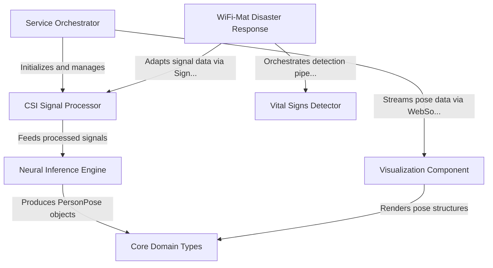

# Tutorial: wifi-densepose

A **WiFi-based perception system** that converts invisible WiFi signal reflections (CSI) into human pose estimates and vital sign analytics. The project features a dual-mode architecture: a **DensePose** pipeline that uses *deep learning* to map body coordinates for general tracking, and a **WiFi-Mat** disaster response module designed to detect *breathing* and *heartbeats* of survivors trapped in rubble.

**Source Repository:** [https://github.com/ruvnet/wifi-densepose](https://github.com/ruvnet/wifi-densepose)

## Chapters

1. [Service Orchestrator](01_service_orchestrator.md)
2. [Core Domain Types](02_core_domain_types.md)
3. [CSI Signal Processor](03_csi_signal_processor.md)
4. [Neural Inference Engine](04_neural_inference_engine.md)
5. [Visualization Component](05_visualization_component.md)
6. [WiFi-Mat Disaster Response](06_wifi_mat_disaster_response.md)
7. [Vital Signs Detector](07_vital_signs_detector.md)

---

Generated by [Code IQ](https://github.com/adityasoni99/Code-IQ)