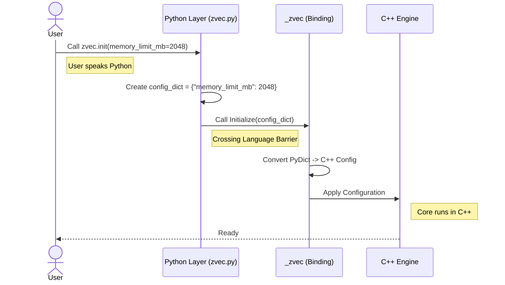

# Chapter 1: Python-C++ Bridge (Bindings)

Welcome to the **Zvec** tutorial! If you want to build high-performance vector databases but love the simplicity of Python, you are in the right place.

## The Motivation: Speed vs. Ease

Imagine you are driving a high-performance race car.
*   **The Engine (C++)**: This is where the power comes from. It's complex, loud, and hard to maintain, but it goes incredibly fast.
*   **The Steering Wheel (Python)**: This is what you actually touch. It's comfortable, ergonomic, and easy to turn.

**The Problem:** How does turning the plastic steering wheel control the metal pistons in the engine? They are made of completely different materials and operate on different principles.

**The Solution:** You need a mechanical linkage system. in `zvec`, this system is the **Python-C++ Bridge**.

### Central Use Case: Starting the Engine
Let's say you want to initialize the database. You want to write a simple Python command, but that command needs to allocate memory and start threads deep inside the C++ core.

## Key Concepts

To understand how `zvec` works, we need to understand three layers:

1.  **The User Layer (Python)**: This is the friendly code you write. It uses standard Python types like `int`, `str`, and `dict`.
2.  **The Bridge (`_zvec`)**: This is a "Universal Translator." It takes a Python object (like a list) and converts it into a memory structure that C++ understands (like a `std::vector`).
3.  **The Core (C++)**: The high-performance engine that does the actual work.

## How to Use It

You don't need to know C++ to drive this car. You just need to know which buttons to press in Python.

Here is how you initialize the system. You pass configuration options using standard Python syntax.

```python
import zvec
from zvec import LogLevel

# We speak Python here!
# We want to limit memory to 2GB and use 4 threads.
zvec.init(
    memory_limit_mb=2048,
    query_threads=4,
    log_level=LogLevel.INFO
)
```

**What happens here?**
The `zvec.init` function collects your arguments. It doesn't run the logic itself; it packages your instructions to send them across the bridge.

## Internal Implementation: Walking the Bridge

Let's look at what happens under the hood when you run the code above.

1.  **Validation**: The Python layer checks if your inputs are valid (e.g., ensuring `memory_limit_mb` is a number).
2.  **Packaging**: It packs valid arguments into a Python dictionary.
3.  **Crossing the Border**: It calls a hidden module named `_zvec`. This module is actually compiled C++ code masquerading as Python.
4.  **Translation**: The bridge library (pybind11) converts the Python dictionary into a C++ `Config` object.
5.  **Execution**: The C++ core receives the config and allocates resources.

### The Sequence Flow

Here is the journey of your command:



## Deep Dive: The Code

Let's look at the actual files that build this bridge.

### 1. The Python Side (`python/zvec/zvec.py`)

This file is the "Steering Wheel." It exposes a friendly function `init`. Its job is to clean up data before sending it to C++.

```python
# python/zvec/zvec.py

# Import the "hidden" C++ module
from _zvec import Initialize, _Collection

def init(memory_limit_mb: Optional[int] = None, ...):
    config_dict = {}
    
    # Only add parameters that the user actually set
    if memory_limit_mb is not None:
        config_dict["memory_limit_mb"] = memory_limit_mb

    # Send the dictionary to the C++ bridge
    Initialize(config_dict)
```

**Explanation:**
The Python function builds a `config_dict`. Notice it imports `Initialize` from `_zvec`. That `_zvec` isn't a Python file—it's the compiled bridge!

### 2. The C++ Side (`src/binding/python/binding.cc`)

This file is the "Linkage." It uses a library called **pybind11** to create the `_zvec` module that Python can import.

```cpp
// src/binding/python/binding.cc

#include "python_config.h" 
// ... other includes ...

namespace zvec {
// This macro creates the python module named "_zvec"
PYBIND11_MODULE(_zvec, m) {
  m.doc() = "Zvec core module";

  // This connects the C++ Config logic to the Python module
  ZVecPyConfig::Initialize(m);
  
  // This connects Collection logic (for later chapters)
  ZVecPyCollection::Initialize(m);
}
}
```

**Explanation:**
This C++ code defines the module structure. `ZVecPyConfig::Initialize(m)` is where the specific function `Initialize` (used in the Python snippet) is actually attached to the module.

## Summary

In this chapter, we learned:
*   **Zvec** is a C++ engine wrapped in Python.
*   The **Bridge** allows Python objects to control C++ memory structures.
*   The `init()` function is the perfect example of Python collecting data and C++ executing the logic.

Now that our engine is initialized and running, we need a place to store our data. In the next chapter, we will learn how to create and manage the actual containers for our vectors.

[Next Chapter: The Collection (Data Container)](02_the_collection__data_container_.md)

---

Generated by [Code IQ](https://github.com/adityasoni99/Code-IQ)