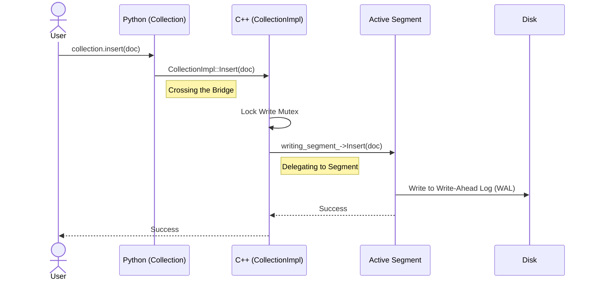

# Chapter 2: The Collection (Data Container)

In the previous chapter, [Python-C++ Bridge (Bindings)](01_python_c___bridge__bindings_.md), we learned how to start the high-performance C++ engine using Python.

Now that the engine is running, we have a problem: **Where do we put the data?**

You can't just throw documents into the engine randomly. You need a structured container to organize, label, and safely store them. In `zvec`, this container is called the **Collection**.

## The Motivation: The Smart Filing Cabinet

Think of a **Collection** as a physical **Smart Filing Cabinet**.

1.  **The Blueprint (Schema)**: Before you buy the cabinet, you decide what goes in it. "This cabinet is for Employee Records. Every file must have an ID, a Name, and a Face Vector."
2.  **The Drawer (Storage)**: You put files in. The cabinet ensures they are sorted and safe.
3.  **Durability**: If the office building (your Python script) loses power, the cabinet is fireproof. When you come back tomorrow, the files are still there.

### Central Use Case: storing Library Books
We want to build a search engine for a library. We need to store:
1.  **ID**: The ISBN number (Integer).
2.  **Title**: The book title (String).
3.  **Embedding**: A semantic vector representing the book's content (Vector).

## Key Concepts

To use a Collection, we need to understand three components:

1.  **Schema**: The strict definition of your data fields. `zvec` is typed—you can't put text into an integer field.
2.  **The Collection Object**: The Python object representing the database on your disk.
3.  **The Document (Doc)**: The actual row of data you insert.

## How to Use It

Let's define our Library Schema and create the Collection.

### Step 1: Define the Blueprint (Schema)

We use `FieldSchema` to define columns and `CollectionSchema` to wrap them up.

```python
from zvec import CollectionSchema, FieldSchema, DataType

# Define the columns
id_field = FieldSchema(name="book_id", dtype=DataType.INT64)
title_field = FieldSchema(name="title", dtype=DataType.STRING)
# Vectors need a dimension size (e.g., 4 floats)
vec_field = FieldSchema(name="vector", dtype=DataType.VECTOR_FLOAT, dim=4)

# Create the blueprint
library_schema = CollectionSchema(name="library", fields=[id_field, title_field, vec_field])
```

### Step 2: Open the Collection

Now we create the actual collection on the disk.

```python
from zvec import Collection

# create_and_open will create the folder "./my_library_db"
# If it already exists, it loads the data inside.
collection = Collection.create_and_open(
    path="./my_library_db", 
    schema=library_schema
)
```

**What just happened?**
`zvec` created a directory on your hard drive. Inside, it initialized specific files to track versions and metadata.

### Step 3: Insert Data

Now we insert a document (a book).

```python
from zvec import Doc

# Create a document
book = Doc(
    fields={
        "book_id": 101,
        "title": "The Great Gatsby",
        "vector": [0.1, 0.9, 0.2, 0.5]
    }
)

# Put it in the cabinet
collection.insert(book)
```

The data is now in memory and being prepared for storage. To ensure it is physically saved to the disk immediately, you can call `collection.flush()`.

## Internal Implementation: The Coordinator

How does `zvec` handle this internally? The **Collection** is actually a coordinator. It doesn't store the data itself; it delegates storage to smaller units called **Segments**.

Think of the Collection as the **Manager**.
1.  **User**: "Here is a new document."
2.  **Collection**: "I will pass this to the *Active Segment* (the guy currently writing things down)."
3.  **Segment**: Writes the data to a memory buffer (and later disk).

### The Sequence Flow



## Deep Dive: The C++ Code

Let's look at `src/db/collection.cc`. This is the brain of the operation.

### The Class Structure (`CollectionImpl`)

The `CollectionImpl` class holds the state of the database.

```cpp
// src/db/collection.cc

class CollectionImpl : public Collection {
 private:
  // The path on the disk (e.g., "./my_library_db")
  std::string path_;
  
  // The schema we defined in Python
  CollectionSchema::Ptr schema_;

  // The segment currently accepting new data
  Segment::Ptr writing_segment_;
  
  // A list of old segments that are sealed and read-only
  SegmentManager::Ptr segment_manager_;
};
```

**Explanation:**
*   `writing_segment_`: This is the "Open Folder" on your desk. All new inserts go here.
*   `segment_manager_`: This is the "Archive Cabinet". When the `writing_segment_` gets full, it is moved here and sealed. (We will cover this in [Segment & Storage Management](04_segment___storage_management.md)).

### The Insert Logic

When you call `insert()`, the Collection acts as a traffic controller.

```cpp
// src/db/collection.cc

Result<WriteResults> CollectionImpl::Insert(std::vector<Doc> &docs) {
  // 1. Thread Safety: Lock the collection so two people don't write at once
  std::lock_guard write_lock(write_mtx_);

  // 2. Check if the current segment is full
  if (need_switch_to_new_segment()) {
      switch_to_new_segment_for_writing();
  }

  // 3. Hand the work over to the segment
  return writing_segment_->Insert(docs);
}
```

**Why is this design "Beginner Friendly" for the developer?**
The `Collection` abstracts away the complexity of file management. It automatically decides when a file is "full" and creates a new one. The user just keeps pushing data in, and the Collection manages the physical files.

## Data Persistence (Recovery)

What happens if you restart the script? The `Collection::Open` method (in C++) is smart.

1.  It checks if the folder exists.
2.  It reads a `VersionManager` file (a manifest).
3.  It reloads the schema and finds where it left off.

```cpp
// src/db/collection.cc

Status CollectionImpl::Open(const CollectionOptions &options) {
  if (schema_ == nullptr) {
    // Schema is null? This means we are loading an existing DB!
    return recovery(); 
  } else {
    // Schema provided? Create a brand new DB!
    return create();
  }
}
```

## Summary

In this chapter, we learned:
*   The **Collection** is the main container for your data.
*   A **Schema** acts as a blueprint to enforce data types.
*   Internally, the Collection delegates storage to **Segments** (like folders in a cabinet).
*   The C++ core handles locking, file creation, and crash recovery automatically.

Now that we have data stored in the collection, the most exciting part begins: **How do we find what we are looking for?**

In the next chapter, we will explore how `zvec` performs searches across these documents using its powerful engine.

[Next Chapter: Hybrid Query Engine](03_hybrid_query_engine.md)

---

Generated by [Code IQ](https://github.com/adityasoni99/Code-IQ)