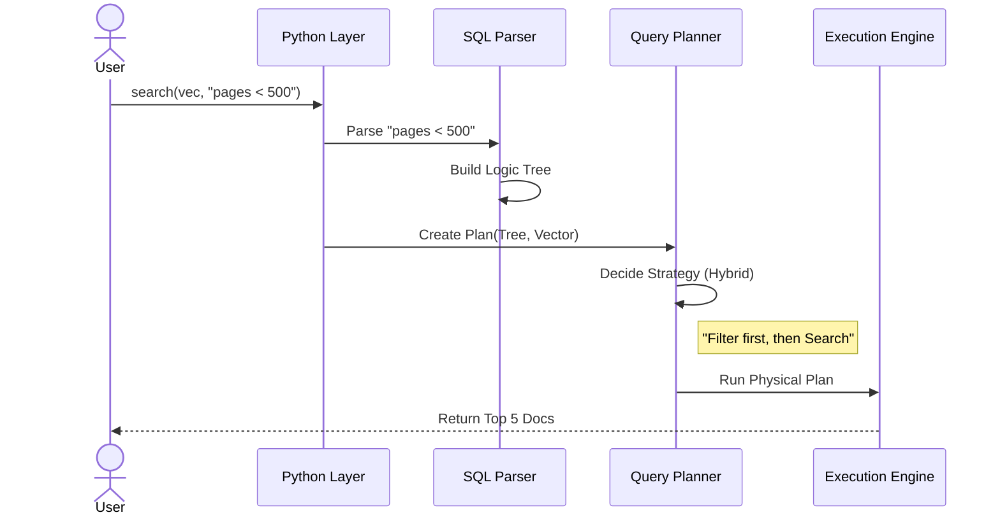

# Chapter 3: Hybrid Query Engine

In the previous chapter, [The Collection (Data Container)](02_the_collection__data_container_.md), we built a "Smart Filing Cabinet" and stored our library books in it.

Now, imagine walking into a library. You don't just want *any* book. You want a specific book. You might say:
> "I want a book about **Space Travel** (Topic), but it must be **published after 2010** (Filter), and cost **less than $20** (Filter)."

This request mixes two different types of thinking:
1.  **Vague (Vector):** "Space Travel" (Similarity search).
2.  **Precise (Scalar):** "Year > 2010" and "Price < 20" (SQL filtering).

The **Hybrid Query Engine** is the brain that combines these two worlds.

## The Motivation: The Travel Agent

Think of the Query Engine as a **Travel Agent**.

If you just say "Send me somewhere warm" (Vector Search), they might send you to a desert that costs $10,000.
If you just say "Somewhere under $100" (Scalar Filter), they might send you to a gas station down the street.

To get the perfect vacation, you need a **Hybrid** approach. You give the agent a goal ("Warm") and constraints ("Under $1000"). The agent creates a **Plan**:
1.  First, list all flights under $1000.
2.  Then, rank them by how "warm" the destination is.

## Central Use Case: Searching the Library

Let's continue with our Library example. We want to find books similar to "Science Fiction" but exclude any books that are damaged.

**Our Query:**
*   **Vector**: A vector representing "Science Fiction".
*   **Filter**: `status != 'damaged'` and `pages < 500`.

## Key Concepts

To understand the Engine, we need to know three terms:

1.  **SQL Parser**: The interpreter. It reads your text string (`"pages < 500"`) and turns it into code logic.
2.  **Execution Plan**: The itinerary. The engine decides *how* to search (e.g., "Should I filter by page count first, or look for Sci-Fi first?").
3.  **Arrow Acero**: The muscle. `zvec` uses Apache Arrow's execution engine to process data extremely fast in batches.

## How to Use It

Using the hybrid engine in Python is intuitive. You provide the vector for similarity and a string for the filter.

### Step 1: Prepare the Search Vector
First, we need the vector we are searching for (the "query vector").

```python
# A vector representing "Science Fiction"
# In a real app, an AI model generates this.
query_vector = [0.9, 0.1, 0.1, 0.8] 
```

### Step 2: Write the Filter Expression
We use a standard SQL-like syntax for filtering.

```python
# We only want books that are NOT damaged
# AND have fewer than 500 pages.
filter_expr = "status != 'damaged' AND pages < 500"
```

### Step 3: Run the Search
Now we ask the collection to perform the hybrid search.

```python
# Search the 'library' collection
results = collection.search(
    vector=query_vector,
    filter=filter_expr,
    top_k=5  # Give me the top 5 best matches
)
```

**What happens here?**
The engine finds books that mathematically match the vector *and* satisfy the text filter, returning the best 5 results.

## Internal Implementation: The Planning Room

How does `zvec` turn that string into a search operation? It goes through a pipeline.

1.  **Parsing**: The string "pages < 500" is broken down into a tree: `(pages) (Less Than) (500)`.
2.  **Planning**: The `QueryPlanner` looks at the data distribution. It asks: "Is it faster to look at vectors first, or filter the pages first?"
3.  **Execution**: It runs the plan using a thread pool.

### The Sequence Flow



## Deep Dive: The C++ Code

Let's look under the hood at how the "Brain" works.

### 1. The Parser (`src/db/sqlengine/antlr/SQLParser.g4`)

`zvec` uses a tool called **ANTLR** to define the grammar of the filter language. This file defines the rules of what users are allowed to type.

```antlr
// This defines a comparison (e.g., price < 10)
relation_expr
    : identifier rel_oper value_expr
    | identifier LIKE value_expr
    | identifier IN (value1, value2)
    ;
```

**Explanation:**
This acts like a dictionary for the computer. It says: "If the user types a word (identifier), a symbol like `<` (rel_oper), and a number (value_expr), that is a valid relationship."

### 2. The Planner (`src/db/sqlengine/planner/query_planner.cc`)

This is where the magic happens. The planner converts the parsed text into C++ operations.

Look at `create_filter_node`. It maps the text symbols to actual logical code.

```cpp
// src/db/sqlengine/planner/query_planner.cc

Result<cp::Expression> QueryPlanner::create_filter_node(const QueryNode *node) {
  // 1. Identify the column (e.g., "pages")
  auto left_exp = cp::field_ref(node->left_text());
  
  // 2. Identify the value (e.g., 500)
  auto right_exp = cp::literal(std::stoi(node->right_text()));

  // 3. Match the operator
  switch (node->op()) {
    case QueryNodeOp::Q_EQ: // ==
      return cp::equal(left_exp, right_exp);
    case QueryNodeOp::Q_LT: // <
      return cp::less(left_exp, right_exp);
    // ... other operators ...
  }
}
```

**Beginner Explanation:**
This function is a translator. It takes the abstract idea of "Less Than" and connects it to the specific C++ function `cp::less` that actually compares binary numbers in memory.

### 3. The Execution Strategy (`make_physical_plan`)

The planner must decide how to execute the query. This is handled in `make_physical_plan`.

```cpp
// src/db/sqlengine/planner/query_planner.cc

Result<PlanInfo::Ptr> QueryPlanner::make_physical_plan(...) {
    // If we have a vector condition
    if (query_info->vector_cond_info()) {
        // Run a vector scan (Hybrid search)
        return vector_scan(segment, query_info, filter);
    } 
    // If we have no vector, just filter (SQL-only mode)
    else {
        return forward_scan(segment, query_info, filter);
    }
}
```

**Beginner Explanation:**
The planner checks your request.
*   If you provided a vector, it calls `vector_scan`. This tells the engine: "We need to do heavy math calculations for similarity, but keep checking the filter constraints while we do it."
*   If you didn't provide a vector, it calls `forward_scan`, which acts like a standard database lookup.

## Summary

In this chapter, we learned:
*   **Hybrid Search** combines fuzzy vector matching with precise scalar filtering.
*   The **SQL Parser** translates human-readable text strings into computer logic.
*   The **Query Planner** acts as the "Travel Agent," creating an efficient itinerary to execute your request.

We now have a Collection, and we know how to Query it. But a Collection isn't just one big pile of data. To make it fast and manageable, `zvec` splits data into smaller chunks.

In the next chapter, we will learn how `zvec` manages these chunks on your hard drive.

[Next Chapter: Segment & Storage Management](04_segment___storage_management.md)

---

Generated by [Code IQ](https://github.com/adityasoni99/Code-IQ)