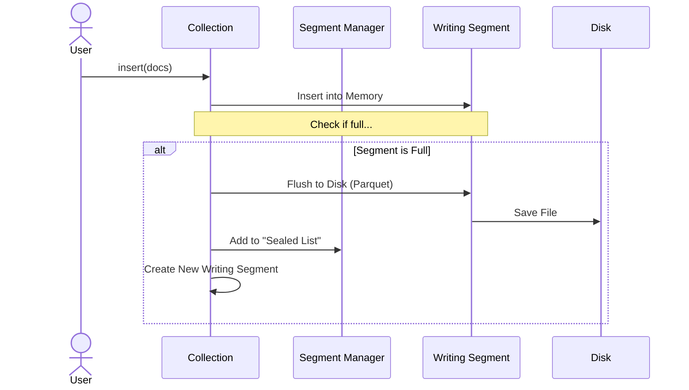

# Chapter 4: Segment & Storage Management

In the previous chapter, [Hybrid Query Engine](03_hybrid_query_engine.md), we learned how to search through our data using complex filters.

But as you keep adding millions of documents, a new problem arises: **How do we manage all this data physically?** If we stored everything in one gigantic file, it would become slow to read and impossible to update.

In this chapter, we explore **Segments**—the strategy `zvec` uses to break your data into bite-sized, manageable chunks.

## The Motivation: Encyclopedia Volumes

Imagine you are writing an Encyclopedia.

*   **The Wrong Way:** You buy a scroll of paper 5 miles long. You write entry #1 at the top. When you get to entry #10,000, you are unrolling miles of paper just to add a comma.
*   **The Right Way (Segments):** You write **Volume 1**. When it's full, you put it on the shelf (seal it) and buy a fresh notebook for **Volume 2**.

In `zvec`, these volumes are called **Segments**.

### Central Use Case: The Daily Log
Imagine a system logging user activity.
1.  **Morning**: You insert 10,000 logs. They go into **Segment A**.
2.  **Noon**: Segment A gets full. The database seals it and saves it to disk as a **Parquet** file (a highly compressed format).
3.  **Afternoon**: New logs go into a fresh **Segment B**.

This ensures that writing is always fast because you are only ever dealing with a small, fresh "notebook."

## Key Concepts

1.  **The Writing Segment (Active)**: This is the "Open Notebook." It sits in your computer's RAM (memory). It accepts new data.
2.  **The Sealed Segment (Immutable)**: This is the "Closed Volume." Once a segment is full, it is turned into a Read-Only file on your hard drive.
3.  **Compaction**: Sometimes "Volume 1" gets messy (e.g., you deleted half the pages). Compaction is the process of rewriting Volume 1 into a smaller, cleaner book.

## How to Use It (Automatic Management)

In most cases, `zvec` manages this automatically based on your configuration. However, you can manually trigger "Housekeeping" (Optimization).

### 1. Automatic Switching
When you define your schema, you (or the system defaults) decide how big a segment should be.

```python
# Conceptual configuration
# zvec automatically switches to a new segment 
# when the current one hits this limit.
max_docs_per_segment = 1024 * 1024  # 1 Million docs
```

### 2. Manual Optimization (Compaction)
If you have deleted many documents, your disk might be full of "holes" (data marked as deleted but still taking up space). You can force `zvec` to clean up.

```python
from zvec import OptimizeOptions

# Tell the collection to merge small segments 
# and remove deleted data physically.
collection.optimize(
    options=OptimizeOptions(concurrency=4)
)
```

**What happens here?**
The database looks at all the sealed segments. If it finds two small ones (e.g., Vol 1 is 30% full, Vol 2 is 20% full), it merges them into a new, efficient Vol 3 and deletes the old ones.

## Internal Implementation: The Lifecycle

How does the data flow from your Python script to the hard drive?

1.  **Insert**: Data enters the **Writing Segment** (Memory).
2.  **Check**: After insertion, the Collection checks: "Is this segment full?"
3.  **Seal**: If full, the segment is flushed to disk (using Apache Arrow/Parquet).
4.  **Rotate**: A new ID is generated, and a new Writing Segment is created.

### The Sequence Flow



## Deep Dive: The C++ Code

Let's look at how `zvec` handles these "Encyclopedia Volumes" in C++.

### 1. The Manager (`src/db/index/segment/segment_manager.cc`)

The `SegmentManager` is the "Librarian." It keeps a list of all the finished volumes.

```cpp
// src/db/index/segment/segment_manager.cc

Status SegmentManager::add_segment(Segment::Ptr segment) {
  if (!segment) {
    return Status::InvalidArgument("Segment is null");
  }

  // Store the segment in a map (Dictionary)
  // Key: Segment ID, Value: The Segment object
  segments_map_[segment->id()] = segment;
  
  return Status::OK();
}
```

**Explanation:**
This is a simple registry. When a segment is finished, the Collection hands it over to this Manager so it can be queried later.

### 2. Switching Volumes (`src/db/collection.cc`)

This logic inside `CollectionImpl` decides when to swap the notebooks.

```cpp
// src/db/collection.cc

Status CollectionImpl::switch_to_new_segment_for_writing() {
  // 1. Save the current data to disk
  auto s = writing_segment_->dump();
  
  // 2. Give the old segment to the Librarian (SegmentManager)
  s = segment_manager_->add_segment(writing_segment_);

  // 3. Create a brand new segment
  auto new_segment = Segment::CreateAndOpen(
      path_, *schema_, allocate_segment_id(), ...);

  // 4. Set the new one as the active writer
  writing_segment_ = new_segment.value();

  return Status::OK();
}
```

**Explanation:**
This code is the "Pivot Point." It ensures that we never stop accepting data. We dump the old one, register it for reading, and instantly spin up a new one for writing.

### 3. Writing to Disk (`src/db/index/storage/parquet_writer.cc`)

When we say "Dump to disk," we don't just write text. We write **Parquet**. `zvec` uses the **Apache Arrow** library to do this efficiently.

```cpp
// src/db/index/storage/parquet_writer.cc

arrow::Status ParquetWriter::write_batch(const arrow::RecordBatch &batch, ...) {
  // 'batch' is a chunk of data in memory (like a spreadsheet)
  
  // 1. Check if we need to filter out deleted rows
  // (Code omitted for brevity...)

  // 2. Write the batch to the Parquet file
  return writer_->WriteRecordBatch(batch);
}
```

**Beginner Explanation:**
*   **Apache Arrow**: Imagine data in memory organized exactly like it will be on disk. No conversion needed. It's incredibly fast.
*   **Parquet**: This is the file format. It compresses column by column. If you have a column of "Years" (2020, 2020, 2020...), Parquet compresses that massively.

## Summary

In this chapter, we learned:
*   **Segments** allow databases to handle infinite data by breaking it into chunks.
*   **Active Segments** live in memory for speed; **Sealed Segments** live on disk for durability.
*   **Compaction** is the process of cleaning up messy segments.
*   Under the hood, `zvec` uses **Apache Arrow** and **Parquet** to make storage incredibly efficient.

Now we have data stored efficiently on disk. But simply storing data isn't enough. We need to perform vector searches (finding the "nearest neighbor"). To do that quickly, we need specialized algorithms.

In the next chapter, we will learn about the math and logic behind Vector Indexing.

[Next Chapter: Vector Indexing Algorithms](05_vector_indexing_algorithms.md)

---

Generated by [Code IQ](https://github.com/adityasoni99/Code-IQ)