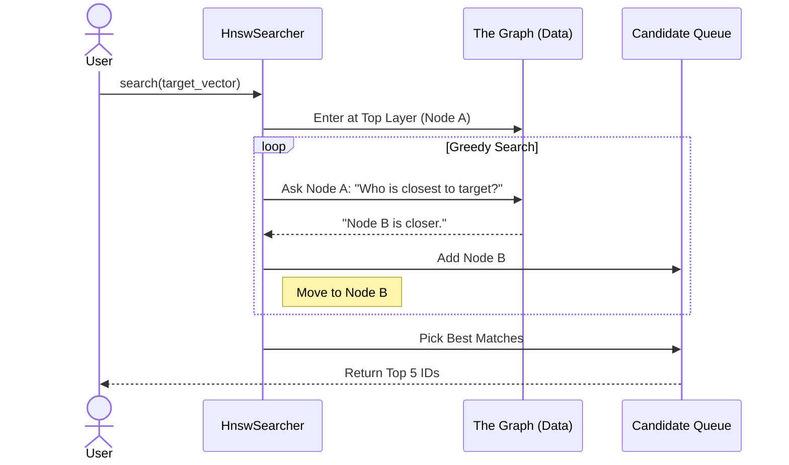

# Chapter 5: Vector Indexing Algorithms

In the previous chapter, [Segment & Storage Management](04_segment___storage_management.md), we learned how `zvec` efficiently stores millions of vectors on your disk using Segments.

Now we have a different challenge: **Speed**.

If you have 10 million vectors, and you want to find the "nearest neighbor," checking them one by one (Brute Force) takes too long. We need a smarter way to navigate the data. We need **Vector Indexing Algorithms**.

## The Motivation: The GPS System

Imagine you are in New York and want to find the nearest coffee shop.

*   **Brute Force (Flat Index)**: You drive down *every single road* in the United States, measuring the distance to every coffee shop, until you find the closest one. This is exact, but painfully slow.
*   **Vector Index (HNSW/IVF)**: You use a GPS. The GPS ignores roads in California or Texas. It zooms in on New York, then your neighborhood, and points you directly to the target.

In `zvec`, the **Index** is the map that allows the engine to skip 99% of the data and find your answer in milliseconds.

### Central Use Case: Facial Recognition
You are building a security system with 10 million faces.
1.  **Requirement**: Match a face at the turnstile in under 10 milliseconds.
2.  **Problem**: A standard linear scan takes 500ms.
3.  **Solution**: Use an **HNSW Index** to navigate the data instantly.

## Key Concepts

To understand indexing, we need to know the three main strategies `zvec` uses:

1.  **Flat (Brute Force)**: The baseline. Checks everything. 100% accurate, but slow.
2.  **HNSW (Graph-Based)**: "Hierarchical Navigable Small World." Think of this as a **social network**.
    *   Vectors are "People."
    *   Similar vectors are "Friends" connected by a line.
    *   To find a target, you ask a person: "Do you know anyone closer to this target than you?" and jump to them.
3.  **IVF (Cluster-Based)**: "Inverted File Index." Think of this as **Zip Codes**.
    *   It divides the world into regions (Clusters).
    *   It only searches the region where your target lives.

## How to Use It

By default, `zvec` might use a Flat index or a default HNSW configuration. Here is how you explicitly configure the algorithm in Python.

### Example 1: Configuring HNSW (The Speed Demon)

HNSW is the most popular algorithm because it is extremely fast and accurate.

```python
from zvec import IndexType, HnswParam

# Define HNSW parameters
# M: Number of "friends" (connections) per node. 
# ef_construction: Accuracy during build time.
hnsw_config = HnswParam(m=16, ef_construction=200)

# Create collection with this index type
collection.create_index(
    field_name="face_vector",
    index_type=IndexType.HNSW,
    params=hnsw_config
)
```

**What happens here?**
We tell `zvec` to build a multi-layered graph. Every time a vector is inserted, it connects to 16 other similar vectors (`m=16`).

### Example 2: Configuring IVF (The Memory Saver)

If you are running out of RAM, IVF is efficient because it groups vectors together.

```python
from zvec import IndexType, IvfParam

# Divide the data into 1024 clusters (centroids)
ivf_config = IvfParam(nlist=1024)

collection.create_index(
    field_name="face_vector",
    index_type=IndexType.IVF_FLAT,
    params=ivf_config
)
```

**What happens here?**
`zvec` calculates 1024 "center points" for your data. When you search, it first finds the closest center point, then only looks at vectors attached to it.

## Internal Implementation: The Navigation

How does the C++ core execute a search using an algorithm like HNSW?

Imagine the index as a **multi-story building**.
1.  **Entry**: You start at the roof (Top Layer).
2.  **Zoom**: You look for a connection that gets you closer to the target (greedy search).
3.  **Descend**: You take the elevator down to the next floor (Lower Layer) and repeat.
4.  **Ground Floor**: You are now in the dense neighborhood of the target.

### The Sequence Flow



## Deep Dive: The C++ Code

Let's explore `src/core/algorithm/hnsw` and `src/core/interface/index.cc` to see how the math is implemented.

### 1. The Interface (`src/core/interface/index.cc`)

This file is the generic wrapper. It doesn't care if you use HNSW or IVF; it just calls the correct implementation.

```cpp
// src/core/interface/index.cc

// This function decides which algorithm to use
int Index::Search(const VectorData &data, ...) {
    
    // 1. Get the execution context (memory for calculations)
    auto &context = acquire_context();

    // 2. Call the specific implementation (HNSW, IVF, or Flat)
    // _dense_search will route to the loaded streamer/searcher
    return _dense_search(data, search_param, result, context);
}
```

**Beginner Explanation:**
This is the "Reception Desk." You hand it a request, and it routes you to the correct department (The HNSW department or the IVF department).

### 2. The HNSW Builder (`src/core/algorithm/hnsw/hnsw_builder.cc`)

How is the graph built? When you insert data, `do_build` connects the dots.

```cpp
// src/core/algorithm/hnsw/hnsw_builder.cc

void HnswBuilder::do_build(node_id_t idx, ...) {
    // Create a context for this specific thread
    HnswContext *ctx = new HnswContext(...);
    
    // Loop through the assigned vectors
    for (node_id_t id = idx; id < entity_.doc_cnt(); id += step_size) {
        
        // The Magic: Add the node to the graph
        // This calculates distances and links it to neighbors
        alg_->add_node(id, entity_.get_level(id), ctx);
    }
}
```

**Beginner Explanation:**
This code runs in the background. For every new face vector (`id`), it asks the algorithm: "Where does this fit in the social network?" The algorithm links it to its nearest neighbors.

### 3. The HNSW Searcher (`src/core/algorithm/hnsw/hnsw_searcher.cc`)

This is the code that runs when you query the database.

```cpp
// src/core/algorithm/hnsw/hnsw_searcher.cc

int HnswSearcher::search_impl(const void *query, ...) {
    // 1. Check if we have very few items. 
    // If so, just use Brute Force (it's faster for < 100 items)
    if (entity_.doc_cnt() <= ctx->get_bruteforce_threshold()) {
        return search_bf_impl(query, qmeta, count, context);
    }

    // 2. Run the HNSW Graph traversal
    // alg_->search does the "Roof to Ground Floor" navigation
    int ret = alg_->search(ctx);
    
    // 3. Convert results for the user
    ctx->topk_to_result(q);
    
    return 0;
}
```

**Beginner Explanation:**
*   **Optimization**: Notice the check `doc_cnt() <= bruteforce_threshold`. `zvec` is smart. If you only have 50 items, building a graph is overkill. It simply checks them all.
*   **`alg_->search(ctx)`**: This is where the greedy graph traversal happens.

### 4. The IVF Searcher (`src/core/algorithm/ivf/ivf_searcher.cc`)

Let's look quickly at the "Zip Code" approach (IVF).

```cpp
// src/core/algorithm/ivf/ivf_searcher.cc

int IVFSearcher::search_impl(...) {
    // 1. Find the closest cluster center (Centroid)
    // This narrows the search from Millions -> Thousands
    centroid_index_->search(query, qmeta, count, centroid_ctx);

    // 2. Get the specific list of vectors in that cluster
    auto &centroids = centroid_ctx->result(q);

    // 3. Search ONLY inside that cluster
    for (size_t i = 0; i < centroids.size(); ++i) {
        auto cid = centroids[i].key(); // Cluster ID
        entity->search(cid, query, ...);
    }
}
```

**Beginner Explanation:**
IVF is a two-step process.
1.  **Coarse Search**: Which bucket is my data in?
2.  **Fine Search**: Look carefully inside that bucket.

## Summary

In this final tutorial chapter, we learned:
*   **Vector Indexing** is the "GPS" that makes searching fast.
*   **Flat Index** is accurate but slow (good for small data).
*   **HNSW** creates a navigable graph (Speed Demon).
*   **IVF** groups vectors into clusters (Memory Saver).
*   The **Builder** creates the map, and the **Searcher** reads the map.

## Conclusion

Congratulations! You have completed the **Zvec** Beginner Tutorial series.

You have journeyed from:
1.  Initializing the engine via the **Python-C++ Bridge**.
2.  Storing data in a structured **Collection**.
3.  Querying data with the **Hybrid Engine**.
4.  Managing physical files with **Segments**.
5.  Accelerating searches with **Vector Algorithms**.

You now possess the foundational knowledge to understand how high-performance vector databases operate under the hood. You can now explore the codebase with confidence, knowing how the plastic steering wheel connects to the metal engine.

**Happy Coding!**

---

Generated by [Code IQ](https://github.com/adityasoni99/Code-IQ)