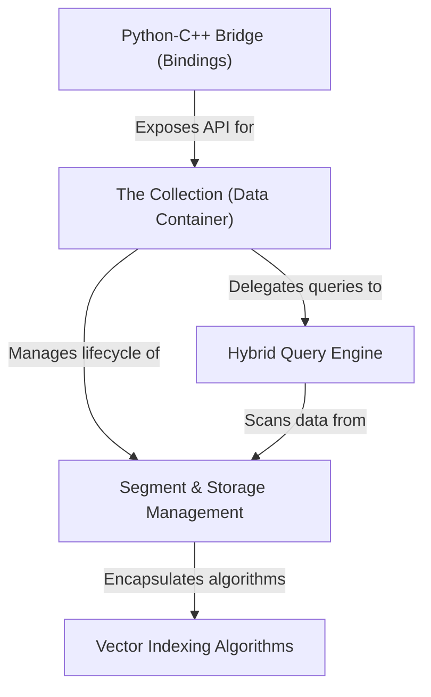

# Tutorial: zvec

Zvec is an embedded **vector database** engine designed to bridge high-performance **C++** internals with user-friendly **Python** bindings. It organizes data into manageable chunks called *segments* and employs a **hybrid query engine** to orchestrate complex similarity searches using advanced indexing algorithms like **HNSW** and **IVF**.

**Source Repository:** [https://github.com/alibaba/zvec](https://github.com/alibaba/zvec)

## Chapters

1. [Python-C++ Bridge (Bindings)](01_python_c___bridge__bindings_.md)
2. [The Collection (Data Container)](02_the_collection__data_container_.md)
3. [Hybrid Query Engine](03_hybrid_query_engine.md)
4. [Segment & Storage Management](04_segment___storage_management.md)
5. [Vector Indexing Algorithms](05_vector_indexing_algorithms.md)

---

Generated by [Code IQ](https://github.com/adityasoni99/Code-IQ)